## 📌 What is a Large Language Model (LLM)?
A Large Language Model (LLM) is a type of advanced AI system designed to understand and generate human-like text. It works by using deep neural networks—typically transformer architectures—and is trained on huge amounts of text data. This allows it to recognize patterns in language, understand context, and produce coherent, relevant responses.

## 📌 What is Prompt Engineering?
Prompt engineering is both an art and a science. It’s about crafting the input (the prompt) you give to an LLM, along with adjusting parameters like temperature or max tokens, to guide the model toward generating the kind of response you want. The more deliberate and structured your prompt, the better your results.

## 📌 What Does a Language Model Actually Do?
At its core, a language model predicts the likelihood of word sequences. Given a piece of text, it estimates the probability of the next word. For example, after the phrase “The sun is”, it might assign the highest probability to the word “shining”.

## 📌 How Have Language Models Evolved?
You can build a basic language model using an n-gram table, which looks at fixed-length sequences of words. But modern models are far more powerful; they use neural networks, especially transformers, which can handle long-range dependencies and context across sentences or even paragraphs.

## 📌 What Is an N-gram Table?
An n-gram is just a sequence of n words in a row.
- A unigram is a single word
- A bigram is a pair of words
- A trigram is a sequence of 3 words
  
An **n-gram table** is a kind of lookup table that tells you how often certain sequences of words appear in a dataset. You can use it to predict the next word based on the previous ones.

### Example: Trigram Table

Imagine the following sentences in your training data:

> “I love machine learning.”  
> “I love deep learning.”  
> “You love machine learning.”

The trigram model looks at 3-word sequences and builds a table like this:

| First Word | Second Word | Predicted Third Word | Frequency |
|------------|-------------|-----------------------|-----------|
| I          | love        | machine               | 1         |
| I          | love        | deep                  | 1         |
| You        | love        | machine               | 1         |
| love       | machine     | learning              | 2         |
| love       | deep        | learning              | 1         |

📌 Recurrent Neural Networks (RNNs)
- Designed to handle sequential data (text, audio, time series)
- Each word/token in a sequence is processed one at a time. At each step, the model uses the previous hidden state and the current input to produce the next hidden state: h_t = f(h_(t-1), x_t)
- Strength: Can, in theory, remember earlier context across time
- Weakness: When backpropagating through long sequences, gradients shrink too much → the model “forgets” long-term dependencies
- Compute: Sequential nature means slow training and difficult to parallelize

📌 LSTM (Long Short-Term Memory)
-  Vanilla RNNs struggle with long-term memory. LSTMs were built to remember information over long sequences without forgetting too quickly
-  Adds internal “gates” to control what information is stored, forgotten, and output at each step:
	Forget gate: What to throw away from memory
	Input gate: What new info to add
	Output gate: What to output at this step
- Strength: Remembers long-term dependencies better
- Limitation: Still sequential → can’t be parallelized during training
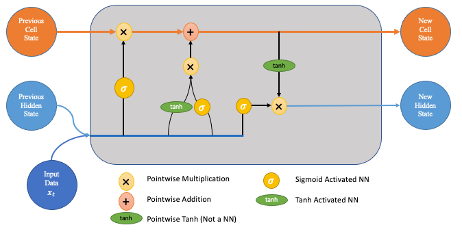

Think of this gray box as a single LSTM cell at one time step. It receives:
🟠 Previous Cell State (C_{t-1}): the long-term memory
🔵 Previous Hidden State (h_{t-1}): the short-term output memory
🔵 Input Data (x_t): the current word/token

Its job is to:
- Decide what to forget
- Decide what new info to add
- Update the cell state
- Output a new hidden state


1. Forget Gate (First Sigmoid & Multiply)

Input: x_t + h_{t-1}
→ Sigmoid (σ)
→ Multiply with C_{t-1}
It decides how much of the old memory (C_{t-1}) to keep.
If output is near 0 → forget it.
If output is near 1 → keep it.


⸻

2. Input Gate (Middle Path)

Split into two parts:

🟡 Sigmoid (σ) — What to write
Determines which values will be updated in the cell state.

🟢 Tanh — Candidate values
Creates new candidate values (new information) to potentially add.

These two are multiplied together, so:
- You create new info
- You decide how much of it is worth writing to memory

⸻

3. Update the Cell State (C_t)

Now we combine:
- What we decided to keep from the past (from the forget gate)
- What we decided to add (from the input gate)

C_t = (forget gate * C_{t-1}) + (input gate * candidate values)

✅ This is your updated memory going into the next time step.

⸻

4. Output Gate (Last Sigmoid + tanh + Multiply)
- Sigmoid gate decides what part of the cell state to output.
- The cell state is passed through a tanh (to scale it between -1 and 1).
- Then both are multiplied to create the new hidden state h_t.

h_t = output gate * tanh(C_t)
This is the short-term memory/output passed to the next step or to the task (like predicting the next word).

⸻

📌 GRU (Gated Recurrent Unit)
- A simpler alternative to LSTM
- Combines the forget and input gates into a single update gate
- Faster to train than LSTMs but slightly less expressive
- Used when efficiency matters more than complexity
  
📌 Transformers
- Transformers threw away the idea of sequential processing entirely
- Instead of going step-by-step, they look at the entire sequence at once and learn how words relate to each other, no matter how far apart they are.
- This is done via self-attention
- Self-attention computes weighted relationships between every pair of tokens
- Introduced in: Attention is All You Need
- Parallelized: Processes all tokens in a sequence at once—huge speed advantage
- Better with long sequences: Can model long-range dependencies more effectively than RNNs
- Limitation: Original self-attention scales quadratically with sequence length : Attention Cost ∝ Sequence Length²

1. What Is a Transformer?

A transformer is a neural network architecture originally designed for sequence-to-sequence tasks, like translating sentences from French to English. It does this using two main parts:
🔷 Encoder: Understands the input sequence
🔶 Decoder: Generates the output sequence

2. End-to-End: How Does It Work?
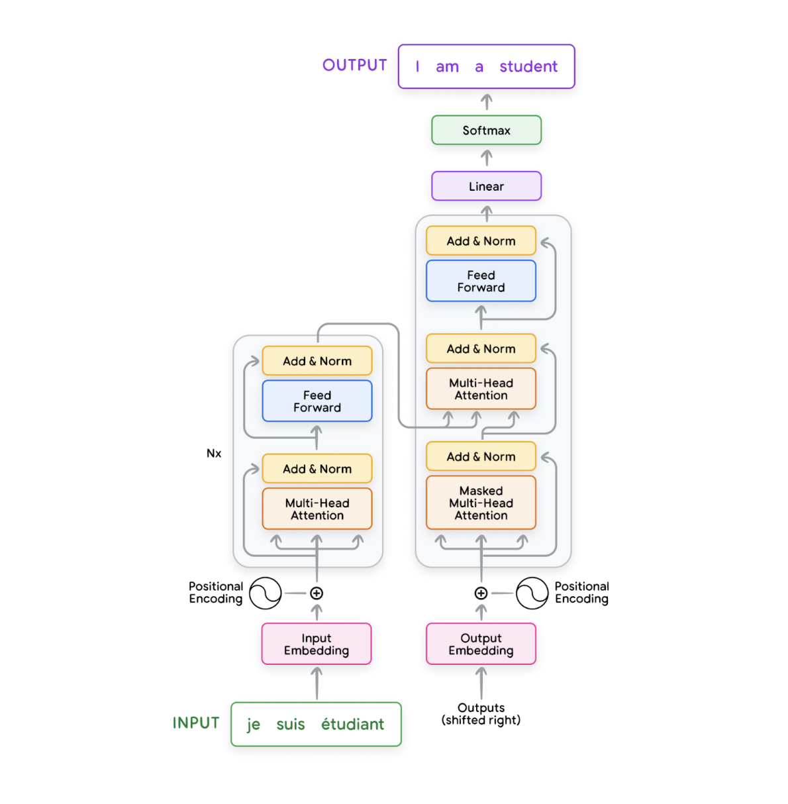

Let’s use the translation example:
Input: je suis étudiant → Output: I am a student
Step-by-step process:
1. Input Embedding: Each word is turned into a vector using a learned lookup table.
2. Positional Encoding: Since transformers have no built-in sense of order, we add this to help it understand word position.
3. Encoder: Applies layers of:
	- Multi-head self-attention (every word looks at every other word)
	- Feed-forward neural nets
	- Residual connections + LayerNorm
4. Decoder: Uses two attention mechanisms:
- Masked self-attention: so the model can’t peek ahead while generating output
- Encoder-decoder attention: helps the decoder refer back to the encoded input
5. Output Embedding + Softmax: Produces the final predicted tokens autoregressively (word by word).

⸻

🔍 3. Inside the Layers

Multi-Head Self-Attention
- Each token asks: “How relevant are the other tokens to me?”
- We compute:
- Q (Query): What am I looking for?
- K (Key): What do I offer?
- V (Value): What should I contribute if selected?
- Dot Product of Q and K → similarity score
- Softmax over scores → attention weights
- Weighted sum of V → the attended context vector

🔁 Multi-head = Multiple Q/K/V sets running in parallel

Each head captures different relationships (e.g., grammar, coreference, etc.). Their outputs are concatenated and passed to the next layer.

⸻

## Add & Norm (Residual Connection + LayerNorm)

For each sub-layer:
- Add: Skip connection from input to output (helps gradient flow)
- Normalize: Stabilizes activations, speeds up training

⸻

## Feedforward Network
- A mini-MLP applied to each position
- Adds depth and non-linearity:

FF(x) = max(0, xW1 + b1)W2 + b2

⸻

4. Visual Walkthrough of Self-Attention

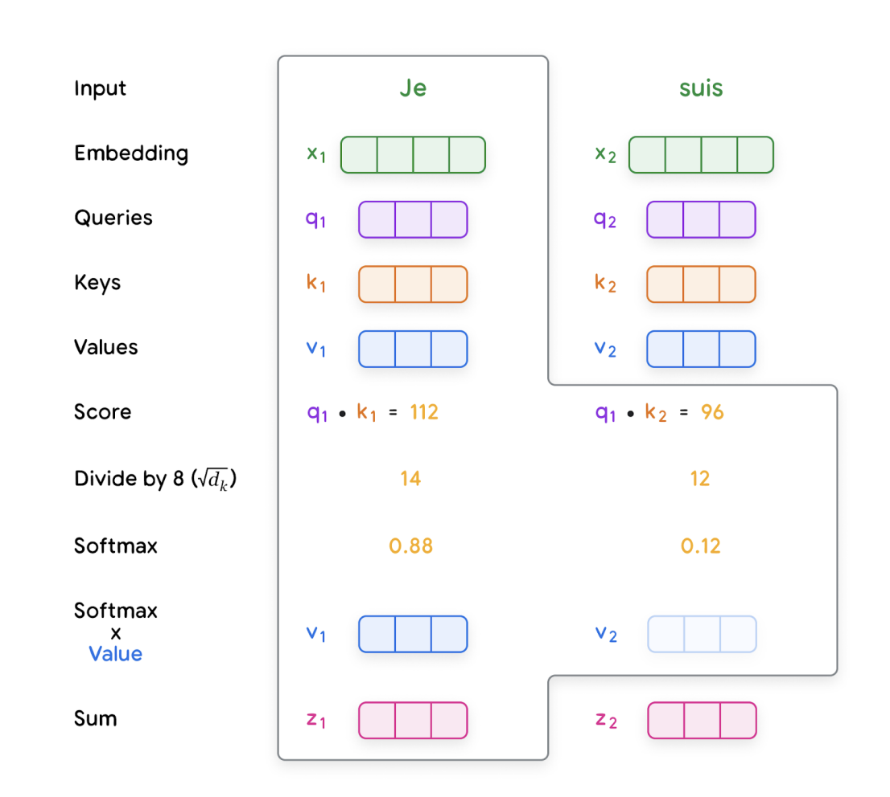

Using the "je suis" example:

Token	Embedding	Query (Q)	Key (K)	Value (V)
Je	x₁	q₁	k₁	v₁
suis	x₂	q₂	k₂	v₂

Step-by-step:
Compute dot product between q₁ and each key:
q₁ ⋅ k₁ = 112, q₁ ⋅ k₂ = 96
Divide by √d to stabilize
Apply softmax → gives attention weights (e.g., 0.88, 0.12)
Weighted sum of values:

z₁ = 0.88*v₁ + 0.12*v₂

Each token gets a new representation that’s context-aware.

⸻

🔁 5. Decoder-Only Transformers (GPT-style)

In modern LLMs (like GPT), we only use the decoder stack — no encoder.

Why?
For tasks like text generation, we don’t need to encode another sequence.
The model simply:
Takes in a prompt
Applies masked self-attention to prevent looking at future tokens
Generates tokens one by one, feeding its own output back in

This simplifies the architecture and is perfect for autoregressive generation.

⸻

🤹‍♂️ 6. Mixture of Experts (MoE)

What It Is:
A model made of many specialized mini-models (experts).
Instead of activating all of them, a gating network chooses the best ones for a given input.
Only a few experts are activated per input → saves compute, improves specialization.
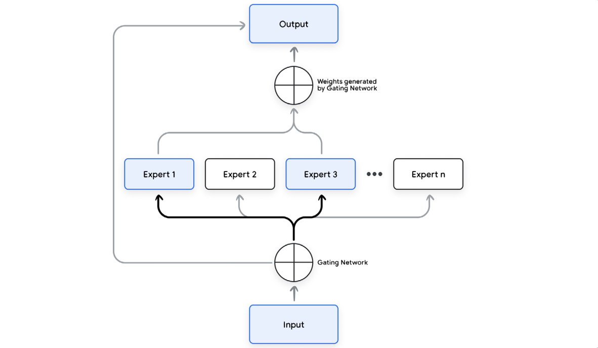

## Transformers: The Foundation, Not the Finish Line
- The transformer architecture (with self-attention) lets the model decide which parts of a sentence matter when making predictions.
Reasoning = not just remembering → it’s thinking in steps

## Prompting Strategies for Reasoning
- Chain-of-Thought (CoT): Mimics how humans reason through problems.
- Tree-of-Thoughts (ToT): Explores multiple reasoning paths (like a tree structure), searches for the best solution using heuristics or search algorithms.
- Least-to-Most Prompting: Starts by solving simpler subproblems, then gradually tackles more complex ones. Each step builds on the last and is inspired by how humans learn difficult tasks incrementally.

## Training Techniques for Reasoning
- Instruction Tuning: Train the model to follow natural language instructions
- Fine-Tuning on Reasoning Datasets: Use datasets with logic, commonsense, math, or QA problems.
- Reinforcement Learning from Human Feedback (RLHF): After training, use human preferences to fine-tune outputs.

## Knowledge Distillation
- Take a larger “teacher” model that reasons well and use it to train a smaller “student” model.
- The student learns to imitate the reasoning steps without requiring as many resources.

## Reasoning During Inference
- Beam Search: Instead of choosing one output at each step, explore multiple paths and pick the best one.
- Temperature Scaling: Controls how “random” the output is; Lower temperature = more focused and deterministic.
- Retrieval-Augmented Generation (RAG): Pull in facts from a knowledge base (e.g., Wikipedia or a database) before answering.

## How Transformers Are Trained

### Data Preparation
1. Clean the data → remove duplicates, noise, irrelevant content.
2. Tokenize the data using:
- Byte-Pair Encoding (BPE) or
- Unigram Tokenization
3. Build a vocabulary: Each token becomes a unique ID.
4. Split into training + test data.

###  Training Loop
1. Take a batch of input sequences
(e.g., “The cat sat on the”)
2. Feed into the transformer → it predicts the next word
(e.g., it should predict “mat”)
3. Compute loss, for exmaple using cross-entropy: CrossEntropy = -log(P(correct_word))
P("mat") = 0.9 → Loss = -log(0.9) = 0.105 (lower cross-entropy = better prediction)
P("rug") = 0.1 → Loss = -log(0.1) = 2.3 (higher = model was way off)
4. Use backpropagation(backward propagation of errors) to adjust weights. So, after the model figured out how wrong the model is (via a loss function), it then calculates how to adjust each weight in the network to reduce that error and finally, updates those weights using gradient descent.
5. Repeat for millions/billions of sequences
### Example
> 🧠 **Backpropagation with Math — Intuition Meets Equations**
>
> 🔸 The forward pass says:  
> “With these dial settings (weights), here’s my guess.”
>
> Mathematically:
> ```
> z = w · x + b        # linear combination (weights * inputs + bias)
> a = σ(z)             # apply activation function (e.g., ReLU, sigmoid)
> ```
>
> 🔸 The loss function says:  
> “That guess was bad — you’re off by this much.”
>
> Example (cross-entropy loss for classification):
> ```
> L = -log(p_correct) = -log(ŷ)
> ```
> where `ŷ` is the predicted probability for the correct class.
>
> 🔸 Backpropagation says:  
> “To reduce that error, tweak weight #17 slightly down, #23 slightly up, etc.”
>
> We compute gradients using the **chain rule**:
> ```
> ∂L/∂w = ∂L/∂a × ∂a/∂z × ∂z/∂w
> ```
> This tells us how sensitive the loss is to each weight: If ∂L/∂w is large, then a small change in w causes a big change in the loss → the weight is very influential. If ∂L/∂w is small, the weight doesn’t affect the loss much → it’s less important (in this context)
>
> 🔸 Gradient descent says:  
> “Okay, I’ve adjusted them. Let’s try again.”
>
> Update rule:
> ```
> w_new = w_old - η × ∂L/∂w
> ```
> where `η` is the learning rate.
>
> 🔁 Repeat this loop to train the model!

 In a Tiny Neural Net, if we had just 3 neurons in layer 1 and 2 neurons in layer 2, we’d already have: 3 × 2 = 6 weights
 Each weight has to be updated individually. So during backpropagation, we calculate a unique:
 ∂L/∂w₁, ∂L/∂w₂, ∂L/∂w₃, ... for all of them
 Number of Parameters (weights + biases) for example in GPT-3 is 175 billion


## Different Training Objectives

### Decoder-Only vs. Encoder-Only: GPT vs. BERT

| Concept                  | GPT / Decoder-Only Transformer                               | BERT / Encoder-Only Transformer                                      |
|--------------------------|------------------------------------------------------------------|-------------------------------------------------------------------------|
| **Architecture**         | Uses only the **decoder blocks** of the transformer             | Uses only the **encoder blocks** of the transformer                     |
| **Token Generation**     | Generates **one token at a time**, left to right (autoregressive) | Processes **all tokens simultaneously**                                |
| **Self-Attention Type**  | **Masked self-attention** tokens can only attend to earlier tokens | **Full bidirectional self-attention** — each token sees all others     |
| **Masking Purpose**      | Prevents the model from **peeking at future tokens** during training | Replaces random tokens with `[MASK]` to teach the model to **fill in blanks** |
| **Causal Mask Example**  | Triangular matrix: `[[1, 0, 0], [1, 1, 0], [1, 1, 1]]` ensures no future access | No causal mask — attention is unrestricted across the input             |
| **Training Objective**   | **Autoregressive Language Modeling**: Predict the next word based on prior words | **Masked Language Modeling (MLM)**: Predict missing words using full context |
| **Prompt Example**       | `Input: The cat sat on the` → `Target: mat`                     | `Input: The [MASK] sat on the mat` → `Target: cat`                     |
| **Output Generation**    | Token-by-token generation: `The → cat → sat → on → the → mat`  | No output generation during pretraining — used for understanding tasks |
| **Used For**             | Text generation, story writing, coding, completion tasks        | Text classification, QA, sentence embedding, next sentence prediction   |
| **Example Models**       | GPT-2, GPT-3, GPT-4, LLaMA, Mistral                              | BERT, RoBERTa, DistilBERT, ALBERT                                       |

##  Context Length
- This determines how much of the past the model can “remember” when predicting.
- Longer = better reasoning + continuity
- But longer = more compute & memory

## The Evolution of Transformers: Conceptual and Mathematical Foundations

The evolution of transformers begins with a simple but powerful idea: **predict the next word** in a sequence using *attention mechanisms*. Early models like **GPT-1** showed that training a *decoder-only* transformer on large unlabeled text using **autoregressive language modeling** could generate coherent language without any task-specific architecture. In contrast, **BERT** used an *encoder-only* architecture and trained with **masked language modeling (MLM)** to understand text *bidirectionally*, making it highly effective for comprehension but not generation.

As models like **GPT-2** and **GPT-3** scaled up in both **parameter count** (from millions to billions) and **training data** (from gigabytes to trillions of tokens), they began to exhibit emergent behaviors, like **few-shot learning** (solving new tasks from just a few examples), **common-sense reasoning** (making logically sound inferences about everyday situations), and **code generation** (writing code based on natural language prompts), all without explicit training on those tasks. This confirmed a crucial insight: *scaling model size and data enables general-purpose reasoning*.

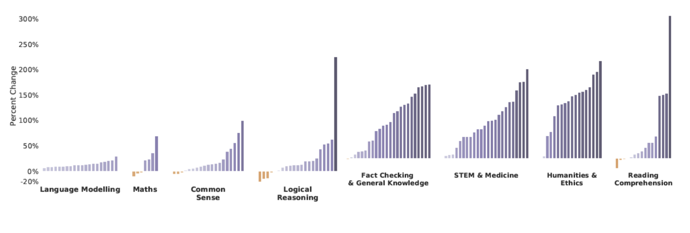

But bigger wasn’t always better. The **Chinchilla** paper revised earlier scaling laws by showing that *balanced scaling*, increasing both model size and dataset size proportionally, leads to better performance. A 70B parameter model trained on more tokens outperformed much larger models trained on less data. These findings formed a new **compute-optimal scaling law**, shaping how we train models efficiently.

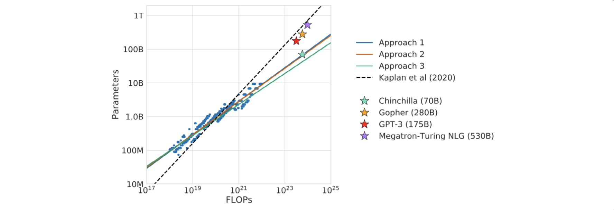


Further breakthroughs came from **instruction tuning** and **reinforcement learning from human feedback (RLHF)**, first introduced in **InstructGPT**. These methods fine-tune models to align with human preferences, making outputs more *truthful*, *safe*, and *helpful*. Notably, smaller tuned models began outperforming larger untuned ones.

To scale efficiently, researchers turned to **Mixture-of-Experts (MoE)** models like **GLaM**, **Gemini**, and **Mixtral**, where only a subset of parameters is activated for each input, drastically reducing compute while maintaining high performance. 

Transformers also expanded in *modality*. With models like **GPT-4** and **Gemini 1.5/2.0**, transformers are now **multimodal**, processing *text, images, audio, and video* in a single sequence. This enables complex tasks like matching a sketch to a movie scene or answering detailed questions about hours of video.

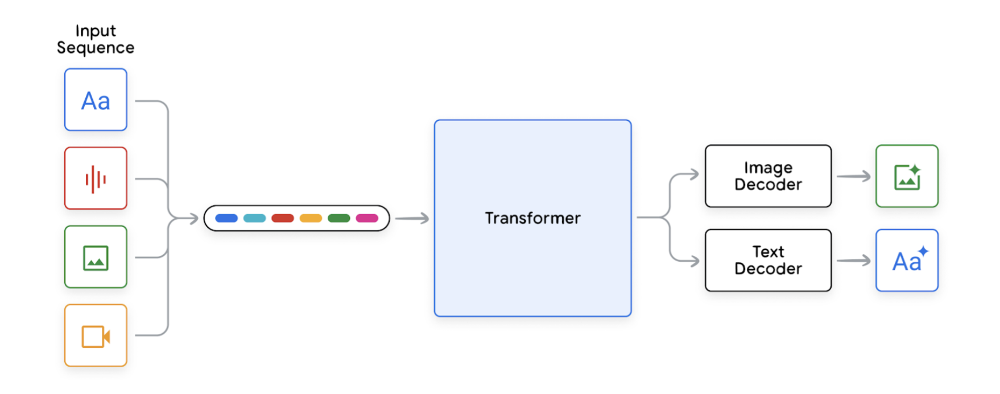

At the same time, **context windows** have exploded: from 2K tokens in early models to **millions of tokens** in Gemini, allowing models to retrieve, reason over, and remember content from *entire books or long conversations*.

Finally, the rise of **open-source models** like **LLaMA**, **Gemma**, and **Mixtral** has democratized access to these capabilities. These models are often *smaller*, *cheaper to run*, and still achieve performance close to or better than commercial LLMs, thanks to innovations in *sparse activation*, *quantization*, and *high-quality training data*.


## Fine-Tuning Large Language Models: Key Concepts

### Pre-training
- The **initial training phase** where the model learns to predict the next token based on previous context.
- Trained on **large, diverse, unlabeled text datasets**.
- Purpose: Learn general language patterns and capabilities across tasks.
- Outcome: Enables **zero-shot** and **few-shot** performance on a wide range of tasks.
- **Expensive and time-consuming** (weeks to months, high GPU/TPU usage).

### Fine-tuning
- A **second training phase** to specialize the model.
- Often referred to as **instruction tuning** or **supervised fine-tuning (SFT)**.
- Uses **smaller, task-specific, labeled datasets** that are usually high-quality and human-curated.
- Goal: Improve performance on **specific tasks** and **desired behaviors**.

### Types of Fine-Tuning

- **Instruction-tuning**: You give the model an instruction-style prompt (e.g. “Write a short story about space exploration”). You also provide the desired response. The model learns to follow the pattern and generalize to unseen instructions later on.
- 
- **Dialogue-tuning**: The model is trained specifically for multi-turn conversations, like chatbots or assistants. The training data consists of dialogue exchanges — usually as a sequence of questions and responses (often human-written).
The model learns things like:
Keeping track of the conversation context,
Giving relevant follow-up answers, responding in a helpful, human-like way.

- **Safety tuning**: It involves a multi-step process, often including:
Careful filtering of training data to avoid toxic or biased content.
Human feedback: rating which outputs are more appropriate or less harmful.
Reinforcement Learning from Human Feedback (RLHF): the model is rewarded for safe responses and penalized for bad ones.

### Supervised Fine-Tuning (SFT)
- Trains on **input–output pairs** (a labeled example where both the input and the expected output are provided): prompt → target response
  - Examples: question → answer, text → summary, English → German.
- The model is trained to minimize the difference between its predicted output and the true output for these input-output pairs. Essentially, the model learns from examples where both the question and the correct answer are provided, and then it tries to generalize that learning to similar tasks.

### Cost
- Fine-tuning is **much cheaper** and more **data-efficient** than pre-training.
- Can be optimized further with newer techniques (discussed later in the whitepaper).


## Reinforcement Learning from Human Feedback (RLHF)

After supervised fine-tuning (SFT), models can be further improved through **RLHF**, a technique that teaches models to align more closely with human values and preferences.

Unlike SFT — which only shows the model *good examples* — RLHF allows us to also learn from *bad examples* by explicitly penalizing undesirable behavior. This helps the model avoid generating responses that are unhelpful, unsafe, biased, or off-topic.

### How RLHF Works

The RLHF process has three main stages:

#### 1. **Train a Reward Model (RM)**
- Start with a pretrained and SFT model.
- Collect **preference data**:
  - Human raters are given a prompt and two possible responses.
  - They choose which response is **better** (more helpful, truthful, safe, etc.).
- These pairs form a labeled dataset to train the **Reward Model**, which learns to **score responses** based on what humans prefer.

#### 2. **Use the RM to Fine-Tune the LLM**
- The reward model now acts as a scoring function.
- A reinforcement learning algorithm (typically policy gradient methods like PPO) is used to fine-tune the LLM.
- The model is rewarded for outputs that the RM scores highly — and penalized otherwise.

#### 3. **Outcome**
- The LLM becomes better at producing responses that reflect **human-preferred qualities**, like clarity, honesty, and safety.
- This stage creates the final **RLHF-aligned model**.


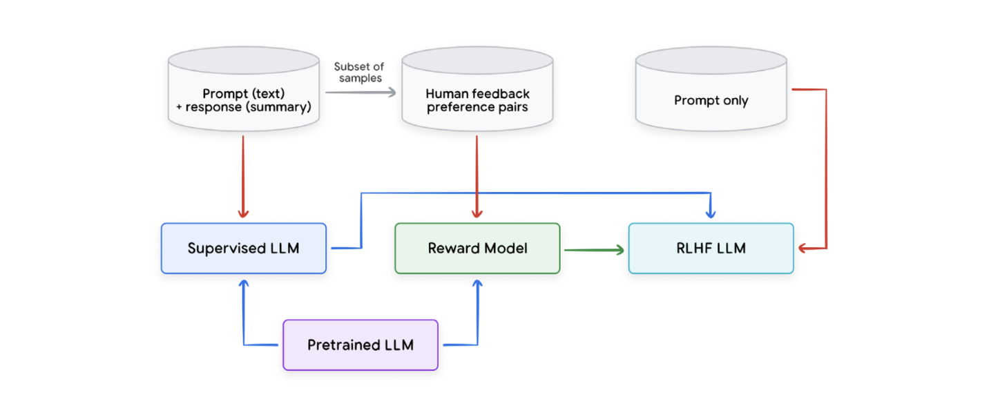

- Start with prompt-response pairs → used to train the **Supervised LLM**.
- A **subset of outputs** is evaluated by humans → forms **preference pairs** → used to train the **Reward Model**.
- The **Reward Model** is used in an RL loop with a model that receives *prompt-only* input → this results in the **RLHF LLM**, which is more aligned with human feedback.


### Extra: AI-Generated Feedback

RLHF can be expensive because human raters are involved. A newer approach is **RLAIF (Reinforcement Learning from AI Feedback)** — where models generate their own preferences to reduce human cost.


## Parameter-Efficient Fine-Tuning (PEFT)

Fine-tuning large LLMs is expensive — but **PEFT techniques** make it cheaper by training **only small parts of the model**. These methods are especially useful after RLHF or for task specialization.

### Popular PEFT Methods:

#### • Adapter-Based Fine-Tuning
- Adds small trainable modules called **adapters** into the model.
- Only the adapter weights are trained.

#### • LoRA (Low-Rank Adaptation)
- Freezes the main model weights.
- Adds small update matrices to approximate changes.
- Efficient to train and deploy.
- **QLoRA**: quantized variant of LoRA for even lower memory use.

#### • Soft Prompting
- Replaces hand-written prompts with **learnable vectors** (aka soft prompts).
- These tokens guide the model, and only they are trained.


### Tradeoff Summary:

| Method            | Performance | Cost  | Memory Use |
|-------------------|-------------|-------|------------|
| Full Fine-Tuning  | Best        | High  | High       |
| LoRA              | Near-best   | Low   | Low        |
| Soft Prompting    | Good        | Very Low | Very Low  |

PEFT methods are especially useful for adapting large models to new tasks *without retraining everything*.


# Using Large Language Models (LLMs)

## Prompt Engineering: Talking to LLMs Like a Pro

LLMs are powerful, but how you talk to them (your *prompt*) seriously affects what they spit out. Prompt engineering is the art of designing those prompts, to make the model **follow instructions**, **be more factual**, or **let its creative freak flag fly**.

There are three popular styles of prompting:

- **Zero-shot prompting**: You just give instructions, no examples.  
  _Example_: "Translate this sentence to French."

- **Few-shot prompting**: You include a few examples (e.g., 3–5) to show the model what you want.  
  _Example_: Show a few country–capital pairs, then ask for a new one.

- **Chain-of-thought prompting**: You walk the model through step-by-step reasoning so it learns how to break down problems.  
  _Example_: Instead of asking “What’s 27 × 42?”, show your math steps for a few other problems first.

Prompt engineering is evolving fast, and the best prompts often require iteration and testing.

---

## Sampling Techniques: How the Model Picks Words

Once the model starts generating, **how it chooses the next word** (token) matters, a lot.

Here’s a tour of the key techniques:

- **Greedy search**: Always pick the highest-probability token. Fast but boring. Tends to loop or repeat itself.
- **Random sampling**: Pick randomly based on probability. Adds surprise (and sometimes nonsense).
- **Temperature**: Scales randomness.  
  - Higher temp (e.g., 1.0+) = more variety, more chaos.  
  - Lower temp (e.g., 0.2) = more focus, less noise.
- **Top-K sampling**: Choose randomly among the top K tokens. K = how deep the candidate pool goes.
- **Top-P sampling (nucleus sampling)**: Instead of a fixed K, choose from a set of tokens that add up to P probability mass (e.g., 0.9). Adapts based on model confidence.
- **Best-of-N sampling**: Generate N outputs, then pick the best one (using logic checks, reward models, etc.). Like letting the model compete against itself.

| **Technique**      | **What It Does**                                                | **DJ**                                                                 |
|-------------------|------------------------------------------------------------------|---------------------------------------------------------------------------------|
| **Greedy Search** | Always picks the highest-probability token                      | DJ stuck on autopilot — plays the #1 song every time. Predictable, boring.     |
| **Random Sampling** | Picks any token based on its probability                       | Wild DJ with no plan — can drop fire or complete chaos.                        |
| **Temperature**   | Controls how random the sampling is (higher = more random)       | DJ mood knob — crank it up for surprises, down for safe sets.                  |
| **Top-K**         | Picks randomly from the top K most likely tokens                 | DJ with a fixed crate of top hits (e.g., Top 20) — focused, but with some spice.|
| **Top-p (nucleus)** | Picks from a dynamic set of tokens covering p% probability     | DJ reads the room — adapts playlist size based on crowd energy.               |
| **Best-of-N**     | Generates N outputs, keeps the best one                         | DJ tries 5 transitions, drops the one that gets the crowd hyped.              |

Smart combos of these + prompt engineering = more **relevant**, **creative**, or **safe** outputs depending on your use case.

---

## Task-Based Evaluation: How to Know if Your LLM App Actually Works

Once you're building real apps with LLMs, you need **custom evaluation**, not just vague “accuracy” scores.

Key ingredients of a solid evaluation strategy:

### 1. **Evaluation Data**  
Forget public leaderboards. You need your own dataset that mimics your real traffic — logs, user feedback, synthetic cases, the works.

### 2. **Development Context**  
You’re not just testing the model; you’re testing **your whole stack**:like RAG pipelines, agent workflows, etc.

### 3. **Definition of “Good”**  
Move beyond exact match or BLEU scores. Think:  
- Does the output meet business needs?  
- Does it follow user instructions?
- Would a human say “yeah, this is good”?

### Evaluation Methods:
- **Traditional metrics**: Good for narrow tasks, bad for creative ones.
- **Human evaluation**: Gold standard. Expensive, but nuanced.
- **LLM-powered autoraters**: Use models to judge model outputs. Fast and scalable¨ but needs calibration against humans.

Bonus: Autoraters can now break down tasks into **subtasks**, evaluate them individually, and give you a full diagnostic report. Think of it as a GPT-powered QA analyst.

---

## Accelerating Inference: Faster Models Without Breaking Them

Bigger LLMs = better results, but also **more cost**, **more latency**, and **more compute hunger**.

Optimizing inference is all about **tradeoffs** and **smart compression**.

---

### Key Tradeoffs

- **Quality vs Latency/Cost**  
  → A tiny loss in quality may give you a massive speed-up.  
  _Use case_: Replacing a huge model with a smaller or quantized one for simple tasks.

- **Latency vs Cost (Throughput)**  
  → Accepting slower individual requests can let you serve way more users for cheaper.  
  _Use case_: Batch processing vs real-time chat.

---

## Quantization: Slimming Down the Model (with Almost No Regret)

Quantization = reducing the precision of numbers used in model weights and activations. From 32-bit floats → 8-bit or even 4-bit integers.

**Why it’s amazing**:
- Less memory = can run bigger models on smaller GPUs.
- Faster math = accelerators love low-precision ops.
- Lower cost = fewer compute cycles, less bandwidth.

**Impact on quality?**  
Surprisingly mild — often negligible. For many tasks, especially simple ones, you won’t even notice the difference. And in cases where you do, the **speed-up usually justifies the drop**.

> Example: A quantized MobileNet ran **2× faster** with only a **2% accuracy drop** on Face Detection.

---

## Bottom Line

Using LLMs efficiently is about knowing how to **talk to them well** (prompts), **sample smartly** (token decisions), **evaluate realistically** (not just with metrics), and **run them lean** (quantization, tradeoffs). It's less about chasing size and more about getting the **best model for your use case** — fast, accurate, and affordable.


## Core Techniques for Efficient LLM Inference

This section breaks down key methods that make large language models faster, cheaper, and smarter during inference — without repeating concepts from earlier sections like sampling or prompt engineering.

---

## Distillation

**Distillation** is about training a smaller, faster model (called the *student*) to mimic a larger, more capable model (the *teacher*). There are several ways to do this:

- **Data distillation**: Use the teacher model to generate extra synthetic training data to boost the student’s performance.
- **Knowledge distillation**: Instead of just copying outputs, the student is trained to match the probability distribution over tokens that the teacher produces. It’s more efficient and requires less data.
- **On-policy distillation**: In reinforcement learning setups, the teacher reviews outputs generated by the student and gives feedback.


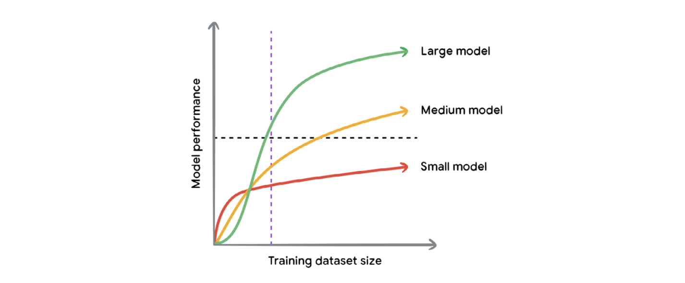

Even with the same data, larger models outperform smaller ones — and distillation helps bridge this gap.

---

## Output-Preserving Methods

These techniques speed up inference **without altering the model’s outputs.**

### Flash Attention

**Flash Attention** speeds up self-attention by minimizing slow memory reads/writes. It restructures the calculation to reduce data transfer between memory layers on GPUs/TPUs (a major source of latency).

- It’s **mathematically identical** to regular attention (exact computation).
- It reduces attention latency by 2–4x.

---

### Prefix Caching

**Prefix Caching** reuses attention key/value scores (`KV Cache`) from previous requests, especially useful in long chats or multi-turn documents.

For example, if a user uploads a long document and asks multiple questions, we don't want to re-process the document each time. We cache that part.

### 📊 Figure: How Prefix Caching Works

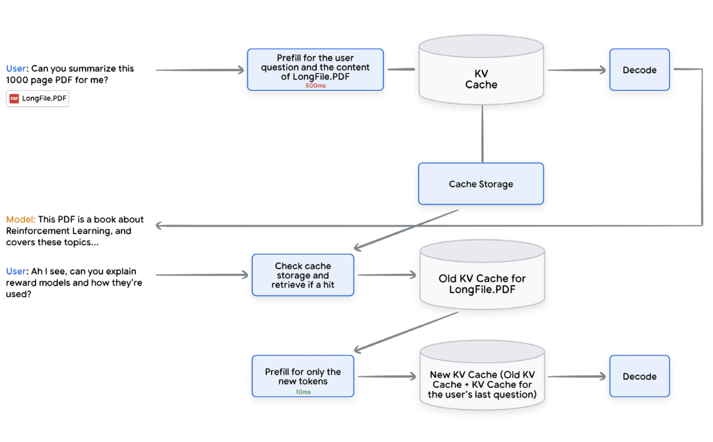

- First question: model reads entire document and stores cache.
- Later questions: only the new user input is processed, saving time.

---

## Speculative Decoding

**Speculative Decoding** speeds up *token-by-token* generation by running a smaller model (the drafter) ahead of the main model:

1. The drafter predicts multiple tokens quickly.
2. The main model checks these tokens in parallel.
3. If they're good, we keep them. If not, we fall back.

This speeds up decoding while preserving output quality.

### Figure: Speculative Decoding Example

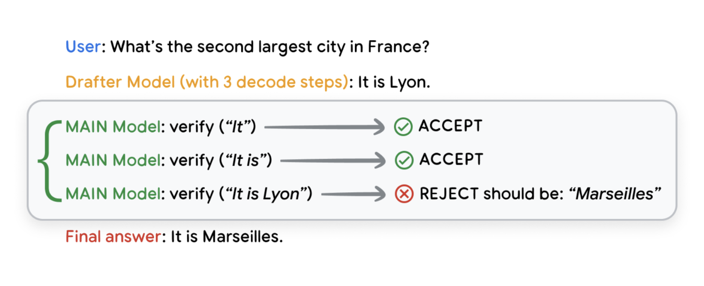

- The drafter guessed "It is Lyon"
- The main model accepts “It is” but rejects “Lyon” and corrects it to “Marseilles”

---

## Batching & Parallelization

Just like in regular software systems, batching and parallelization help LLMs perform faster at scale.

- **Batching**: Handle multiple decode requests together. Efficient use of GPU/TPU memory, especially for chatbots and bulk processing.
- **Parallelism**:
  - *Sequence parallelism*: Split input across devices.
  - *Pipeline parallelism*: Split model layers across devices.
  - *Tensor parallelism*: Split matrix operations inside layers.

These techniques help scale up inference **without rewriting the model.**

---

## Summary of Output Efficiency Techniques

| Technique             | Type                | What It Does                                                      | Preserves Output? |
|----------------------|---------------------|-------------------------------------------------------------------|-------------------|
| Flash Attention       | Output-preserving   | Optimizes self-attention memory access                            | ✅ Yes            |
| Prefix Caching        | Output-preserving   | Reuses attention scores from previous tokens                      | ✅ Yes            |
| Speculative Decoding  | Output-preserving   | Uses fast model to guess ahead, verifies with main model          | ✅ Yes            |
| Distillation          | Output-approximating| Trains a smaller model to act like a bigger one                   | ❌ No             |
