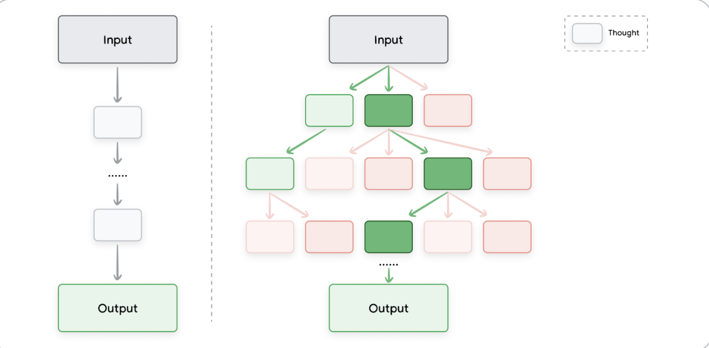

# Prompt Engineering 

> “Prompting is programming.”  
> This whitepaper explores how to craft prompts effectively, configure LLM outputs, and avoid common pitfalls.

---

## Introduction

A **prompt** is the input provided to a Large Language Model (LLM), which then predicts a corresponding output.

- Everyone can write a prompt but writing **effective prompts** is an *iterative process*.
- Prompt quality depends on:
  - The **model** used
  - The model’s **training data**
  - **Configuration settings** (e.g., temperature, top-K)
  - **Prompt wording, tone, structure, and context**

> This whitepaper focuses on prompting the **Gemini model via Vertex AI or API**, where you can configure advanced options like temperature.

---

## What is Prompt Engineering?

LLMs are **prediction engines**. They take a sequence of text as input and predict the next most likely token.

- Prompt engineering is the practice of crafting inputs to guide LLMs toward accurate and helpful outputs.
- Applications include:
  - Summarization
  - Q&A
  - Text classification
  - Translation (natural language or code)
  - Code generation & documentation
  - Reasoning tasks


---

## LLM Output Configuration

Before prompting, you must choose a **model** and configure its **output settings**. When we say “configuring LLM output settings,” we mean **setting parameters that affect how the model generates text**. These are not embedded in the prompt itself, but are passed as additional settings via an API or platform like Vertex AI, OpenAI, etc.

---

### Output Length

- Controls the number of tokens generated.
- More tokens = more compute = higher latency + cost.
- Important for certain prompting techniques like **ReAct**, where extra tokens can add noise.

#### Example ReAct format:
```
Question: What's the weather in Berlin tomorrow?
Thought: I need to look up the forecast for Berlin.
Action: search("Berlin weather tomorrow")
Observation: Sunny, 20°C
Thought: I now have the weather info.
Answer: It will be sunny and 20°C.
```
#### Problem with extra tokens in ReAct

If output length is too long or sampling settings are too loose, the model might:
- Keep generating repetitive thoughts (“I now know the answer… I now know the answer…”)
- Continue hallucinating actions long after the correct answer has been reached

So: **extra tokens = noise**, especially in ReAct where output formatting matters.

```
- Input: "Summarize the following article:" + article_text
- Output: max_tokens = 200 → the model will generate up to 200 tokens in response
```
##### This does not guarantee the output will be 200 tokens long. It simply means “don’t go beyond this length.
> Note: A shorter output length doesn’t make responses more concise, it just cuts them off sooner.

---

### Sampling Controls

LLMs don’t select the next token by simply picking “the best” one. Instead, they generate a **probability distribution** over their entire vocabulary and then **sample** from it based on various settings.

### 📍 Step 1: Model Outputs Logits

When an LLM is predicting the next token, it generates a **logit** (a raw score) for **every token in its vocabulary** — usually ~50,000 tokens.

These scores are not probabilities yet. They're just real numbers like:
```
Paris: 12.6

London: 10.2

Berlin: 8.4

Banana: -4.1
```

### 📍 Step 2: Softmax — Turning Logits into Probabilities

The **softmax function** takes those logits and turns them into a **probability distribution** where:

- Each probability is between `0` and `1`
- All probabilities sum to `1`

Mathematically:
```math
\text{softmax}(z_i) = \frac{e^{z_i / T}}{\sum_j e^{z_j / T}}
```
Where:

( z_i ) = logit for token i

( T ) = temperature (controls sharpness)

At this point, every token in the vocabulary has a probability. Yes, this really happens at every single token generation step!
So if the model generates a 5-token word, it did this whole scoring-sampling process 5 times!

### 📍 Step 3: Top-K and Top-P Sampling

After probabilities are computed, we can filter them before sampling:

### Top-K
- Keep only the top **K tokens** with the highest probability  
- **Example:** `Top-K = 2` means only the 2 most likely tokens survive  

### Top-P (a.k.a. Nucleus Sampling)
- Keep the **smallest set of tokens** whose **combined probability ≥ P**  
- **Example:** `Top-P = 0.7` means include tokens until their total adds up to 70%
Examples:

- `Top-K = 1`: This is just greedy decoding → always pick the single highest one → disables creativity
- `Top-K = 5`: Model only considers the top 5 tokens with highest probability
- `Top-P = 0.95`: Model will include the top tokens whose combined probability mass is at least 95%
- `Top-P = 1`: Includes everything (unfiltered randomness)
- `Top-P = 0.5`: Only high-confidence tokens considered

### Combining Top-K and Top-P
If both are used, we **intersect the two**:

```
Filtered_Tokens = top-K ∩ top-P
```

---

### Example Walkthrough

1. Softmax produces:

| Token     | Probability |
|-----------|-------------|
| Paris     | 0.40        |
| London    | 0.20        |
| Berlin    | 0.10        |
| Tokyo     | 0.08        |
| Weather   | 0.07        |
| …others   | 0.15 (spread across 49,995 tokens) |

2. `Top-K = 2` → Keep only **Paris** and **London**  
3. `Top-P = 0.7` → Need **70% cumulative**:
   - Paris (0.40) + London (0.20) + Berlin (0.10) = **0.70**
   - ✅ **Berlin would have been included**, but **Top-K filtered it out**

> **Order matters!** Most systems apply **Top-K first**, then **Top-P**. Once Top-K filters tokens out, they’re gone forever and Top-P works only on what’s left.

> If Top-P is your primary control, you might want to disable Top-K (or set it very high, like top_k = 1000)
➕ If you want hard creativity limits, use Top-K first


## 📍 Step 4: Temperature — Controlling Randomness

Once we have our filtered list, we sample one token.  
**Temperature** controls how random that sampling is:

| Temperature | Behavior                            |
|-------------|-------------------------------------|
| `0`         | Greedy decoding (always top token)  |
| `0.5`       | Peaky distribution (less diversity) |
| `1.0`       | Balanced creativity                 |
| `2.0`       | Flattened distribution (chaotic)    |

### What does “flattened” mean?

The **softmax curve** changes shape:

- **Low T** → sharp peak = model strongly prefers top token  
- **High T** → flat curve = underdog tokens get a chance  

🎯 So yes — increasing temperature **flattens** the curve, just like stretching a bell curve.  
Probabilities are pulled **closer together**.

## Final Recap

| Concept     | Role                                          |
|-------------|-----------------------------------------------|
| **Logits**     | Raw scores for each token                     |
| **Softmax**    | Converts logits → probabilities               |
| **Top-K**      | Keep top K tokens only                        |
| **Top-P**      | Keep tokens until total prob ≥ P             |
| **Temperature**| Controls how sharply we favor top tokens     |

---
### Yes — All this Happens Every Time You Talk to an LLM

Even for simple answers like:

> **“The capital of France is Paris.”**

The model did **all of the above**, scoring and sampling **~50,000 tokens** at every step:

- “Paris” = 5 tokens → 5 full softmax + sampling operations!

That’s why **LLM inference is expensive**!

---

### Warning: Repetition Loop Bug

**Symptom:** Model gets stuck repeating phrases.

**Causes:**

- Low temperature → over-determinism
- High temperature → over-randomness

**Solution:** Tune temperature, top-K, and top-P to balance determinism and diversity.

---

## Prompting Techniques

LLMs follow instructions better when prompts are **clear and structured**.

---

### General prompting/Zero-Shot Prompting

- No examples
- Just give the model an instruction and an input.
- You don’t show the model how to do the task, you just tell it what to do.

🎬 Example: Zero-Shot Movie Review Classification

| **Name**        | 1_1_movie_classification                                  |
|-----------------|-----------------------------------------------------------|
| **Goal**        | Classify movie reviews as positive, neutral or negative.  |
| **Model**       | gemini-pro                                                |
| **Temperature** | 0.1                                                       |
| **Token Limit** | 5                                                         |
| **Top-K**       | N/A                                                       |
| **Top-P**       | 1                                                         |
| **Prompt**      | Classify movie reviews as POSITIVE, NEUTRAL or NEGATIVE. <br> Review: "Her" is a disturbing study revealing the direction humanity is headed if AI is allowed to keep evolving, unchecked. I wish there were more movies like this masterpiece. <br> Sentiment: |
| **Output**      | POSITIVE                                                  |

### 💡 Quick Explanation: Why “POSITIVE” Fits in 5 Tokens

Even though **"POSITIVE"** has 8 characters, most LLMs tokenize based on **subword units**, not individual letters.

- `"POSITIVE"` is likely **1 token**.
- Token length is **not equal** to character length.
- Average token = ~4 characters in English.

So the output comfortably fits within the **token limit of 5**.
---
### One-Shot & Few-Shot Prompting

When crafting prompts for LLMs, providing examples is a **powerful way to steer model behavior**.

These strategies show the model what kind of output you're expecting, especially when:
- A specific structure or format is needed (like valid JSON)
- The task is complex or unusual

### One-Shot Prompting

> You provide **a single example** of the input and the expected output.

This helps the model learn **by imitation**; it sees one completed case and tries to match that pattern.

#### Example (from the pizza parser):

```text
Prompt:  
Parse a customer's pizza order into valid JSON:

EXAMPLE:  
I want a small pizza with cheese, tomato sauce, and pepperoni.

JSON Response:
{
  "size": "small",
  "type": "normal",
  "ingredients": [["cheese", "tomato sauce", "pepperoni"]]
}
```
A **single example** can already help the model:

- Understand the **output format** (e.g., JSON)
- Learn to **extract structured data** from casual, unstructured text

**Useful when:**

- Output structure is **easy to learn**
- Task is **not overly complex**
- You want to **keep the prompt short**

---

### Few-Shot Prompting

You provide **multiple examples** (typically 3–5) in your prompt.  
This helps the model recognize a pattern and generalize to new inputs.

**Example Prompt:**

```
EXAMPLE:
Can I get a large pizza with tomato sauce, basil and mozzarella?

{
  "size": "large",
  "type": "normal",
  "ingredients": [["tomato sauce", "basil", "mozzarella"]]
}

Now, I would like a large pizza, with the first half cheese and mozzarella.  
And the other half tomato sauce, ham and pineapple.

JSON Response:
{
  "size": "large",
  "type": "half-half",
  "ingredients": [["cheese", "mozzarella"], ["tomato sauce", "ham", "pineapple"]]
}
```

This helps the model:

- Learn **multiple response styles** (e.g., normal vs. half-half pizza)
- **Generalize formatting rules**
- Handle **multi-step or edge case inputs**

**Useful when:**

- You need **consistency** across inputs
- The task is **more complex**
- You want to handle **edge cases**

---

## How Many Examples Should You Use?

| Factor               | Impact                                |
|----------------------|----------------------------------------|
| Task complexity    | More complex → more examples           |
| Input/output variety | More diverse → more examples        |
| Token budget       | Shorter limit → fewer examples         |

**Guidance:**

- Use **3–5 high-quality examples** for most few-shot tasks
- Use **more** if the task is complex
- Use **fewer** if the model has a tight token limit

---

## Prompt Engineering Tips

- Pick **relevant**, **diverse**, and **error-free** examples
- Avoid mistakes, even small ones can **derail** the model
- Include **edge cases** if needed for robustness

**Edge Cases** = uncommon but valid examples  
Example: `"no cheese"` or `"two sauces"`

---

## 💬 Summary Table

| Prompting Style | Example Count | Best For                                 |
|------------------|----------------|-------------------------------------------|
| **Zero-shot**     | 0              | Simple tasks, fast iterations             |
| **One-shot**      | 1              | Teaching the model output format          |
| **Few-shot**      | 3–5+           | Complex tasks, varied input, edge cases   |

Prompt Engineering Techniques - Detailed Overview

This markdown document provides an in-depth overview of advanced prompting techniques used in Large Language Models (LLMs). Each technique is explained with its definition, purpose, advantages, and examples. This summary builds upon the content covered in Google's Prompt Engineering whitepaper (February 2025).

---

## Contextual Prompting

**Definition:**  
Includes background info or previous conversation to tailor the response.

**Example:**

```
Context: You are writing for a retro arcade games blog.
Prompt: Suggest 3 article topics with short descriptions.
```

**Use Case:**  
Improves relevance in multi-turn conversations or creative tasks.

---

## Role Prompting

**Definition:**  
Assigns a persona or role to the model to shape tone/content.

**Example:**

```
Prompt: Act as a travel guide. Suggest 3 places to visit in Amsterdam for someone interested in museums.
```

**Use Case:**  
Tailoring tone, expertise, and stylistic preferences.

---

## Step-Back Prompting

**Definition:**  
Ask the model to generate background knowledge before solving a specific task.

**Example:**

```
Step 1 Prompt: What are 5 interesting settings for a first-person shooter game?
Step 2 Prompt: Write a storyline for one of these settings.
```

**Use Case:**  
Improving reasoning by activating knowledge first.

---

## Chain-of-Thought (CoT) Prompting

**Definition:**  
Encourages step-by-step reasoning.

**Example:**

```
Prompt: When I was 3, my partner was 3 times my age. I am now 20. How old is my partner? Let's think step by step.
```

**Output:**  
Step-by-step logic leading to the correct answer.

**Use Case:**  
Math, logic, and reasoning-heavy tasks.

---

## Self-Consistency

**Definition:**  
Generate multiple CoT responses and select the most common answer. Imagine asking 10 different people the same math puzzle. You take the most common answer.


**Steps:**

1. Generate N CoT completions  
2. Extract answers  
3. Select the most frequent answer

**Use Case:**  
Improves accuracy and stability over single deterministic output.

---

## Tree of Thoughts 🌳 

**Definition:**  
Generalizes CoT by exploring multiple reasoning paths in a tree structure. Imagine 1 smart person solving a puzzle by trying many paths. At each step, they backtrack, evaluate partial ideas, and choose the best path to move forward.

⸻


**Use Case:**  
Search, planning, complex decision-making.

**Visualization:**  
- CoT: Linear  
- ToT: Branching

---

## ReAct Prompting (Reason + Act)

**Definition:**  
Combines reasoning steps with actions (e.g., search, API call).

**Example:**

```
Reason: I need to find how many children James Hetfield has  
Act: Search  
Observe: 3  
Reason: 1/4 done  
Repeat...
```

**Use Case:**  
Tool-using agents, active environments.

---

## Automatic Prompt Engineering (APE)

**Definition:**  
Use LLMs to generate and refine prompts.

**Steps:**

1. Generate prompt candidates  
2. Score/evaluate  
3. Select best-performing one

**Use Case:**  
Scaling high-quality prompt generation.

---

## Code Prompting 💻 

**Code Writing**

```
Prompt: Write a Bash script that renames all files in a folder by prepending "draft_"
```

**Code Explaining**

```
Prompt: Explain the following Bash code: ...
```

**Code Debugging**

```
Prompt: This code errors with `NameError: 'toUpperCase' is not defined`. Help fix it.
```

**Code Translating**

```
Prompt: Convert this Bash script into Python.
```

**Use Case:**  
Supporting developers with writing, understanding, or translating code.

---

## Best Practices

- Provide high-quality examples (few-shot)
- Be specific about output format
- Prefer instructions over vague constraints
- Set token length limits
- Use variables/placeholders for reusable prompts
- Mix examples to prevent overfitting
- Document all prompt iterations
- Use structured outputs (e.g., JSON)

---

## Summary of Techniques

| Technique            | Purpose                                      |
|----------------------|----------------------------------------------|
| Zero-Shot            | Direct task, no examples                     |
| One-Shot             | Single example included                      |
| Few-Shot             | Multiple examples, more accuracy             |
| System Prompting     | Define format/constraints                    |
| Role Prompting       | Set tone/persona of model                    |
| Contextual Prompting | Provide task-related background              |
| Step-Back Prompting  | Activate background before solving           |
| Chain-of-Thought     | Step-by-step reasoning                       |
| Self-Consistency     | Vote on multiple CoT outputs                 |
| Tree of Thoughts     | Explore reasoning branches                   |
| ReAct Prompting      | Combine reasoning with actions               |
| APE                  | Auto-generate & refine prompts               |
| Code Prompting       | Write, debug, explain, or convert code       |