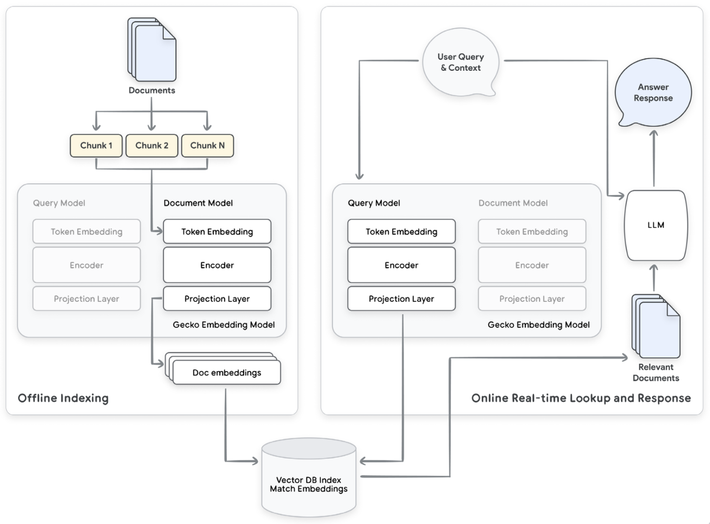
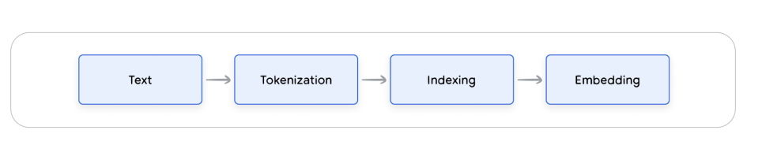
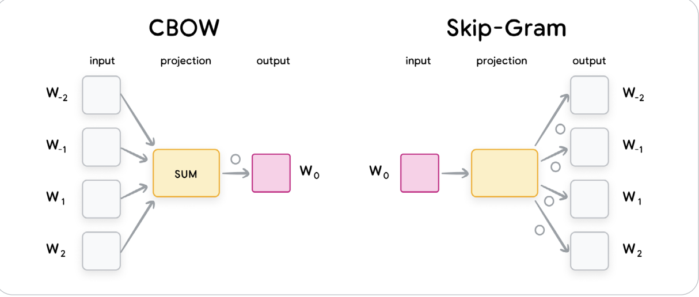
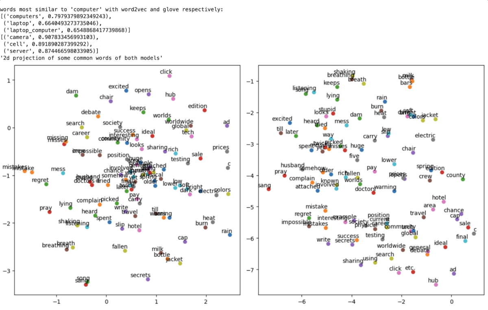

## What Are Embeddings?

Embeddings are **numerical representations** of real-world data, such as:
- Text
- Speech
- Images
- Videos

They map complex, high-dimensional data into **low-dimensional vectors** (e.g., BERT maps a sentence into a 768-dimensional vector).


## Intuition Behind Embeddings

- Let's think of **latitude and longitude**:  
  A real-world location gets mapped to two numbers → a 2D vector.  
  Similarly, a sentence or image gets mapped to a fixed-size vector.

- In this new vector space:
  - Similar objects are **closer together** (e.g., "computer" and "laptop")
  - Dissimilar ones are **far apart** (e.g., "computer" and "car")

---
## Tokenization: How Text Gets Broken Down

Before turning text into vectors, it has to be **tokenized**. A *token* is a small unit of meaning, usually:

- A **word** (classic NLP)
- A **subword** (e.g. "running" → "runn", "ing")
- Even a **character** or **byte**

### Why Subwords?

Words like:
- "playing"
- "played"
- "playful"

All share the root "play" → So, subword tokenizers (like BPE) say:
> "Let me store 'play' once and reuse it."

This cuts down vocab size dramatically (maybe 30K instead of 100K+), while still letting us understand *novel words*

---

## 🔠 One-Hot Encoding: The “Before Embeddings” Era

Imagine a super naive way to represent words:  
Give every word in your vocabulary, a big old binary vector with a **1** in its own spot, and **0** everywhere else.

You have a vocabulary (let’s say of size 50,000) — a list of every word your model knows.
Index 0 = “a”
Index 1 = “apple”
Index 2 = “banana”
…
Index 742 = “cat”
…
Index 49,999 = “zebra”
When the word “cat” appears, we create a vector
`[0, 0, 1, 0, ..., 0]` = This word is ‘cat’, which is the 742nd word in my vocab.
For another word, let's say "dog" → `[0, 0, 0, 1, ..., 0]`
Our vectors are each 50,000-dimensional.

If we want to represent a sentence, we build up using the vocab:
We don’t one-hot encode the whole sentence as a single vector.
We one-hot encode each word individually based on the vocabulary and tokenize that into 3 words:
“the” → [1, 0, 0, ..., 0]
“cat” → [0, 0, 1, ..., 0]
“sleeps” → [0, 0, 0, ..., 1]
Then the sentence is represented as a matrix:
<pre>
[
 [1, 0, 0, ..., 0],
 [0, 0, 1, ..., 0],
 [0, 0, 0, ..., 1]
]
</pre>
So if our vocab is size V and our sentence has T tokens, the sentence becomes a matrix of shape: 
3×50,000 matrix

> 🧨 Problem: This is **sparse** (mostly zeros), **huge**, and **dumb** — it treats all words as completely unrelated.

It gets worse:
- You can’t know that "cat" and "dog" are similar
- And "cat" and "keyboard" are just as far apart

One-hot is like everyone sitting alone at their own table in a cafeteria.  
Embeddings are when similar people **start sitting together**, sharing vibes and snacks.

---

## 📏 Embedding Geometry: Distance & Similarity

### Key Intuition:
> "Things that **mean the same** should be **near each other** in vector space."

### Common Distance Metrics:


### Why Cosine Is Often Better

- Two embeddings may have different magnitudes due to length, emphasis, etc.
- But we care about **meaning**, not intensity
- Cosine similarity lets us compare **semantic direction**

---

## Modalities: Multisensory Magic

**modality** = a *type of data you can perceive*.

| Modality | Example |
|----------|---------|
| **Text** | "Pizza is life."|
| **Image** | A photo of a pizza |
| **Audio** | Someone saying “Pizzaaa” |
| **Video** | A TikTok of someone eating pizza |
| **Touch (maybe)** | Vibration data from a smartwatch |

> Humans are naturally **multimodal**.  
> You see, hear, and read simultaneously and fuse it all into one vibe.  
> Multimodal AI is trying to **replicate this**.

---

## What Are Multimodal Embeddings?


The top-left box is the Video space. Embeddings like x1, x2, x3 are outputs of a video encoder f_x
The bottom-left box is the Text space. Embeddings like y1, y4 come from a text encoder f_y
Each encoder processes data in its own way, but they both output fixed-size vectors.

Mapped into the Same Embedding Space

Using learned functions f_x and f_y, these representations are:
- Projected into a shared vector space
- So now we can directly compare their positions: like x2 vs. y1
This shared space is like a semantic coordinate system, where closeness = related meaning.
- Positive (similar meaning) = pull together
- Negative (different meaning) = push apart


> "Find me a video that matches this text."  
> "Show me pictures that sound like this audio clip."

Behind the scenes:
- A **text encoder** turns text into a vector  
- An **image encoder** turns an image into a vector  
- A **projection layer** aligns them both to the *same space*

Then we use good old **cosine similarity** to compare and match!

---
## Why You Need Labeled Datasets

To evaluate if an embedding model retrieves the **right documents**, we need to **already know what “right” means**.
That’s where **labeled datasets** come in, datasets where:
- ✅ Each **query** (like a question) has a list of **relevant documents**
- ❌ And a bunch of documents that are **not relevant**
  
Example:
<pre>
{
  "queries": {
    "q1": "What are the symptoms of diabetes?",
    "q2": "How can I treat high blood pressure?"
  },
  "documents": {
    "d1": "Common symptoms of diabetes include frequent urination, fatigue, and blurred vision.",
    "d2": "High blood pressure can be treated with lifestyle changes and medications.",
    "d3": "Heart disease is the leading cause of death worldwide."
  },
  "relevance": {
    "q1": ["d1"],
    "q2": ["d2"]
  }
}
</pre>
> Like having an answer key when grading a test.


When your embedding model returns ranked lists for each query:
- You check whether d1 is near the top for q1
- You check whether d2 is near the top for q2
- You penalize if d3 is returned (false positive)

### Example: NFCorpus (Natural Questions Corpus for health-related queries)

- Comes with real human-labeled relevance judgments
- We can then evaluate:  
  > Did our model retrieve the correct answers?

---

## Precision vs Recall — Let’s Get Clear

### Precision

> “Of the documents we retrieved, how many were actually relevant?”

**Formula**:
```plaintext
Precision@K = (Number of relevant docs retrieved) / (Total docs retrieved)
```

**Example**:
- You retrieve 10 documents
- 7 are actually useful
→ Precision@10 = 7/10 = **0.7**

---

### Recall

> “Of all the relevant documents that exist, how many did we manage to find?”

**Formula**:
```plaintext
Recall@K = (Number of relevant docs retrieved) / (Total relevant docs in the dataset)
```

**Example**:
- There are 14 relevant documents total
- You retrieved 7 of them
→ Recall@10 = 7/14 = **0.5**

---

## nDCG — Because Order Matters

Sometimes, **all retrieved results are relevant**, but we still care **how they’re ordered**.
> You want the most relevant one **on top**, because users don’t scroll forever. 

Imagine you’re a YouTube recommender:
- nDCG@5 = Did you show the 5 best videos, in the best order?
- If the best video is at position 5 (not 1), DCG drops, nDCG drops

### How nDCG Works
1. **Calculate DCG (Discounted Cumulative Gain)**:
2. **Calculate Ideal DCG (iDCG)**: What DCG would be *if your results were perfectly ordered*
3.  **Normalize it**:
```plaintext
nDCG = DCG / iDCG
```
 nDCG ranges from **0.0 to 1.0**
- 1.0 = perfect order
- Closer to 0 = bad ranking
```plaintext
DCG@p = rel₁ + (rel₂ / log₂(2)) + (rel₃ / log₂(3)) + ...
```
Example:

You search
> **"How to reduce stress naturally?"**

You’re comparing two things:

✅ What your model actually retrieved and how it ranked them
→ This gives you the DCG

🏆 The best possible ordering of the same documents
→ This gives you the Ideal DCG (iDCG)

#### Final Step:
```
nDCG@5 = DCG@5 / iDCG@5
````

Let's say our model returns **5 documents**. A human annotator rates their **relevance** like this:

| Rank | Document ID | Relevance Score |
|------|-------------|-----------------|
| 1    | D7          | 3 (Perfect match) |
| 2    | D2          | 2 (Pretty good) |
| 3    | D4          | 0 (Not relevant) |
| 4    | D9          | 1 (Slightly relevant) |
| 5    | D1          | 2 (Good but buried) |

#### Compute DCG@5 (The DCG score considering only the top 5 results returned by the model)

Using the formula:
```math
DCG@5 = rel₁ + (rel₂ / log₂(2)) + (rel₃ / log₂(3)) + (rel₄ / log₂(4)) + (rel₅ / log₂(5))
```

Plug in values:
```math
DCG@5 = 3 + (2 / log₂(2)) + (0 / log₂(3)) + (1 / log₂(4)) + (2 / log₂(5)) ≈ 0.86
```

```math
DCG@5 ≈ 3 + 2 + 0 + 0.5 + 0.86 = **6.36**
```

### Now Compute Ideal DCG (iDCG@5)

Let’s assume the best possible ranking would be:
- [3, 2, 2, 1, 0] ← highest scores at top

Then:
```math
iDCG@5 = 3 + (2 / log₂(2)) + (2 / log₂(3)) + (1 / log₂(4)) + (0 / log₂(5)) = 0
```

```math
iDCG@5 ≈ 3 + 2 + 1.26 + 0.5 + 0 = **6.76**
```

---

### Final nDCG@5 Score

```math
nDCG@5 = DCG@5 / iDCG@5 = 6.36 / 6.76 ≈ **0.94**
```

Your model got **94% as close to perfect** as it could for this query!

- Higher rank = higher weight
- Later positions are discounted
---

## Benchmarks You Should Know

### BEIR — Benchmark for Evaluation of Information Retrieval
- Collection of 18+ retrieval tasks
- Domains: bio, legal, news, Reddit, FAQs, etc.
- Used to compare retrieval models side by side

> Your model might score:  
> nDCG@10 = 0.65  
> Recall@50 = 0.72

---

### MTEB — Massive Text Embedding Benchmark
- Tests more than just search!
- Covers 8 task types:
  - Classification
  - Clustering
  - Reranking
  - Bitext mining
  - Semantic similarity
  - and more...

> It’s the go-to for evaluating **general-purpose embedding models**

---

### TREC — The OG of Retrieval Evaluation
- One of the oldest and most trusted retrieval evaluation conferences
- Known for high standards
- You can score models using:
  - `trec_eval` (CLI)
  - `pytrec_eval` (Python)

---

## Search with Embeddings (RAG Style)

Here's how **Retrieval-Augmented Generation** (RAG) works:

### Phase 1: Indexing

- Documents → broken into **chunks**
- Each chunk gets embedded using `RETRIEVAL_DOCUMENT` model
- Stored in a **vector DB** (like FAISS)

### Phase 2: Query Time

- User asks a question
- Embed the query using `RETRIEVAL_QUERY` model
- Find nearest chunks in the DB (via cosine/Euclidean)
- Pass top chunks to an LLM → generate a great answer

> This phase must be FAST — users are waiting

---

## Siamese vs Dual Encoders

This section gives you the complete mental model, differences, use cases, and training breakdown between **Siamese** and **Dual Encoders**, including common architecture patterns like **single-stream** and **RAG-style retrieval systems**.

## What is a Single-Stream Neural Network?

A **single-stream** model is the most classic neural net flow:

- Neural networks take input → process through layers → output
- Backpropagation adjusts weights to minimize a loss
- Typically, one model is trained end-to-end (like a classifier or regressor)


### Example: Sentiment Classification
```plaintext
Input: "I love this phone!"
      ↓
[ BERT Encoder ]
      ↓
Output: 🔵 Positive
```

- No pairwise comparison
- Uses standard classification loss (e.g., cross-entropy)

But now… in dual encoders for retrieval:

A system that takes a query, find top-k most relevant documents using a vector similarity search from your vector DB, and passes them to an LLM (final step in a RAG pipeline), like this:
```
PROMPT to LLM:

You are a helpful assistant. Based on the following documents, answer the question:

Documents:
- Fasting reduces insulin levels.
- Cellular repair is enhanced during fasting.

Question:
What are the benefits of intermittent fasting?

Answer:
```
###### The LLM uses this retrieved evidence to generate a factual, grounded answer.

#### But to do that, we need:
- All documents stored as vectors
- Incoming queries to also be turned into vectors
- A way to compare them via vector similarity

Which brings us to two emthods of embedding:

## Siamese Encoder

> “Use the **same encoder** with shared weights for both inputs.”

- Great for **symmetric** tasks (inputs have similar structure)
- Embeds two things using the same neural network, then compares them

### Example:
- Input A: "Dogs are friendly pets"
- Input B: "Canines make great companions"

```plaintext
A ---> [Encoder] ---> Embedding A
B ---> [Encoder] ---> Embedding B
Similarity = cosine(Embedding A, Embedding B)
```

### Use Cases:
- Semantic Textual Similarity (STS)
- Duplicate question detection
- Paraphrase mining

---

## Dual Encoder

> I have two neural networks. I give each their own input. I want their outputs to be close (or far). Just like in classification where you backprop through one model, here, you backprop through two separate (but coordinated) models

#### In classic classification:
```
Input → [Neural Net] → Output → Loss → Backprop (one model)
```
#### In Dual Encoder training:
````
Input 1 → [QueryEncoder]   → Vector 1  
Input 2 → [DocEncoder]     → Vector 2  
           ↓
Compare (similarity) → Loss → Backprop to *both* encoders
````
They are co-trained, meaning:
- They’re trained in sync using the **same contrastive loss**
- You compute **similarities** between (query, pos_doc, neg_doc)
- You backpropagate into **both** encoders

But they remain separate networks with their own parameters.

- Ideal for **asymmetric** tasks (like query ↔ document)
- Each encoder learns to specialize in its input type

### Example: Search
- Query: "Best ways to reduce stress"
- Document: "Studies show that meditation reduces cortisol..."

```plaintext
Query ---> [Query Encoder] ---> q_vec
Doc   ---> [Doc Encoder]   ---> d_vec
Similarity = cosine(q_vec, d_vec)
```
In code:

```python
q_vec = QueryEncoder(query)
d_pos_vec = DocEncoder(relevant_doc)
d_neg_vec = DocEncoder(irrelevant_doc)

sim_pos = cosine(q_vec, d_pos_vec)
sim_neg = cosine(q_vec, d_neg_vec)

loss = max(0, margin - sim_pos + sim_neg)
```
---

## Online vs Offline Embedding
In RAG systems:
- Often the document encoder is precomputed and stored in a vector DB (offline)


| Phase     | What Happens                        | Done When? | Speed |
|-----------|-------------------------------------|------------|-------|
| **Offline** | Embed all documents once and store in a vector DB  | Before query time | Slow but done once |
| **Online**  | Embed the query live, search DB for similar docs | During query time | Fast |

This is the **heart of RAG** (Retrieval-Augmented Generation):
1. Offline: docs → embeddings → vector DB
2. Online: query → embedding → find matches → send to LLM

- You may or may not train the query encoder, depending on your goal

### Option A: Use a pretrained query encoder

→ Great if your queries are general and you’re fine with generic semantic search

Just load a model like sentence-transformers/all-MiniLM-L6-v2 or a Google Vertex API.


### Option B: Fine-tune the query encoder

You customize the QueryEncoder (sometimes along with the DocEncoder) on your own data.

→ Useful if:

- You have domain-specific language (e.g. legal, medical, dev)
- You want to align the query encoder more tightly with the doc encoder

⸻


### Diagram: Dual Encoder RAG Flow with Offline Indexing + Online Retrieval

This diagram shows how a dual encoder architecture powers a RAG pipeline using the Gecko embedding model. On the **left**, documents are preprocessed and split into chunks, which are passed through the **Document Encoder** to produce vector embeddings stored in a **Vector Database** — this happens **offline** or ahead of time.

On the **right**, a **Query Encoder** processes incoming user queries in real-time. The resulting query embedding is matched against stored vectors to retrieve semantically similar documents. These documents are then passed to a **Large Language Model (LLM)**, which generates a grounded and contextually relevant answer.

 Key components:
- Dual encoder setup (query + doc models)
- Offline document embedding for fast lookup
- Online query embedding + similarity search
- RAG architecture with LLM response generation



## From Text to Embedding: Tokenization, Indexing, and One-Hot
> ## 🧭 Setting the Stage: Encoders vs Embeddings
> Before we dive into **types of embeddings**,  it’s important to draw a clear line between two closely related but very different concepts:
>
> - **Encoders** (like Dual or Siamese) are the **architectures** that generate embeddings.
> - **Embeddings** are the **outputs**: Dense vectors that capture the meaning of data.
> 
> No matter which encoding path you take, the destination is an embedding.
The difference lies in how you get there, and what task you’re solving.
>
>Embeddings aim to create **low-dimensional representations** of complex data (like text, images, etc.) while preserving the **semantic meaning**. For text data, this process starts long before embeddings are applied: it begins with **tokenization**.

---

## Pre-Embedding Text Lifecycle

```plaintext
Text → Tokenization → Indexing → Embedding
```

1. **Text**: Raw string input from user.
2. **Tokenization**: Split into smaller pieces (tokens). Can be:
   - Words
   - Wordpieces (subwords like "play", "##ing")
   - Characters
   - Punctuation
3. **Indexing**: Each token is assigned a unique integer (Token ID).
4. **Embedding**: These IDs are converted into dense vector representations.

---

## Example: One-Hot Encoding with TensorFlow

Below is a real example of turning text into token IDs and then one-hot encoding:

```python
from tensorflow.keras.preprocessing.text import Tokenizer

data = [
  "The earth is spherical.",
  "The earth is a planet.",
  "I like to eat at a restaurant."
]

tokenizer = Tokenizer(num_words=15, filters='!"#$%&()*+,-./:;<=>?@[\\]^_`{|}~\\t\\n', lower=True, split=' ')
tokenizer.fit_on_texts(data)

ID_sequences = tokenizer.texts_to_sequences(data)
binary_sequences = tokenizer.sequences_to_matrix(ID_sequences)

print("ID dictionary:", tokenizer.word_index)
print("ID sequences:", ID_sequences)
print("One-hot encoded sequences:", binary_sequences)
```

### Output:
```plaintext
ID dictionary:
{'the': 1, 'earth': 2, 'is': 3, 'a': 4, 'spherical': 5, 'planet': 6, 'i': 7, 'like': 8, 'to': 9, 'eat': 10, 'at': 11, 'restaurant': 12}

ID sequences:
[[1, 2, 3, 5], [1, 2, 3, 4, 6], [7, 8, 9, 10, 11, 4, 12]]

One-hot encoded sequences:
[[0. 1. 1. 1. 0. 1. 0. 0. 0. 0. 0. 0. 0.]
 [0. 1. 1. 1. 1. 0. 1. 0. 0. 0. 0. 0. 0.]
 [0. 0. 0. 0. 1. 0. 0. 1. 1. 1. 1. 1. 1.]]
```

---

## ⚠️ The Problem with One-Hot

- Each token is represented by a **sparse** vector (mostly zeros)
- There’s **no sense of similarity** between words (e.g., “earth” and “planet” are just different 1s)
- Token IDs are **arbitrary**, not semantically informed

This is why **embeddings** are a huge leap forward. They:
- Give you **dense vectors** (e.g., 300-d or 768-d)
- Capture **semantic relationships** between tokens
- Allow **meaningful distance/similarity calculations**

---

## Key Concepts

| Step        | What Happens                              | Why It's Important |
|-------------|-------------------------------------------|--------------------|
| Tokenization| Break text into parts                     | Enables numerical processing |
| Indexing    | Assign integer IDs to tokens              | Makes them machine-readable |
| One-hot     | Sparse binary vectors                     | Simple but no semantics |
| Embeddings  | Dense semantic vectors                    | Compact, meaningful, and powerful |

---
# Word Embeddings: Classic Techniques That Shaped NLP

Before today's context-aware language models like BERT and GPT, NLP used **context-free word embeddings**: dense, fixed-length vectors representing words regardless of their context.

Each word is mapped to a vector of real numbers (usually 100–300 dimensions). These embeddings sit in a high-dimensional space and are trained to capture semantic meaning.

These numbers aren’t manually assigned. They are learned from large corpora—massive text dumps from Wikipedia, books, and web pages—by training models like Word2Vec and GloVe to observe:
- Which words appear near each other
- What patterns exist in how words are used

---

## Anatomy of a Word Vector

Let’s say we train a model like Word2Vec or GloVe. The word “queen” might be assigned a vector like:

```
"queen" → [0.30, 0.16, 0.96, ..., (300 total numbers)]
```

This means:  
- The word “queen” is represented by 300 numbers  
- So is every word in the vocabulary  
- These vectors are what we call **embeddings**

> Why 300?  
> 300 is a common size. Bigger vectors allow more nuance, but require more training data.

---

## The Embedding Matrix

If you create vectors for every word in your vocabulary, you get a large table:

| Word   | Embedding (300 numbers)        |
|--------|-------------------------------|
| the    | [0.01, -0.22, 0.16, …]        |
| brown  | [-0.14, 0.33, 0.07, …]        |
| fox    | [0.27, 0.11, 0.91, …]         |
| woman  | [0.24, 0.15, 0.93, …]         |

This matrix is updated during training and becomes a lookup table that maps each word to its embedding.

---

## Classic Algorithms for Word Embeddings


## 🧭 Word Embedding Models: Summary Table

All of the following models are designed to **learn an embedding matrix** — a lookup table of dense word vectors. They differ in *how* they learn those vectors.

| Model     | Training Method(s)         | What It Learns               | Used In                            |
|-----------|----------------------------|------------------------------|-------------------------------------|
| **Word2Vec** | CBOW or Skip-Gram (predictive learning) | Embedding matrix via a shallow neural net | NLP pipelines, initialization for larger models, semantic similarity, search |
| **GloVe**    | Matrix factorization on global word co-occurrence counts | Embedding matrix via global statistics | Semantic analysis, word analogy tasks, downstream ML models |
| **SWIVEL**   | Parallel matrix factorization + loss for missing pairs | Embedding matrix optimized for distributed systems | Fast training on large corpora, rare word representation |

### Notes:
- All of these models result in a **pretrained embedding matrix** of shape `(vocab_size × embedding_dim)`
- These embeddings are often used as **inputs to deep learning models**, or for tasks like:
  - Text classification
  - Sentiment analysis
  - Named entity recognition
  - Search/retrieval
  - Clustering and topic modeling


| Model     | Key Idea | Best For |
|-----------|----------|----------|
| Word2Vec  | A word’s meaning is defined by its neighbors | Fast, small datasets |
| GloVe     | Combines global co-occurrence statistics with local context | Better semantic coverage |
| SWIVEL    | Like GloVe, but optimized for parallel training | Rare words, distributed training |

---

## Word2Vec: Training Methods

Word2Vec uses two strategies to learn embeddings from massive unlabeled text:
- CBOW (Continuous Bag of Words)
- Skip-Gram

### CBOW

CBOW is a simple feedforward neural network that learns word vectors by predicting a target word from its surrounding context.

Training is self-supervised:
- No labels or annotations
- Just raw text

#### Example Task

Sentence:
```
"The brown fox jumps over the fence"
```

- Target word: `"fox"`
- Context window (size 2): `["the", "brown", "jumps", "over"]`

---

### What Happens During CBOW Training

1. **Look up embeddings** for context words  
   These are initialized randomly:

```
"the"   → [0.01, -0.22, 0.16, ...]
"brown" → [-0.14, 0.33, 0.07, ...]
...
```

2. **Average the context vectors**:

```python
context_vector = average(["the", "brown", "jumps", "over"])
```

3. **Pass through a softmax layer** over the vocabulary  
   This gives a probability for each possible target word.

4. **Update the model**  
   If it guessed the wrong word, the model adjusts:
   - The vectors for the context words
   - The softmax prediction weights

This process is repeated across millions of examples.

---

### What Are We Training?

We’re training:

1. **The Embedding Matrix**
   - A `(vocab_size × embedding_dim)` table
   - Each row is a learnable word vector

2. **The Prediction Weights**
   - The softmax classifier that predicts the target word

These are updated by backpropagation using cross-entropy loss.

---

### Why This Works

Over time:
- Words used in similar contexts move closer in vector space
- Vector math becomes possible:

```
"king" - "man" + "woman" ≈ "queen"
```

The difference vector (king - man) captures “royalty minus male,” and adding “woman” gives you “queen.”

---

### Skip-Gram

Skip-Gram is the inverse of CBOW: 
Instead of predicting the center word from context, we use the center word to predict its context words.

- Slower to train
- Better for rare words
- Useful for small datasets



## Example: The Skip-Gram Task

Given the sentence:
```
"The brown fox jumps over the fence"
```

Target word: `"fox"`  
Window size = 2 → Context words: `["brown", "jumps", "the", "over"]`

So, the Skip-Gram model will take `"fox"` and try to predict:
- `"brown"`
- `"jumps"`
- `"the"`
- `"over"`

## What Actually Happens Inside?

### Step 1: Look up embedding for the center word

```plaintext
"fox" → [0.27, 0.11, 0.91, ...]
```

This is the input vector.

### Step 2: Predict the context words

This vector goes into a **softmax layer** that outputs scores for every word in the vocabulary.

The model tries to assign high probabilities to each of the actual context words.


### Step 3: Compute the loss

For every actual context word (e.g., "jumps"):
- If the model assigns a high score → ✅ good!
- If it assigns a low score → ❌ loss increases

This process is repeated for all context words of the target word.

### Step 4: Backpropagation

The model updates:
- The embedding of the **center word**
- The **prediction weights** to better capture context

---
## Word2Vec Embeddings in Action

- Embeddings start as random vectors
- Trained using a sliding window
- After training:
  - You can find nearest neighbors
  - Use embeddings in downstream models
  - Visualize them using dimensionality reduction



---

## GloVe: Global Vectors for Word Representation

GloVe is a model for learning **word embeddings** that captures both:
- **Local context** (like Word2Vec)
- **Global statistics** (unlike Word2Vec)

The key idea is:
> Words that occur in similar contexts should have similar vector representations and we can learn this from a giant word-word co-occurrence matrix.

## Step-by-Step: How GloVe Works

### 1️⃣ Build a Co-occurrence Matrix

From a large corpus, count how often word pairs appear near each other.

```
"The cat sat on the mat"
```

Co-occurrence matrix:

|       | the | cat | sat | on | mat |
|-------|-----|-----|-----|----|-----|
| the   |  0  |  1  |  1  | 1  |  1  |
| cat   |  1  |  0  |  1  | 0  |  0  |
| sat   |  1  |  1  |  0  | 1  |  0  |
| on    |  1  |  0  |  1  | 0  |  1  |
| mat   |  1  |  0  |  0  | 1  |  0  |

### What Actually Goes Into the Co-occurrence Matrix?

The co-occurrence matrix in GloVe has:
- **Rows**: Every word in the vocabulary
- **Columns**: Every word in the vocabulary  
So it's a full square matrix of shape `vocab_size × vocab_size`.

> But not every word co-occurs with every other word.

With `window size = 2`, for each word in a sentence, we only update counts for the 2 words before and after it.

#### Example:
In the sentence:
```
"The cat sat on the mat"
```
With window size = 2, the word `"cat"` has `"the"` and `"sat"` as context. So:

- `cooccur["cat", "the"] += 1`
- `cooccur["cat", "sat"] += 1`

We **do not** update:
- `cooccur["cat", "on"]`
- `cooccur["cat", "mat"]`
- `cooccur["cat", "cat"]`

> Just because "cat" appears as both a row and column doesn’t mean it’s compared to itself — unless it’s actually near itself in the text (like `"cat cat"`).

Most cells in the matrix are **zero**, especially for large vocabularies.

### 2️⃣ Learn Vectors via Matrix Factorization

GloVe learns:
- A vector for each word: `w_i`
- A context vector: `w_j`
- Bias terms: `b_i`, `b_j`

The objective:
```
dot(w_i, w_j) + b_i + b_j ≈ log(X_ij)
```

Where:
- `X_ij` = number of times word j appeared in context of word i
- `dot(w_i, w_j)` = similarity between the two word vectors

>The dot product between two vectors is highest when:
> - They point in the same direction
> - They’re long (large values)
> 
> So GloVe learns vectors that point in the same direction if words frequently co-occur — and diverges them otherwise.

### 3️⃣ Define a Loss Function

GloVe minimizes:
```
L = ∑ f(X_ij) * (dot(w_i, w_j) + b_i + b_j - log(X_ij))²
```

Where `f(X_ij)` is a weighting function that:
- Down-weights rare word pairs
- Avoids overweighting very frequent pairs

>For every pair of words that co-occur, try to make the dot product of their vectors match the log of how often they co-occur. Penalize the model when it gets this wrong

## What Makes GloVe Different?

| Model     | Core Idea                       |
|-----------|----------------------------------|
| Word2Vec  | Predict target from context      |
| GloVe     | Factorize co-occurrence matrix   |

GloVe uses **global word statistics**, not just local prediction tasks.

## Practical Benefits

- Fast to train on large corpora
- Embeddings capture **linear semantic relationships**
- Often used for:
  - Semantic similarity
  - Word analogy tasks
  - Downstream NLP models

> Example:
> `"king" - "man" + "woman" ≈ "queen"`
---

## SWIVEL: Fast & Parallel Embedding Training

SWIVEL stands for **Skip-gram Word Embedding with Vectors from a Low-rank approximation**.  
It builds on GloVe’s ideas but focuses on **scaling word embeddings to huge datasets** quickly and efficiently.

---

## 🧠 Core Idea

Like GloVe, SWIVEL uses a **co-occurrence matrix**.  
But it introduces two major innovations:

1. **Parallelizable training** using matrix sharding
2. A smart way to handle **missing co-occurrence entries** (when two words never appear together)


### 1️⃣ Matrix Sharding

- The full co-occurrence matrix is split into small submatrices (shards)
- Each shard contains a subset of words and contexts
- These can be processed **independently and in parallel**, across many machines or cores

This allows SWIVEL to **scale easily** on big datasets.

### 2️⃣ Handles Missing Pairs Gracefully

In real corpora, most word pairs **never occur together**.  
These are called **unobserved co-occurrences**.

GloVe ignores them. SWIVEL **uses them** to learn better representations.

It does this using a **piecewise loss function**:
- If a pair is observed → use squared loss (like GloVe)
- If a pair is unobserved → apply a different loss that encourages neutral similarity

This means it avoids overfitting to only the common words, and learns from rare ones too.


## Result: A Smarter, Scalable Embedding System

| Feature                     | GloVe         | SWIVEL                     |
|-----------------------------|---------------|-----------------------------|
| Co-occurrence matrix        | ✅             | ✅                           |
| Handles missing word pairs  | ❌ (ignored)   | ✅ (via special loss)        |
| Parallel training           | ❌             | ✅ (via matrix sharding)     |
| Fast on big corpora         | 🚫             | ✅                           |

### Tiny SWIVEL Example with `window size = 1`

Let’s say we have this tiny corpus:

```
"The sun rises"
"The moon shines"
```

### Vocabulary:
```
["the", "sun", "rises", "moon", "shines"]
```
### Step-by-Step Co-occurrence with `window size = 1`

We look at **1 word before and after** each target word.

#### Sentence: "The sun rises"

| Target   | Context Words       |
|----------|---------------------|
| "the"    | "sun"               |
| "sun"    | "the", "rises"      |
| "rises"  | "sun"               |

Resulting updates:
- `cooccur["the", "sun"] += 1`
- `cooccur["sun", "the"] += 1`
- `cooccur["sun", "rises"] += 1`
- `cooccur["rises", "sun"] += 1`

#### Sentence: "The moon shines"

| Target   | Context Words         |
|----------|-----------------------|
| "the"    | "moon"                |
| "moon"   | "the", "shines"       |
| "shines" | "moon"                |

Updates:
- `cooccur["the", "moon"] += 1`
- `cooccur["moon", "the"] += 1`
- `cooccur["moon", "shines"] += 1`
- `cooccur["shines", "moon"] += 1`

---

### Final Co-occurrence Matrix (window size = 1)

|         | the | sun | rises | moon | shines |
|---------|-----|-----|--------|------|--------|
| **the**    |  0  |  1  |   0    |  1   |   0    |
| **sun**    |  1  |  0  |   1    |  0   |   0    |
| **rises**  |  0  |  1  |   0    |  0   |   0    |
| **moon**   |  1  |  0  |   0    |  0   |   1    |
| **shines** |  0  |  0  |   0    |  1   |   0    |

---

### SWIVEL's Advantage

- Word pairs like `"rises"` and `"moon"` have `X_ij = 0`
- **GloVe** ignores such pairs
- **SWIVEL** uses a different loss to still **learn something useful**

This helps SWIVEL:
- Handle rare and unseen word pairs better
- Avoid overfitting to only common words
