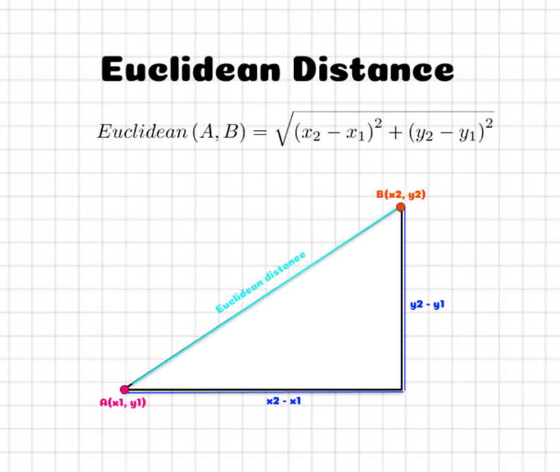
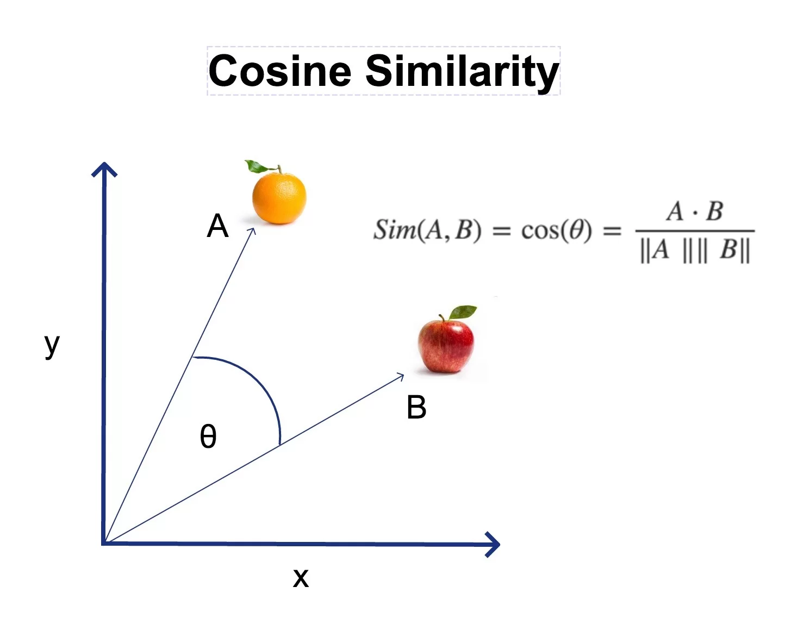
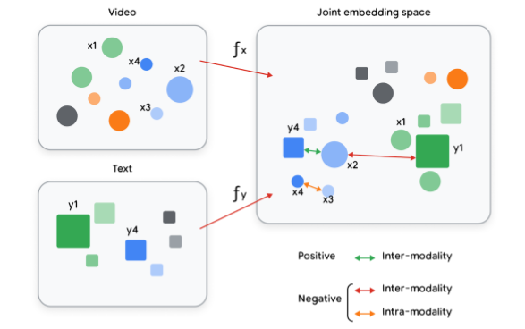

What Are Embeddings?

Embeddings are **numerical representations** of real-world data, such as:
- Text
- Speech
- Images
- Videos

They map complex, high-dimensional data into **low-dimensional vectors** (e.g., BERT maps a sentence into a 768-dimensional vector).


## Intuition Behind Embeddings

- Let's think of **latitude and longitude**:  
  A real-world location gets mapped to two numbers → a 2D vector.  
  Similarly, a sentence or image gets mapped to a fixed-size vector.

- In this new vector space:
  - Similar objects are **closer together** (e.g., "computer" and "laptop")
  - Dissimilar ones are **far apart** (e.g., "computer" and "car")

---
## Tokenization: How Text Gets Broken Down

Before turning text into vectors, it has to be **tokenized**. A *token* is a small unit of meaning, usually:

- A **word** (classic NLP)
- A **subword** (e.g. "running" → "runn", "ing")
- Even a **character** or **byte**

### Why Subwords?

Words like:
- "playing"
- "played"
- "playful"

All share the root "play" → So, subword tokenizers (like BPE) say:
> "Let me store 'play' once and reuse it."

This cuts down vocab size dramatically (maybe 30K instead of 100K+), while still letting us understand *novel words*

---

## 🔠 One-Hot Encoding: The “Before Embeddings” Era

Imagine a super naive way to represent words:  
Give every word in your vocabulary, a big old binary vector with a **1** in its own spot, and **0** everywhere else.

You have a vocabulary (let’s say of size 50,000) — a list of every word your model knows.
Index 0 = “a”
Index 1 = “apple”
Index 2 = “banana”
…
Index 742 = “cat”
…
Index 49,999 = “zebra”
When the word “cat” appears, we create a vector
`[0, 0, 1, 0, ..., 0]` = This word is ‘cat’, which is the 742nd word in my vocab.
For another word, let's say "dog" → `[0, 0, 0, 1, ..., 0]`
Our vectors are each 50,000-dimensional.

If we want to represent a sentence, we build up using the vocab:
We don’t one-hot encode the whole sentence as a single vector.
We one-hot encode each word individually based on the vocabulary and tokenize that into 3 words:
“the” → [1, 0, 0, ..., 0]
“cat” → [0, 0, 1, ..., 0]
“sleeps” → [0, 0, 0, ..., 1]
Then the sentence is represented as a matrix:
<pre>
[
 [1, 0, 0, ..., 0],
 [0, 0, 1, ..., 0],
 [0, 0, 0, ..., 1]
]
</pre>
So if our vocab is size V and our sentence has T tokens, the sentence becomes a matrix of shape: 
3×50,000 matrix

> 🧨 Problem: This is **sparse** (mostly zeros), **huge**, and **dumb** — it treats all words as completely unrelated.

It gets worse:
- You can’t know that "cat" and "dog" are similar
- And "cat" and "keyboard" are just as far apart

One-hot is like everyone sitting alone at their own table in a cafeteria.  
Embeddings are when similar people **start sitting together**, sharing vibes and snacks.

---

## 📏 Embedding Geometry: Distance & Similarity

### Key Intuition:
> "Things that **mean the same** should be **near each other** in vector space."

### Common Distance Metrics:





### Why Cosine Is Often Better

- Two embeddings may have different magnitudes due to length, emphasis, etc.
- But we care about **meaning**, not intensity
- Cosine similarity lets us compare **semantic direction**

---

## Modalities: Multisensory Magic

**modality** = a *type of data you can perceive*.

| Modality | Example |
|----------|---------|
| **Text** | "Pizza is life."|
| **Image** | A photo of a pizza |
| **Audio** | Someone saying “Pizzaaa” |
| **Video** | A TikTok of someone eating pizza |
| **Touch (maybe)** | Vibration data from a smartwatch |

> Humans are naturally **multimodal**.  
> You see, hear, and read simultaneously and fuse it all into one vibe.  
> Multimodal AI is trying to **replicate this**.

---

## What Are Multimodal Embeddings?


The top-left box is the Video space. Embeddings like x1, x2, x3 are outputs of a video encoder f_x
The bottom-left box is the Text space. Embeddings like y1, y4 come from a text encoder f_y
Each encoder processes data in its own way, but they both output fixed-size vectors.

Mapped into the Same Embedding Space

Using learned functions f_x and f_y, these representations are:
- Projected into a shared vector space
- So now we can directly compare their positions: like x2 vs. y1
This shared space is like a semantic coordinate system, where closeness = related meaning.
- Positive (similar meaning) = pull together
- Negative (different meaning) = push apart


> "Find me a video that matches this text."  
> "Show me pictures that sound like this audio clip."

Behind the scenes:
- A **text encoder** turns text into a vector  
- An **image encoder** turns an image into a vector  
- A **projection layer** aligns them both to the *same space*

Then we use good old **cosine similarity** to compare and match!

---
## Why You Need Labeled Datasets

To evaluate if an embedding model retrieves the **right documents**, we need to **already know what “right” means**.
That’s where **labeled datasets** come in, datasets where:
- ✅ Each **query** (like a question) has a list of **relevant documents**
- ❌ And a bunch of documents that are **not relevant**
  
Example:
<pre>
{
  "queries": {
    "q1": "What are the symptoms of diabetes?",
    "q2": "How can I treat high blood pressure?"
  },
  "documents": {
    "d1": "Common symptoms of diabetes include frequent urination, fatigue, and blurred vision.",
    "d2": "High blood pressure can be treated with lifestyle changes and medications.",
    "d3": "Heart disease is the leading cause of death worldwide."
  },
  "relevance": {
    "q1": ["d1"],
    "q2": ["d2"]
  }
}
</pre>
> Like having an answer key when grading a test.


When your embedding model returns ranked lists for each query:
- You check whether d1 is near the top for q1
- You check whether d2 is near the top for q2
- You penalize if d3 is returned (false positive)

### Example: NFCorpus (Natural Questions Corpus for health-related queries)

- Comes with real human-labeled relevance judgments
- We can then evaluate:  
  > Did our model retrieve the correct answers?

---

## Precision vs Recall — Let’s Get Clear

### Precision

> “Of the documents we retrieved, how many were actually relevant?”

**Formula**:
```plaintext
Precision@K = (Number of relevant docs retrieved) / (Total docs retrieved)
```

**Example**:
- You retrieve 10 documents
- 7 are actually useful
→ Precision@10 = 7/10 = **0.7**

---

### Recall

> “Of all the relevant documents that exist, how many did we manage to find?”

**Formula**:
```plaintext
Recall@K = (Number of relevant docs retrieved) / (Total relevant docs in the dataset)
```

**Example**:
- There are 14 relevant documents total
- You retrieved 7 of them
→ Recall@10 = 7/14 = **0.5**

---

## nDCG — Because Order Matters

Sometimes, **all retrieved docs are relevant**, but we still care **how they’re ordered**.

> You want the most relevant one **on top**, because users don’t scroll forever. 

### How nDCG Works
DCG@p for example DCG@5, meaning the DCG score considering only the top 5 results returned by the model. We’re mostly interested in top-k quality.

Imagine you’re a YouTube recommender:
- nDCG@5 = Did you show the 5 best videos, in the best order?
- If the best video is at position 5 (not 1), DCG drops, nDCG drops

1. **Calculate DCG (Discounted Cumulative Gain)**:
```plaintext
DCG@p = rel₁ + (rel₂ / log₂(2)) + (rel₃ / log₂(3)) + ...
```
Example:

You search
> **"How to reduce stress naturally?"**

You’re comparing two things:

✅ What your model actually retrieved and how it ranked them
→ This gives you the DCG

🏆 The best possible ordering of the same documents
→ This gives you the Ideal DCG (iDCG)

Let's say our model returns **5 documents**. A human annotator rates their **relevance** like this:

| Rank | Document ID | Relevance Score |
|------|-------------|-----------------|
| 1    | D7          | 3 (Perfect match) |
| 2    | D2          | 2 (Pretty good) |
| 3    | D4          | 0 (Not relevant) |
| 4    | D9          | 1 (Slightly relevant) |
| 5    | D1          | 2 (Good but buried) |

---

### Compute DCG@5

Using the formula:
```math
DCG@5 = rel₁ + (rel₂ / log₂(2)) + (rel₃ / log₂(3)) + (rel₄ / log₂(4)) + (rel₅ / log₂(5))
```

Plug in values:
```math
DCG@5 = 3 + (2 / log₂(2)) + (0 / log₂(3)) + (1 / log₂(4)) + (2 / log₂(5)) ≈ 0.86
```

```math
DCG@5 ≈ 3 + 2 + 0 + 0.5 + 0.86 = **6.36**
```

---

### Now Compute Ideal DCG (iDCG@5)

Let’s assume the best possible ranking would be:
- [3, 2, 2, 1, 0] ← highest scores at top

Then:
```math
iDCG@5 = 3 + (2 / log₂(2)) + (2 / log₂(3)) + (1 / log₂(4)) + (0 / log₂(5)) = 0
```

```math
iDCG@5 ≈ 3 + 2 + 1.26 + 0.5 + 0 = **6.76**
```

---

### Final nDCG@5 Score

```math
nDCG@5 = DCG@5 / iDCG@5 = 6.36 / 6.76 ≈ **0.94**
```

Your model got **94% as close to perfect** as it could for this query!

- Higher rank = higher weight
- Later positions are discounted

3. **Calculate Ideal DCG (iDCG)**:
- What DCG would be *if your results were perfectly ordered*

4. **Normalize it**:
```plaintext
nDCG = DCG / iDCG
```
 nDCG ranges from **0.0 to 1.0**
- 1.0 = perfect order
- Closer to 0 = bad ranking
---

## Benchmarks You Should Know

### BEIR — Benchmark for Evaluation of Information Retrieval
- Collection of 18+ retrieval tasks
- Domains: bio, legal, news, Reddit, FAQs, etc.
- Used to compare retrieval models side by side

> Your model might score:  
> nDCG@10 = 0.65  
> Recall@50 = 0.72

---

### MTEB — Massive Text Embedding Benchmark
- Tests more than just search!
- Covers 8 task types:
  - Classification
  - Clustering
  - Reranking
  - Bitext mining
  - Semantic similarity
  - and more...

> It’s the go-to for evaluating **general-purpose embedding models**

---

### TREC — The OG of Retrieval Evaluation
- One of the oldest and most trusted retrieval evaluation conferences
- Known for high standards
- You can score models using:
  - `trec_eval` (CLI)
  - `pytrec_eval` (Python)

---

## Search with Embeddings (RAG Style)

Here's how **Retrieval-Augmented Generation** (RAG) works:

### Phase 1: Indexing

- Documents → broken into **chunks**
- Each chunk gets embedded using `RETRIEVAL_DOCUMENT` model
- Stored in a **vector DB** (like FAISS)

### Phase 2: Query Time

- User asks a question
- Embed the query using `RETRIEVAL_QUERY` model
- Find nearest chunks in the DB (via cosine/Euclidean)
- Pass top chunks to an LLM → generate a great answer

> ⚡ This phase must be FAST — users are waiting

---

## Siamese vs Dual Encoders

Siamese vs Dual Encoders — Explained with Examples

Both Siamese and Dual encoders are used to embed **pairs of inputs** — such as a user query and a document — into vectors that can be compared using cosine similarity or other metrics. But the choice between them depends on **how similar the inputs are**.

---

## Siamese Encoder

> "Use the **same encoder** for both inputs."

- Same architecture, same weights, same tokenizer
- Works best when both inputs are **similar in structure and purpose**

### Example:
**Task:** Semantic Textual Similarity  
**Inputs:**
- Sentence A: "Cats are cute animals"
- Sentence B: "Kittens are adorable pets"

Both inputs are short, symmetric, and text-based → Use a Siamese Encoder.

### Use Case:
- Sentence similarity
- Paraphrase detection
- Duplicate question detection

---

## Dual Encoder

> "Use **two different encoders** — one for each input — trained together."

This is great when your inputs are **asymmetric**, like:
- A short, vague **query**
- A long, structured **document**

### Example:
**Task:** Document Retrieval  
**Inputs:**
- Query: "How do I reduce stress naturally?"
- Document: "Studies show meditation lowers cortisol levels, reducing stress over time."

Here, the query and document are **very different**, so it’s better to:
- Use a **Query Encoder** trained to understand user intent
- Use a **Document Encoder** trained to summarize content

---

## Real-World Analogy

| Model Type | Analogy |
|------------|---------|
| **Siamese** | Two identical twins reading different pages of the same book |
| **Dual** | A customer asking a question, and a librarian trained to fetch relevant answers |

---

## Architecture Diagrams

```plaintext
Siamese:
  Query ---> [Encoder] ---> Vector
  Doc   ---> [Encoder] ---> Vector

Dual:
  Query ---> [Encoder_Q] ---> Vector
  Doc   ---> [Encoder_D] ---> Vector
```

> In Dual Encoders, `Encoder_Q ≠ Encoder_D`, but they’re trained **together** to minimize the distance between matching pairs.

---

## Used In:

| Use Case               | Encoder Type | Why? |
|------------------------|--------------|------|
| Semantic similarity    | Siamese      | Inputs are symmetric |
| Q&A Retrieval          | Dual         | Asymmetric structure |
| FAQ matching           | Dual         | Query ≠ Answer phrasing |
| Product recommendations| Dual         | User profile ≠ product text |
| Translation scoring    | Siamese/Dual | Depends on symmetry |