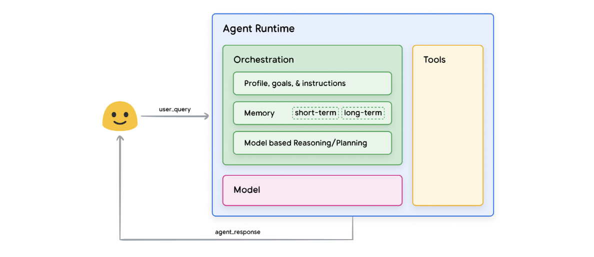
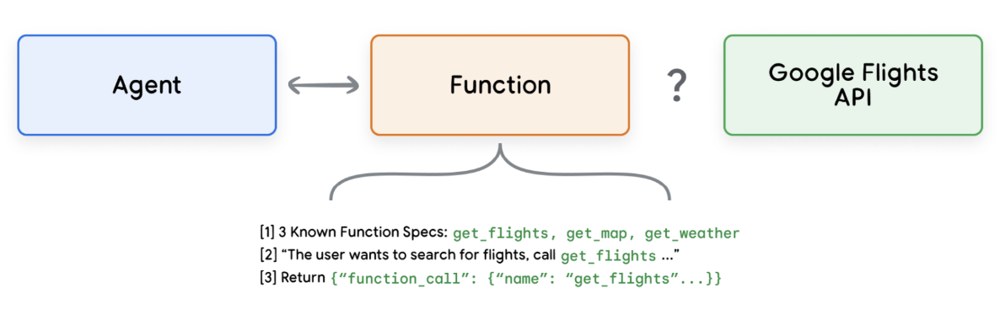

## What Is an AI Agent?

An **AI agent** is more than just a model: it's a **goal-driven system** that can observe, reason, plan, and act in the world using memory and external tools. Think of it like a supercharged assistant that doesn't just answer your questions, but takes initiative to get things done.

---

## Core Concept

Just like humans use tools (e.g., Google Search, calculators, books) to complement their thinking, **Generative AI agents** combine:
- A **model** (e.g., a language model),
- A **toolset** (e.g., APIs, databases),
- And a **reasoning/planning system**

...to solve real-world tasks *autonomously*.

---

## Cognitive Architecture of an Agent

According to Google's diagram, the **agent runtime** consists of three essential components:

## Components of an Agent

### 1. The Model

In an agent architecture, the **model** serves as the core decision-maker. It's typically a language model (LM), and can be:
- General-purpose
- Fine-tuned for specific tasks
- Multimodal (e.g., text + vision)

The model's job is to **interpret prompts**, **reason**, and **generate outputs** using logic frameworks(thinking patterns) such as:
- **Chain-of-Thought (CoT)**
- **ReAct (Reasoning + Acting)**
- **Tree-of-Thoughts**

These are reasoning strategies = ways to guide how a model thinks through a problem.

While the model itself isn't trained with the exact setup of the agent (e.g., tool APIs or orchestration logic), its performance can be boosted by fine-tuning or giving it **example-based demonstrations** of how to act as part of the agent.

> Tip: Use a model that’s already trained or familiar with data patterns related to the tools you're integrating. This improves performance in real-world agent applications.

---

### 2. The Tools

Foundational models are excellent at generation, but they **cannot interact with the world** by themselves.

**Tools fill that gap**, letting agents:
- Access external data
- Perform actions (e.g., send an email, update a database)
- Query APIs or knowledge bases

Tools follow common API interaction styles like:
- `GET` (retrieve data)
- `POST` (send/create)
- `PATCH` (update)
- `DELETE` (remove)

Tools also enable advanced capabilities such as **Retrieval-Augmented Generation (RAG)**, letting the agent pull in relevant external documents or real-time info to guide responses.

> Think of tools as the agent’s “hands and eyes” in the digital world, giving it superpowers the base model doesn't have.

---

### 3. The Orchestration Layer

The **orchestration layer** is the control center that governs:
- How information is received (input)
- How reasoning is performed (looping logic, memory access, condition checks)
- Which action or tool to invoke (output)

This loop continues **until the agent reaches a goal or decides to stop**.

The complexity of this reasoning loop can vary:
- Simple: A few rules or direct tool calls
- Complex: Multi-step logic chains, external ML model calls, or probabilistic reasoning

The orchestration layer also defines agent "turns", where each turn includes one user input and one agent response.

---

### Agents vs. Models

| Feature | Models | Agents |
|--------|--------|--------|
| **Knowledge Scope** | Limited to training data | Extended via tools |
| **Session Handling** | No memory by default | Can manage multi-turn memory (short & long-term) |
| **Tool Use** | None | Native support for external tools |
| **Reasoning** | Prompt-based or guided by user | Built-in logic layer (e.g., ReAct, CoT) |
| **Autonomy** | Single-shot prediction | Goal-driven and autonomous |

---

## Analogy

> A **language model** is like a brilliant intern who answers every question you throw at them.  
> An **agent** is that same intern, now equipped with a browser, a phone, access to your calendar, and the initiative to get things done *without waiting for you to tell them everything*. Chat GPT for example is the brain, but not the executive system unless connected to memory, planning, and tools. Just like your brain alone doesn’t book flights! Your executive functions + tools make that happen.
---
## Cognitive Architectures: How Agents Operate

A **cognitive architecture** is the internal engine that powers an agent’s thinking loop. It's the combination of planning, memory, reasoning, and action selection that drives how the agent works toward achieving a goal.

To understand this, imagine a **chef in a kitchen**:

- **Input**: Orders from customers, current pantry contents.
- **Reasoning**: What dishes can I prepare? What ingredients are missing?
- **Action**: Cook dishes, adjust flavors, present meals.
- **Iteration**: Revise based on customer feedback or changing inventory.

Agents behave similarly, constantly **gathering info, reasoning, taking action, and adjusting plans**.

---

### What Drives the Agent? The Orchestration Layer

At the heart of this cognitive architecture is the **orchestration layer**, which handles:

- **Prompting the model** at each step
- **Selecting the right reasoning strategy**
- **Managing memory and agent state**
- **Calling tools based on logic**
- **Looping through this process** until a goal is achieved

This is where frameworks like **ReAct**, **Chain-of-Thought**, and **Tree-of-Thoughts** come into play.

---

### Reasoning Frameworks (Prompt Engineering Strategies)

Here are three widely used prompt frameworks that help guide an agent’s step-by-step thinking:

#### ReAct (Reason + Act)
Interleaves **thoughts** and **actions**:
1. Think about what to do
2. Call a tool (if needed)
3. Observe the result
4. Think again...
5. Finalize an answer

Well-suited for tasks requiring interaction with tools or external APIs.

#### Chain-of-Thought (CoT)
Encourages the model to think step-by-step without necessarily calling tools. Great for:
- Logic puzzles
- Math
- Reasoning tasks

Variants include:
- **Self-consistency** (sample multiple reasoning paths)
- **Active prompting** (ask for follow-up clarifications)
- **Multimodal CoT** (add visual steps)

#### Tree-of-Thoughts (ToT)
Explores **multiple solution paths** in parallel before choosing the best one. Used in:
- Strategy generation
- Creative problem solving
- Long-horizon planning

---

### Example: Flight Booking Agent (ReAct Loop)

Let’s walk through a full ReAct-style reasoning loop using the **flight booking agent**:


---
## Tools: How Agents Interact with the Real World

Language models are powerful reasoning engines but they are inherently **blind and powerless**. They:
- Can't access real-time data.
- Can't execute actions.
- Can only guess based on what they saw in training.

**Tools** change that. Tools give agents the ability to:
- Retrieve real-world data.
- Trigger workflows (like booking, emailing, searching).
- Interact with APIs.

Tools bridge the gap between an agent’s internal reasoning and the **external systems** that do real work.

---

## Tool Types in Google’s Agent Ecosystem

As of this whitepaper, Google’s GenAI agents primarily interact with three categories of tools:

# 1. **Extensions**
Standardized wrappers around APIs that "teach" the agent how to use external systems (e.g., Google Flights, Maps, Weather).
- Define **what the tool does**
- Define **what inputs it expects**
- Provide **examples** to guide usage

This allows the agent to **generalize usage** even for flexible or loosely structured inputs.

It is a reusable interface that wraps an external API in a way that's **understandable by a language model**. This structure teaches the model how to use a tool, like you’d teach a junior dev using sample API docs.

### Key Benefits:
- No brittle hardcoding logic.
- Can be reused across agents.
- Includes examples to improve tool selection and argument formatting.
- Agents dynamically choose whether and how to invoke them.

---

#### Example: Flights Extension

Imagine the agent receives this prompt:

> "I want to book a flight from Austin to Zurich."


In this case:
- The agent chooses the Flights Extension.
- The extension wraps the Google Flights API and explains to the model how to use it.
- The API delivers the real-world result.

"The get_flights method can be used to get the latest..."
"When the user wants to search for flights, call get_flights..."
"Input args for get_flights are origin, destination, date..."

---
## Built-in Extensions: Code Interpreter Example

Google Vertex AI offers **ready-to-use Extensions** to make it easier for agents to interact with the world. One powerful example is the **Code Interpreter Extension** — a tool that lets agents write and execute code based on natural language prompts.

---

### What Is This Extension?

The **Code Interpreter** is an out-of-the-box tool provided by Vertex AI. It allows agents to:
- Understand natural language code-related questions.
- Generate Python code using a large language model.
- Execute that code in a secure runtime.
- Return the generated code (and optionally the output) to the user.

This extension turns a language model into a hands-on coding assistant — not just a text generator.

---

### Why Would an Agent Use This?

Suppose you’re chatting with an agent and say:

> "Write a Python method to invert a binary tree."

Here’s what happens:
1. The agent reads your input and thinks:
   - "This looks like a coding request."
   - "I should call the `code_interpreter` tool."
2. It runs the code below to trigger that tool.

---

### Behind the Scenes: Code Execution Example
There are **two levels** this example:

### 1. The **agent's tool** → `code_interpreter`
This is a **pre-built extension** provided by Vertex AI.  
Its job is to:
- Take a natural language task (e.g., "Write a Python function to invert a binary tree")
- Use a language model to generate Python code
- Execute that code
- Return the result


```python
import vertexai
from vertexai.preview.extensions import Extension

# Setup Vertex AI project
vertexai.init(project="YOUR_PROJECT_ID", location="us-central1")

# Load the Code Interpreter extension from the Extensions Hub
extension_code_interpreter = Extension.from_hub("code_interpreter")

# Define the natural language task
CODE_QUERY = "Write a python method to invert a binary tree in O(n) time."

# Execute the tool
response = extension_code_interpreter.execute(
    operation_id="generate_and_execute",
    operation_params={"query": CODE_QUERY}
)
````
This is not solving the problem directly.
It’s saying:

> Hey tool, here’s a coding question — figure it out, run it, and tell me the result.

### 2. The **code that was generated** by the tool

This is the actual Python logic that solves the tree inversion problem.
It’s the product of the code interpreter tool, not the agent logic.

```python
class TreeNode:
    def __init__(self, val=0, left=None, right=None):
        self.val = val
        self.left = left
        self.right = right

def invert_binary_tree(root):
    if not root:
        return None
    root.left, root.right = invert_binary_tree(root.right), invert_binary_tree(root.left)
    return root
```
Without this extension:
- The model could only guess at the code (no execution, no testing)
- You would need to run the code yourself

With the extension:
- The agent can generate and validate the code before responding
- It creates a loop of reason → act → observe, which is the foundation of modern AI agents
  
The Code Interpreter is one example of how Vertex AI agents:
- Use extensions to perform real tasks
- Go beyond static generation
- Deliver grounded, executable results in dynamic settings

# 2. **Functions**
  
## Function Calling: Giving the Agent a Blueprint, Not a Button

In traditional programming, **functions** are reusable blocks of logic that can be called with specific inputs and return outputs. In the world of agents, **function calling** follows a similar idea.

## Functions in the Agent Ecosystem

While **extensions** allow an agent to call external APIs and perform live actions on the agent-side, **functions** work a bit differently. They are more like traditional software functions that are defined to do a specific job and are executed on the client-side. This gives developers tighter control over how and when API calls and data transformations are performed.

The agent is like your smart assistant saying:
> Hey, I think you should call this function with these settings.”
But you make the actual call (client-side nature)

With extensions, it’s more like:

> “I’m going to call it for you right now.”

---

### Key Characteristics of Functions

1. **Model Output Only, No Direct API Call:**  
   When a model uses a function, it outputs the name of the function and its arguments based on the task it’s trying to solve. It doesn’t make an immediate API call. Some APIs are for example not exposed to the internet and are intentionally private or firewalled.

2. **Client-Side Execution:**  
   Functions are executed on the client-side application (your middleware or front-end), not by the agent itself. This means the logic that calls the actual API endpoint is decoupled from the agent's reasoning loop.

3. **Granular Control for Developers:**  
   - **Middleware Integration:** API calls can be handled at a different layer (for example, within a middleware system) rather than within the agent’s architecture.  
   - **Security & Authentication:** The API endpoints may require credentials or might not be directly accessible by the agent.  
   - **Timing and Order Constraints:** Functions can be used when API calls need to be batched or require human-in-the-loop review before execution.  
   - **Data Transformation:** They allow you to transform or filter API responses in ways that the agent may not handle natively.

---

### How It Works (Using the Google Flights Example)


Imagine an agent receives a request related to flight information, for instance:

> "Show me the cheapest flights from New York to London for next month."

#### With Functions:

1. **Model Decision:**  
   The model decides that it needs to use a flight search function and outputs something like:

   ```json
   {
     "function": "search_flights",
     "arguments": {
       "origin": "New York",
       "destination": "London",
       "date_range": "2025-05-01 to 2025-05-31"
     }
   }


Setup A:

-The agent is in charge.
- Once the user asks something (like “find me a flight”), the agent handles everything.
- It chooses the tool (Extension), formats the API call, makes the request, and processes the response — all on its own.

Setup B:
- The agent doesn’t call the API directly.
- Instead, it outputs a “function plan” like:
"Call get_flights with origin=NYC, destination=London"
- Your middleware or frontend handles the real API call.

Function Calling in GenAI Agents — A Developer’s Playground

In this section, we explore how **functions** can be used by generative agents to **structure output**, delegate **execution logic to the client-side**, and maintain full developer control over data flows and API calls.

We'll walk through:
- A real-world use case (a ski trip assistant)
- A visual sequence diagram
- Python sample code using `gemini-2.0-flash-001`
- When and why function calling is useful

---

## Use Case: Ski Trip Planning Assistant

Imagine a user types:

> "I'd like to take a ski trip with my family but I'm not sure where to go."

You want your agent to:
- Suggest cities for skiing
- Format them in a **machine-readable way** (for your app)
- Let your client-side UI handle the actual Google Places API call to fetch images, maps, etc.

Instead of returning plain text like:

> “Crested Butte, Whistler, Zermatt...”

…the model uses **function calling** to output something structured:

```json
{
  "function": "display_cities",
  "arguments": {
    "cities": ["Crested Butte", "Whistler", "Zermatt"],
    "preferences": "skiing"
  }
}
```

---

## Why Not Use Extensions?

Because you:
- Don’t want the agent to make direct API calls
- Want to manage the Google Places API on the frontend
- Might need to filter, transform, or stage the response
- Don’t want to expose secrets to the agent runtime


### Flow Explained:

| Step | What Happens |
|------|---------------|
| 1 | User enters a natural language request like "ski trip ideas" |
| 2 | Frontend forwards this query to the agent backend |
| 3 | Agent packages the query into a structured prompt and sends it to the mode |
| 4 | Model returns a proposed function call with arguments in JSON format |
| 5 | The frontend captures this JSON output before it reaches the agent again |
| 6 | Middleware then uses the JSON data to query the Google Places API directly |
| 7 | The API response (e.g., resort info) is formatted by the UI for presentation |
| 8 | Final response (like ski resort suggestions + images) is shown to the user |

---

## Function Definition (Python)

Here’s how we define the function the model is allowed to call:

```python
from typing import Optional

def display_cities(cities: list[str], preferences: Optional[str] = None):
    \"\"\"Provides a list of cities based on user preferences.\"\"\"
    return cities
```

---

## Model Call with Gemini 2.0 Flash

```python
from google.genai import Client, types

client = Client(vertexai=True, project="PROJECT_ID", location="us-central1")

res = client.models.generate_content(
  model="gemini-2.0-flash-001",
  model="I'd like to take a ski trip with my family but I'm not sure where to go?",
  config=types.GenerateContentConfig(
    tools=[display_cities],
    automatic_function_calling=types.AutomaticFunctionCallingConfig(disable=True),
    tool_config=types.ToolConfig(
      function_calling_config=types.FunctionCallingConfig(mode='ANY')
    )
  )
)

print(f"Function Name: {res.candidates[0].content.parts[0].function_call.name}")
print(f"Function Args: {res.candidates[0].content.parts[0].function_call.args}")
```

### Sample Output:
```plaintext
Function Name: display_cities  
Function Args: {'preferences': 'skiing', 'cities': ['Aspen', 'Park City', 'Whistler']}
```

---

## Why Function Calling Rocks

You get:
- Structured output
- Full control over execution (timing, security, retries)
- Zero need to embed secrets in the model context
- Flexibility to **filter or manipulate responses** post-generation
- Choice to send data back to the agent — or not

---

## When to Use Function Calling

- You want the model to suggest actions but **not perform them directly**
- You need to call **private APIs** or APIs with complex logic
- You're working in **multi-device systems** (e.g., generate on cloud, execute on edge)
- You’re building a UI where **output needs structure** (JSON, lists, tags, etc.)

---

## Final Take

Function Calling turns your model into a **smart planner**, not a blind executor.  
You (the developer) decide what actually runs, the model just helps fill in the blanks.
This design pattern keeps your agents modular, secure, and production-grade.

---

# 3. Data Stores 

Language models are powerful but they’re not always up-to-date. Think of a model like a frozen library: it contains only the data it was trained on, and nothing new ever gets added.

That’s where **Data Stores** come in.

---

### Why Data Stores Matter

Language models:
- Can’t browse the internet (by default)
- Can’t pull in real-time or company-specific knowledge
- Can hallucinate or go off-track if not grounded in fresh, relevant data

Data Stores solve these limitations by:
- **Augmenting the agent’s knowledge** with dynamic, external sources
- Supporting formats like **PDFs**, **websites**, **CSV files**, and **spreadsheets**
- Enabling **RAG** (Retrieval-Augmented Generation) to fetch precise data at runtime

---

### From Static Model to Smart Agent

#### The Problem

Agents alone can't talk to your internal files, webpages, or systems.

#### ✅ The Fix


Add a **Data Store** in between, it bridges the gap and acts like a live index(a searchable data structure that updates in real time or near real time) of your knowledge:
- The Data Store (usually a vector database) contains up-to-date documents or entries.
- The agent doesn’t memorize everything — it searches this index dynamically whenever a query comes in.
- It’s “live” because you can upload a new PDF, update a spreadsheet, or scrape a webpage — and the agent can immediately use that updated content during its next reasoning cycle.

So unlike the LLM’s static memory, a live index reflects the present, not the past.

---

### Types of Data Stores

Data Stores are often backed by a **vector database**, which stores your content as high-dimensional embeddings. This allows for **semantic search** and matching.

The agent can tap into:
- `unstructured_data_store` → PDFs, TXT files
- `website_data_store` → URLs, blogs
- `structured_data_store` → CSVs, spreadsheets


Each of these data stores can be treated like a plug-and-play (modular, flexible, no-friction integration) tool within the agent’s runtime.

---

### How Retrieval Works (The RAG Loop)

Here’s how a query flows through the system:

1. **User Query** → Transformed into an embedding  
2. **Embedding** → Compared against stored vectors  
3. **Matching** → Best results returned from the vector database  
4. **Agent** → Uses that content to reason and generate a response  
5. **User** → Gets the final, grounded answer  

---

### 💬 Real-World Example: Internal HR Agent

Imagine a user asks:  
> “What’s our parental leave policy?”

The agent uses vector search across a `pdf_dstore` and responds:


- It **plans** (ReAct-style):
  - *“I should search PDFs.”*
  - *“Here's what I found. Now I’ll summarize it.”*
- It returns a fact-based, document-backed answer

---

### Developer-Friendly Benefits

Data Stores give developers:
- **Zero need to fine-tune models**
- **No format conversion** — upload PDFs, CSVs, and let the embedding layer handle it
- **Secure, local knowledge integration**
- **Selective access** — you decide which stores the agent can query

---

### Final Take

Data Stores transform a model from a "closed-book test-taker" into an "open-book assistant." Combined with RAG and ReAct reasoning, they let your agent:
- Tap into up-to-date private knowledge
- Ground its outputs in real documents
- Avoid hallucinations
- Stay relevant to your users

Let me know if you want a hands-on notebook example to set up a vector store with Gemini or LangChain!

# Enhancing Model Performance with Targeted Learning

Choosing the right tools at the right time is essential for high-performing agents, especially in production environments. While language models come with general capabilities, targeted learning strategies allow them to adapt to **specific domains, tasks, or datasets**, enabling more precise and intelligent behavior.

---

## Targeted Learning Approaches

To enhance model performance, we can use several complementary techniques:

| Technique                      | Description |
|-------------------------------|-------------|
| **In-Context Learning**       | The model receives prompts, tools, and a few examples at inference time. It learns how to use them "on the fly" without retraining. This is useful for flexible and dynamic task handling. |
| **Retrieval-Based In-Context**| Prompts are automatically populated with relevant tools and examples by retrieving them from an external memory or database. This allows the model to remain grounded and task-aware without retraining. |
| **Fine-Tuning**               | The model is pre-trained on a dataset of tool usage and examples. This approach makes the model inherently capable of choosing and using tools accurately, even before a user query is received. |

By combining these approaches, we can create agents that are not only flexible and reactive but also deeply knowledgeable in specific domains.

---

## Analogy to Understand Learning Styles

- **In-Context Learning**: Like a chef receiving a new recipe and improvising using provided ingredients and a few examples of the dish.
- **Retrieval-Based Learning**: The chef uses a pantry filled with ingredients and a library of cookbooks to dynamically create the dish.
- **Fine-Tuning**: The chef went through formal training to master a cuisine, enabling them to recreate similar dishes with confidence and expertise.

---

## Production-Ready Agents with Vertex AI

Google’s Vertex AI offers a managed environment to build, run, and improve agent applications at scale. It simplifies tasks like:

- Declaratively defining goals, tools, and agent behaviors
- Integrating extensions, function calling, and memory (example stores)
- Running evaluations and debugging tools
- Maintaining and deploying production agents

The architecture below shows how multiple tools and layers work together within Vertex AI:


**Flow Summary**:
1. User submits query via a custom interface.
2. The UI sends the query to the agent runtime.
3. The agent adds prompts and tool definitions, passing it to the model.
4. The model outputs function/tool calls.
5. The UI executes those tools client-side (in the case of functions).
6. APIs like Google Places are queried and results are returned to the user.

---

## Quickstart: LangChain + LangGraph

Let’s build a reasoning agent using:

- The `gemini-2.0-flash-001` model
- `SerpAPI` for search
- `Google Places API` for locations

```python
from langgraph.prebuilt import create_react_agent
from langchain_core.tools import tool
from langchain_community.utilities import SerpAPIWrapper
from langchain_community.tools import GooglePlacesTool

@tool
def search(query: str):
    search = SerpAPIWrapper()
    return search.run(query)

@tool
def places(query: str):
    places = GooglePlacesTool()
    return places.run(query)

model = ChatVertexAI(model="gemini-2.0-flash-001")
tools = [search, places]

agent = create_react_agent(model, tools)
query = "Who did the Texas Longhorns play in football last week? What is the address of the other team's stadium?"

input = {"messages": [("human", query)]}
for s in agent.stream(input, stream_mode="values"):
    print(s["messages"][-1] if not isinstance(s["messages"][-1], tuple) else s)
```
- defines a search() function and registers it as a tool. When the agent decides to “use search”, it will call this function and pass in a string query.
- defines a places() tool. It will be used when the agent needs location-specific data (e.g., address of a stadium).
- Initializes a Gemini model hosted via Vertex AI. This will handle the reasoning and language generation inside the agent loop.
- `tools = [search, places]` is a list of tools the agent is allowed to use.
-  think of this as giving the agent access to specific APIs.
-  `agent = create_react_agent(model, tools ` wraps the Gemini model into a ReAct-style agent.
This setup demonstrates how a multi-step agent can use one tool to gather information and another to follow up, with each step driven by reasoning logic.
#### `for s in agent.stream(input, stream_mode="values")` 
- `agent.stream(...)` is a generator that yields a dictionary of results after every step in the agent’s reasoning process.
- `stream_mode="values"` makes the agent return just the new values (not the full intermediate state).
- `s["messages"][-1]` grabs the most recent message added by the agent (from its chat log)

---

## Execution Example

This is how the agent interprets and responds to a query in real-time:

Step-by-Step Agent Stream Breakdown

```python
for s in agent.stream(input, stream_mode="values"):
    print(s["messages"][-1])
```

### 🔹 Step 1: Initial Thought

```json
{
  "role": "model",
  "content": "Thought: To answer the question, I first need to find out who the Texas Longhorns played last week."
}
```

The agent reasons about what it needs to do first. This is the beginning of the ReAct reasoning loop.

---

### 🔹 Step 2: Tool Call — `search`

```json
{
  "role": "tool_call",
  "content": "Calling tool: search with query=\\"Texas Longhorns football schedule\\""
}
```

It decides to use the `search()` tool to look up the football schedule.

---

### 🔹 Step 3: Observation from Search Tool

```json
{
  "role": "observation",
  "content": "Search result: Texas played against Georgia Bulldogs on Saturday, Oct 21."
}
```

The result is returned and sent back to the model for further reasoning.

---

### 🔹 Step 4: Follow-up Thought

```json
{
  "role": "model",
  "content": "Thought: Now that I know they played Georgia, I should find the location of Georgia’s stadium."
}
```

The agent reasons again based on the new info from the search result.

---

### 🔹 Step 5: Tool Call — `places`

```json
{
  "role": "tool_call",
  "content": "Calling tool: places with query=\\"Georgia Bulldogs stadium address\\""
}
```

It calls the second tool to get the address of Georgia’s stadium.

---

### 🔹 Step 6: Observation from Places Tool

```json
{
  "role": "observation",
  "content": "Sanford Stadium, 100 Sanford Dr, Athens, GA 30602, USA"
}
```

The Places tool returns the actual address via Google Places API.

---

### Step 7: Final Answer

```json
{
  "role": "model",
  "content": "The Texas Longhorns played against the Georgia Bulldogs last week. The game was at Sanford Stadium, located at 100 Sanford Dr, Athens, GA 30602, USA."
}
```

The agent combines all the information and returns a complete, grounded answer.

---

## Summary Table

| Step | Role        | What Happens                                      |
|------|-------------|---------------------------------------------------|
| 1    | `model`     | Thinks about the initial question                 |
| 2    | `tool_call` | Calls the `search()` tool                         |
| 3    | `observation` | Gets match result from tool                    |
| 4    | `model`     | Thinks about follow-up action                     |
| 5    | `tool_call` | Calls the `places()` tool                         |
| 6    | `observation` | Receives address of the stadium                |
| 7    | `model`     | Returns the full final answer to the user        |

Now we compare the special behavior of a LangGraph agent's streaming loop with a traditional Python loop. Understanding the difference helps clarify why we use `for s in agent.stream(...)` in agent reasoning flows.

##  Overview Table

| Feature                        | `agent.stream(...)` Loop                                       | Standard Python Loop                        |
|-------------------------------|----------------------------------------------------------------|---------------------------------------------|
| Purpose                       | Watch agent reasoning step-by-step                             | Process each item in a pre-existing list    |
| Loop target                   | A generator (stream of evolving states)                        | A static iterable (list, tuple, etc.)       |
| Items exist up front?         | Generated dynamically, one step at a time                   | All items exist before the loop starts    |
| Typical content               | Agent thoughts, tool calls, observations, final answer         | Plain values like numbers or strings        |
| Example                      | Reasoning trace from a model solving a query                   | Items like `["apple", "banana", "cherry"]`  |

---

## 🍌 Standard Python Loop Example

```python
fruits = ["apple", "banana", "cherry"]

for fruit in fruits:
    print(fruit)
```

### Output:

```
apple
banana
cherry
```

- The loop processes all items that already exist.
- You know the content of `fruits` ahead of time.
- No logic is generated step-by-step.

---

## `agent.stream(...)` Loop Example

```python
for s in agent.stream(input, stream_mode="values"):
    print(s["messages"][-1])
```

### Output (for a query like "Who did Texas play last week?"):

```
Thought: I should check who Texas played last week.
Calling tool: search(query="Texas Longhorns schedule")
Observation: Georgia Bulldogs, Oct 21
Thought: Now I should get their stadium address.
Calling tool: places(query="Georgia Bulldogs stadium")
Observation: Sanford Stadium, Athens, GA
Final Answer: They played Georgia at Sanford Stadium in Athens, GA.
```

- The loop yields one **new agent state** at a time.
- Each iteration is a **new message** added to the conversation.
- You are watching the agent think, act, and observe — step by step.

---

## Summary

| Characteristic                  | Normal Loop                        | `agent.stream(...)` Loop                  |
|-------------------------------|------------------------------------|-------------------------------------------|
| Type of data                  | Static values                      | Incrementally generated reasoning steps   |
| Control flow                  | Processes what’s already available | Waits for next action from the agent      |
| Useful for                    | Lists, arrays, iterables           | Streaming multi-step agent logic          |
| Visibility                    | Entire structure known at start    | Built dynamically as model runs           |

---

In summary, `agent.stream(...)` gives you a **live view into an agent's thought process**, unlike standard loops which just walk through existing data.
"""

