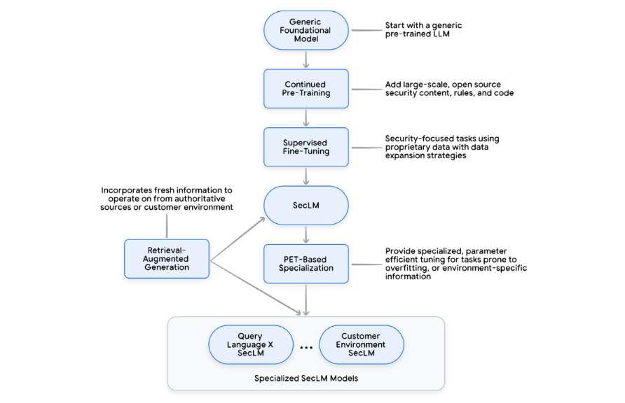

# LLMs in Specialized Domains – Cybersecurity & Medicine

## 1. Overview

This section explores how Large Language Models (LLMs) are being fine-tuned to tackle high-stakes domains where general-purpose models fall short — particularly in **cybersecurity** and **medicine**.

> Core idea: Adapt LLMs from generalists to domain-native specialists.

---

## 2. Why General-Purpose Isn’t Enough

### Cybersecurity
- **Dynamic threat landscape**: New attacks emerge daily.
- **Sparse, sensitive data**: Threat intel is rarely public.
- **Repetitive toil**: Analysts spend hours triaging alerts manually.
- **Adversarial setting**: Attackers evolve faster than defenders.

> ⚠️ LLMs here must generalize from sparse data, detect patterns in chaos, and prioritize real threats.

### 🩺 Medicine
- **Massive, evolving knowledge base**
- **Context-sensitive reasoning**: Same symptoms can mean different things depending on context.
- **High accuracy stakes**: Missteps can harm patients.

> ✅ LLMs like Med-PaLM excel when trained to reason step-by-step and provide trustworthy, interpretable answers.

---

## 3. Domain-Specific Adaptations

### SecLM (Cybersecurity)
- Trained on CVEs (Common Vulnerabilities and Exposures = Public database of known security flaws in software/hardware, these databases are like a bug tracker for the whole cybersecurity world), threat reports, logs.
- Likely uses:
  - **Retrieval-Augmented Generation (RAG)** for up-to-date threats
  - **Instruction tuning** on security tasks
  - **Adversarial fine-tuning** to simulate attacker behavior

### Med-PaLM (Medicine)
- Trained with:
  - **Chain-of-thought prompting** for stepwise reasoning
  - **RLHF** to avoid hallucinated or dangerous outputs
  - Evaluated with **clinical-style QA (e.g., USMLE)**

---

## 4. Real-World Impact

### Cybersecurity Analyst
- Auto-summarizes alerts
- Detects emerging threats
- Recommends actions in natural language

### Medical Use
- Maps symptoms to differential diagnoses
- Suggests next-best tests
- Explains reasoning clearly for clinician trust

---

## 5. Key Takeaways

- General LLMs underperform in high-stakes, fast-changing fields.
- Specialized fine-tuning + retrieval + safety layers = essential.
- Domains like security and medicine need models that **reason**, not just **recall**.

---

> Up next: deeper look into how SecLM and Med-PaLM are trained, evaluated, and deployed.

# GenAI for Cybersecurity – Personas, Challenges, and the SecLM Stack

## Multi-Layered GenAI Stack for Cybersecurity (SecLM)

To meaningfully solve real-world cybersecurity problems, Google proposes a **3-layered architecture**, where each layer plays a distinct but complementary role. An LLM alone can’t act or stay updated. Logs alone are useless without analysis. Tools alone don’t know what’s going on. The stack turns GenAI into a security assistant that can think, decide, and act 

### 1. Bottom Layer: **Authoritative Datastores**
- These are the **sources of truth** for security.
- Examples: CVE databases, MITRE ATT&CK, internal logs, asset inventories, playbooks.
- May also include: 
  - Output from security tools (like SIEMs, EDRs)
  - Knowledge from internal red-team activity
- **Purpose**: Provide accurate, real-time, domain-specific context.

> Think of it as the **memory layer**, a vault of raw intelligence.

---

### 2. Middle Layer: **Security-Specialized Model API (SecLM)**
- The brain of the stack, combines:
  - LLM fine-tuned on security tasks
  - Planning and reasoning abilities
  - Ability to decompose complex problems into steps
- Integrated with **tool use and RAG** to dynamically access relevant data.

> This is the **reasoning engine**; it doesn’t just regurgitate facts, it connects the dots.

---

### 3. Top Layer: **Security Tools with Actuation**
- These are the operational interfaces like:
  - Firewalls, detection systems, SIEM dashboards, SOAR platforms.
  - Anything that can **take action**: block an IP, escalate an alert, push a config update.
- Must understand security-specific formats and context (e.g., queries, rules, logs).

> This is the **action layer**, it makes things happen in the real world.

---

### Why This Stack Matters

A single LLM isn’t enough for real-world security. You need:

- **Reasoning** from a security-specialized model (Middle)
   **Grounded knowledge** from vetted sources (Bottom)
- **Integration with tools** that can act (Top)

Without this stack:
- The LLM might hallucinate threats.
- It won’t have live access to the user’s environment.
- It can’t perform meaningful actions (like auto-remediation).

> This is what makes **SecLM a platform**, not just a chatbot.

---

## 👥 Key Security Personas and How GenAI Helps

| **Persona** | **Challenges Faced** | **How GenAI Helps** |
|-------------|----------------------|----------------------|
| **Security Analyst** | Unfamiliarity with bespoke query languages; Alert triage is manual and fragmented; Hard to assemble steps for remediation | Translate NL to security queries; Automate triage and classification with real-time tool integration; Personalized, case-specific remediation plans |
| **Threat Researcher / SysAdmin** | Encounter obfuscated scripts/binaries that are hard to reverse | LLM-based reverse engineering with explanation and classification |
| **CISO Team** | Manual effort to summarize threat landscape for decision-making | Generate tailored summaries and reports from internal data |
| **IT Admin / Security Team** | Difficult to map attacker paths across sensitive systems | Identify potential attack vectors and recommend mitigations |
| **App Developers** | Unsure where to fuzz test | Identify fuzz-test targets and generate code |
| **App Devs + IT Admins** | Misaligned access policies | Recommend least-privilege configs based on historical access |
| **General User / Operator** | Lacks clarity on how to apply security concepts to real-world problems | Provide stepwise expert-level explanations tailored to user environment |

---

## SecLM Architecture: A Holistic Cybersecurity API

SecLM is not a single model, it’s a **stacked system** combining:
- A fine-tuned security LLM
- Retrieval-Augmented Generation (RAG)
- Tool integration
- Parameter-efficient fine-tuning (PET)

[Generic LLM] → [Continued Pretraining on Open Security Data]

→ [Supervised Fine-Tuning on Proprietary Tasks]: For example using labeled data from internal **SOCs** (Security Operations Center, a team of analysts watching over company systems 24/7), **red teams** (ethical hackers hired to attack the system and expose weaknesses), or **sandbox environments** (an isolated space where suspicious files (e.g., malware) are run safely, so analysts can observe what they do without harm.
)

→ [SecLM Core]: Result of pretraining + supervised fine-tuning. General-purpose security-specialized model that understands: 
- “General-purpose” = can handle many types of tasks (e.g., triage, query translation, remediation planning).
- “Security-specialized” = it only works within the domain of cybersecurity.

→ [PET / RAG for Task-Specific or Customer-Specific Variants]: Training an entire large model is expensive and slow.
PET is a shortcut: Instead of retraining everything, you just tweak a small subset of parameters or add a small adapter module. Techniques include:
	
- LoRA (Low-Rank Adaptation): LoRA adds two small trainable matrices inside the model. These tunable matrices “nudge” the frozen model to behave differently without retraining the entire thing. A frozen layer is a layer that is not updated during training. We freeze layers during fine-tuning to: Save time and compute + Prevent “forgetting” valuable general knowledge. Think of it like attaching a lightweight custom lens on a powerful camera, you don’t change the camera itself, but you change how it sees.

- Adapters: Adapters are tiny neural network layers inserted between the frozen layers of a large model. Only these layers are trained.

- Prefix Tuning: Instead of updating the model, you prepend a learnable set of tokens (a prefix) to every input prompt. These tokens steer the model’s behavior. It's like putting a mood + format + style prompt silently before the question.

➡ Result: Specialized SecLMs for query languages, customer environments, etc.

---

## ⚠️ Why Generic LLMs Fall Short in Security

| **Problem** | **Explanation** |
|-------------|------------------|
| **Lack of public data** | Most high-value security data is private, and generic datasets are sparse or biased. |
| **Limited depth** | Security work blends low-level tech (Examples: assembly code, system calls (how programs interact with the OS), binaries (compiled programs, often in unreadable form) with high-level policy Examples: who should access what? What’s considered a “critical risk”? What compliance standards apply, e.g., GDPR, HIPAA). Security specialists must move between both levels. A general LLM might know how to explain each one in isolation — but it doesn’t know how they interact in practice, which is where security work happens. |
| **Sensitive use cases** | Teaching a general LLM how malware works (or how to write phishing emails) could backfire; bad actors might use it to create threats. So providers intentionally filter or block this kind of data from training. But security defenders need to know how malware works so they can detect, block, or reverse it. That’s why security-specialized LLMs are trained on this data in a safe, controlled way. |

---

## Design Requirements for SecLM

To be truly useful, SecLM must:

- **Stay Fresh**: Ingest new threats without full retraining → solved via RAG + streaming updates
- **Respect Privacy**: Avoid centralized training on customer data → solved via lightweight on-prem fine-tuning (Companies don’t want to share sensitive data with LLM providers. So instead of centralized training, you use PET (Parameter-Efficient Tuning) on local/private data.)
- **Demonstrate Expertise**: Translate high-level concepts (e.g. lateral movement) into tractable sub-tasks (LLMs should understand advanced ideas like: Lateral movement: when attackers go from one machine to another in a network. The model must break this down into searchable sub-steps, like: “Look for RDP logins from one user to 5+ machines”, “Check if any lateral move follows privilege escalation”)
- **Support Multistep Reasoning**: Combine tools, user data, and models to answer complex questions

---
 # SecLM’s Planning, Training, and Reasoning Framework

---

## 1. Why Start with a Foundation Model?

Training LLMs from scratch is **slow and expensive**, so SecLM starts with a **general foundational model** (like PaLM) trained on:
- Billions/trillions of tokens from books, web, code, and structured data
- Dozens of languages and formats

**Benefit**: Multilingual, multimodal, and general reasoning capability; a solid base for fine-tuning into a security expert.

---

## 2. Specializing the Model for Security

### Continued Pretraining
Train further on:
- Security blogs
- Threat intel reports
- Detection rules
- IT & infosec books

This teaches the model the **language and structure** of cybersecurity: what terms like *CVE* (A known security vulnerability, published in a public database (e.g. CVE-2024-1234)), *TTP* (Tactics, Techniques, and Procedures — the behaviors hackers use (e.g., how they move, steal data)), or *YARA rule* (A rule-based syntax for detecting malware. Think: "If file contains X strings, it's suspicious.") mean.

### Supervised Fine-Tuning
Trained on **real tasks** security experts do:
- Explain malicious command-line behavior
- Summarize alerts or reports
- Translate threats into SIEM queries
- Extract indicators of compromise (IOCs = Indicators of Compromise” clues that a system was hacked. E.g. IP address, filename, domain, hash.)

This is where the model becomes **SecLM Core**: a versatile, security-specialized brain.

---

## 3. Evaluation Strategies

Because security tasks vary (classification, reasoning, summarization), multiple evaluation strategies are used:
- **Classification tasks** → accuracy, precision, recall (e.g. malware vs. benign)
- **Generation tasks** → similarity scores like ROUGE, BLEU, BERTScore
- **Human evaluation** → side-by-side expert review using Likert scales

> This ensures the model isn’t just good on paper, it performs in real-world, high-stakes scenarios.

---

## 4. How SecLM Plans and Executes Tasks

### Use Case: “Are APT41(A real-world hacking group (state-sponsored))’s tactics happening in my system?”
The SecLM API **automates a multi-step reasoning workflow**:

1. **Retrieve threat intel** on APT41
2. **Extract TTPs** (Tactics, Techniques, Procedures) from unstructured intel
3. **Generate a SIEM query** to look for these indicators
4. **Fetch relevant security logs** from the user's environment
5. **Summarize the results**, highlighting any matching signs of attack

➡ This saves hours of manual effort for an analyst.

> It’s like chaining together a researcher, analyst, and scriptwriter — all inside one assistant.

---

## 5. A Flexible Reasoning Framework

SecLM’s strength lies in its ability to **combine tools + LLMs + human knowledge + live data** through:

- **LLM reasoning** (fine-tuned on domain tasks)
- **Tool use** (e.g. base64 decoder, malware analyzer)
- **RAG** (pull fresh info from threat feeds, documents)
- **PET fine-tuning** (align model with internal tools, schemas)
- **In-context learning** (provide examples at runtime to teach it new tasks)
- **Modular agents** (step-by-step planners that orchestrate all the above)

---

## 6. Concrete Example: PowerShell Log Analysis
✅ This kind of task would take 15–30 mins manually, now done in seconds:
Prompt: powershell.exe -EncodedCommand dHJl…
SecLM:
- Decodes the base64(makes scripts harder to immediately read, like putting a message in a locked envelope)
- Analyzes the command
- Explains:  
  1. Connects to localhost  
  2. Downloads remote file  
  3. Saves it locally  
  4. Disconnects  
- Concludes: Malicious activity → remote access + file theft risk

### 🔍 What is an Obfuscated PowerShell Command?

> *(Optional context for non-security readers)*
- A hacker wrote a malicious script and encoded it in Base64.
- The command looks like harmless gibberish (powershell.exe -EncodedCommand dHJ...)
- But when decoded, it:
- Connects to a server
- Downloads a file
- Runs it

All without showing the real code at first glance. This is part of a **“Living off the Land”** (LotL) attack:

Instead of bringing in external malware, attackers use built-in tools (like PowerShell) to blend in and stay stealthy.

---

## 7. Final Takeaway

SecLM is not just a model, it's a **full platform** with:
- Specialized models
- Live data retrieval
- Modular reasoning agents
- Tool integrations
- Personalized adaptation (via PET)

> The result: A **one-stop AI security assistant** that helps junior analysts, experts, and admins alike — saving time, improving accuracy, and lowering burnout.

# 🩺  Med-PaLM, MedLM & the Future of GenAI in Healthcare

---

## A New Kind of Medical Assistant Is Emerging

Once upon a time, AI in medicine could only answer simple yes/no questions or give you a risk score.

But now? It's starting to **reason, explain, and even collaborate**, like a medical resident trained in 1000 clinics at once.

Enter **Med-PaLM**, and its successors like **MedLM**: large language models **fine-tuned specifically for healthcare**.

---

## Why Is Medical QA So Hard?

- Medical knowledge is **constantly evolving**.
- Every patient’s case is **contextual**: symptoms, history, meds.
- **High stakes**: mistakes aren’t just wrong answers, they could harm someone.
- Answers often require **logical reasoning, evidence, and compassion**, not just facts.

Yet despite all this, Med-PaLM showed AI could tackle this complexity with grace.

---

## From Med-PaLM to MedLM: The Journey

| Version | Highlights |
|--------|------------|
| **Med-PaLM (2022)** | First AI to pass the US Medical Licensing Exam (USMLE) with >67% |
| **Med-PaLM 2 (2023)** | Reached **86.5%** accuracy on USMLE-style questions — **expert level** |
| **MedLM (2024)** | A full suite of medically-tuned models ready for real clinical use cases |

---

## Diagram: How Med-PaLM 2 Thinks

1. **Input**: You give it a medical question.
2. **Med-PaLM 2** explores **multiple reasoning paths**.
   - Imagine consulting different experts or thinking through various explanations.
3. These reasoning paths are merged and **refined**.
4. The model outputs a **final answer**, one that's informed, contextual, and trustworthy.

This is called **ensemble refinement** (an AI-specific technique, and you can think of it as an advanced version of how a model reflects on its own thoughts), and it boosts accuracy by **voting on the best explanation**, just like a panel of doctors.

---

## 💡 Real-World Use Cases for GenAI in Healthcare

Imagine GenAI helping with:

- **Personal health coaching**  
  _“What’s safe for me to do this weekend after my recent knee surgery?”_

- **Message triage for doctors**  
  _Automatically categorize and prioritize patient messages by urgency._

- **Smarter intake forms**  
  _Ask follow-up questions based on your responses, not a fixed checklist._

- **Conversation feedback**  
  _Help clinicians reflect on patient interactions, and support patients in asking better questions._

- **Curbside consults**  
  _An LLM trained on thousands of papers and case reports, answering your “what would you do?” moments._

---

## How We Know It Works: Evaluation Methods

### **Quantitative**  
- Benchmarked using **USMLE-style questions**
- Scored using metrics like **accuracy**, and **long-form reasoning quality**

### **Qualitative (Expert Review)**  
Doctors evaluated the model's answers for:
- Factual correctness
- Reasoning quality
- Helpfulness
- Risk of harm
- Missing or inaccurate info

Each answer was **compared blind** against physician answers — Med-PaLM performed impressively well.

---

## How Med-PaLM Gets Smarter: Training Techniques

- **Instruction Fine-Tuning**: Trained using medical datasets like MedQA, MedMCQA, HealthSearchQA, etc.
- **Chain-of-Thought (CoT) Prompting**: Each answer shows its full reasoning steps.
- **Self-Consistency**: Model generates multiple answers → **votes** on the best one.
- **Ensemble Refinement**: Refines its own output by reflecting on its first drafts and combining insights.

> Imagine giving a student multiple tries at a question, then asking them to reflect and summarize their best answer. That’s what Med-PaLM 2 does; at scale.

---

## Beyond Text: Towards Multimodal Healthcare AI

MedLM isn’t just for text. Future versions aim to:
- Interpret **medical images**
- Pull data from **wearables**
- Understand **EHRs** and **genomic info**

This shift makes it more useful in **real clinical settings**, where context comes from many sources — not just words.

---

## Real-World Evaluation: Not Just Benchmarks

To move from lab to clinic, MedLM goes through:
- **Retrospective testing**: Uses past case data (no patient risk)
- **Prospective (observational)**: Tests on live data, but doesn’t influence care
- **Prospective (interventional)**: With consent, it **guides real patient decisions**, under strict review

This staged approach is **essential for clinical trust** and regulatory compliance.

---

## Why Domain-Specific Models Matter

- Med-PaLM outperforms generic LLMs in **reasoning, safety, and clarity**
- But… a model good at general medicine isn’t always good at:
  - Psychiatry
  - Pediatrics
  - Genetic risk
  - Medical image reading

So, task-specific adaptation + careful validation is still key.

---
# Final Reflection

This whitepaper shows what happens when general-purpose AI becomes **domain-specialized and human-aligned**. In cybersecurity, SecLM acts as a force multiplier for analysts and defenders: automating toil, accelerating triage, and turning logs into action. In healthcare, MedLM builds on Med-PaLM’s reasoning and empathy to assist clinicians with complex questions, workflows, and patient interactions.  

But the core insight isn’t just about model performance, it’s about **collaboration**: between models, tools, and human experts. With careful evaluation and real-world integration, domain-specific LLMs can unlock new capabilities, reduce burnout, and bring real value to people's lives.