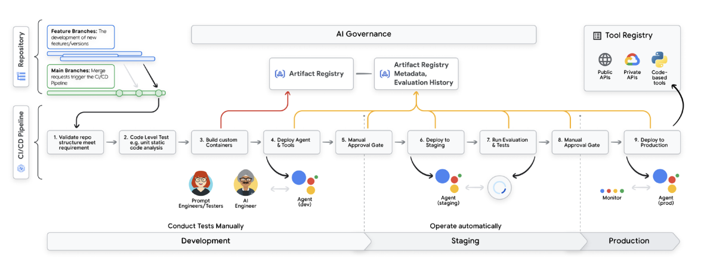
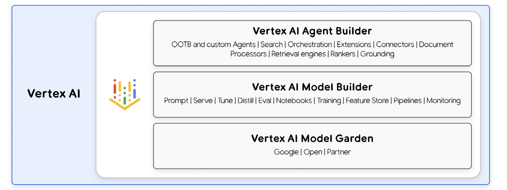

**Welcome to the production-grade trenches. Today’s focus:** 

Taking GenAI from “wow, it works!” to “yep, it's running at scale, versioned, and monitored.**
---

## What Are DevOps and MLOps?

- **DevOps** = the OG workflow for getting code from dev → deploy.
  - 🔁 Emphasizes **automation**, **collaboration**, and **CI/CD**
- **MLOps** = DevOps for machine learning, **but with more chaos**
  - Tackles the experimental, data-hungry, retrain-heavy nature of ML

### Core MLOps Practices:
- **Data validation**  
  _Clean data = happy model_
- **Model evaluation**  
  _Measure performance with the right metrics_
- **Model monitoring**  
  _Catch drift, bugs, or just weirdness_
- **Tracking & reproducibility**  
  _If you can’t reproduce it, it doesn’t count, meaning if someone else or future you can’t recreate the same results using the same code, data, parameters, and environment, then the result has no real value._

---

## Enter GenAI: New Game, New Rules

GenAI doesn’t just tweak the pipeline, it **reshuffles the deck**.

> “Which model do I use?”  
> “Should I prompt-tune or fine-tune?”  
> “How do I ground this thing in reality?”  
> “What happens if it starts hallucinating?”  
> “Wait, how do I evaluate *this*?”

---

## The Traditional ML Workflow (Still Relevant!)


This is the OG ML pipeline and it works well when you’re training traditional models. But GenAI changes the game. Let’s unpack that:

### Are we separating ML and GenAI by saying “New Game, New Rules”?

Yes but strategically.

We’re not throwing away ML fundamentals. Instead, we’re saying:

- Traditional ML = train → validate → deploy → monitor
- GenAI = compose models + prompt + retrieve context + evaluate output like a human

#### So yes, we’re drawing a distinction, but not a divorce.
- Same foundations (MLOps principles)
- New components (prompts, vector stores, hallucination metrics)
- New expectations (subjective evaluation, ethical risk)
#### You’re building on top of MLOps — not replacing it.

## GenAI-Specific MLOps Challenges

### Model Selection

- Choose from a wide range of foundation models (open-source or proprietary)
- Decide how to adapt them:
  - Prompt engineering
  - Parameter-efficient fine-tuning (e.g. LoRA, PEFT)

---

### Prompt Engineering

- Prompts are the new hyperparameters
- They need to be versioned, tested, and evaluated like code
  
prompt-v1/ summarize.txt

> 🟩 user: Summarize this article in 3 bullet points.  
> 🧠 model: Sure!  

prompt-v2/summarize.txt
> 🟩 user: You are a legal assistant. Summarize key tenant rights from this document.  
> 🧠 model: Got it. Here are 3 legal takeaways…

---

### Grounding Output
**Grounding** means anchoring the model’s generated text in **verifiable, real-world information**.

Without grounding, a GenAI model can hallucinate, make things up confidently and persuasively. 

To avoid this, we inject factual information (from external sources) into the model’s prompt before generation.

### Example:

```python
query = "What are our refund policies?"
relevant_docs = vector_db.search(query)
prompt = f"{relevant_docs}\n\nAnswer the user's question: {query}"
```
Instead of relying on a model’s memory (which might be outdated or wrong), we:

1. Search your internal knowledge base
2. Find the actual policy document
3. Feed that into the model's context

So the model replies based on **retrieved facts**, not guesses.

This is typically done using **RAG (Retrieval-Augmented Generation)**.


### Evaluation Metrics (Beyond Accuracy)
Traditional metrics like accuracy or F1 are not sufficient. In GenAI, key evaluation criteria include:

- Factuality: Checks **whether the output is factually correct**, given the input or source documents.
> A model answering “Yes, you can fly a drone over airports” would fail a factuality test.
- Helpfulness: Evaluates how **useful or actionable** the response is for the user’s goal.
> If the user asks for “steps to reset a password” and the answer is vague or generic, it scores low on helpfulness.

- Toxicity and bias: Measures whether the model’s output contains:
  - Harmful language
  - Stereotypes
  - Offensive or discriminatory content

This is **crucial** for deploying models safely in production, especially in user-facing apps.

### Some Evaluation methods include:
- LLM-as-a-judge: Use a second language model (like GPT-4 or Gemini) to assess the quality of an output.

> Given a question, reference answer, and model output — the judge model rates it on helpfulness, factuality, etc.

It’s fast, scalable, but may inherit biases from the judge model itself.

- Human-in-the-loop review: Real humans review and rate model outputs manually.
This is still the gold standard when you need:
  - Nuanced judgment
  - Domain expertise
  - Trustworthy QA
  
Downside: slower and more expensive.
- Tools: 
  - Promptfoo: A tool to test multiple prompts and models side by side. Helps automate prompt evaluation with scoring and regression checks

  - TruLens: Adds observability to LLM applications. Lets you define custom evaluation functions and monitor model behavior in production

  - Ragas: Focused on evaluating RAG pipelines. Computes metrics like faithfulness, answer relevancy, and context precision

# Operationalizing GenAI: Lifecycle of a GenAI System

You've deployed your first chatbot: it's live, talking to users, and delivering answers.  
But behind the scenes? There's a **complex pipeline of steps**:

**Operationalize** means 
> Turning it from an experiment → into a **live, working product** that delivers real responses, to real users, in a production environment.

This section unpacks the **five key stages** of a GenAI system's lifecycle:


There are **two lifecycles**:

### Foundation Models (top section)
- Not specific to one use case
- Typically done by Big Tech (e.g. Google, Meta, OpenAI)
- Steps:
  - Pre-training
  - Instruction tuning
  - Alignment
  - Serving/release

> These steps require massive compute, custom datasets, and safety tuning; most orgs don’t touch this directly.

---

### GenAI Systems (bottom section)
- Built **on top of foundation models**
- Tailored to specific business needs (chatbots, copilots, summarizers, etc.)
- This is where **you** come in

---

## 🟦 Lifecycle of a GenAI System

### 1. Discover

- Select the most suitable foundation model for your use case
- Evaluate models based on:
  - Strengths/weaknesses (e.g. reasoning vs language fluency)
  - Cost
  - Latency
  - Compatibility (e.g. API, fine-tuning support)

---

### 2. Curate Data

- Collect examples, context, and relevant enterprise data
- Types of data:
  - Documents for grounding (internal policies, KBs)
  - Examples for few-shot prompting
  - Correction examples for fine-tuning

---

### 3. Develop & Experiment

Core components:

- **Prompt engineering**  
  Craft and iterate prompts to shape model behavior

- **Few-shot learning**  
  Add task examples to steer output

- **Parameter-efficient fine-tuning (PEFT)**  
  Fine-tune only small subsets of model parameters (e.g. LoRA) for cost and speed

- **Model chaining**  
  Combine multiple model calls into a sequence/workflow  
  Example: classify intent → generate answer → summarize output

- **Factual grounding**  
  Ensure responses use trusted, up-to-date info from internal sources

---

### 4. Release & Deploy

Deployment now includes:
- Prompt templates
- Chain definitions
- Embedding models
- Retrieval data stores
- Fine-tuned adapters

These artifacts require **governance**:
- Who updated the prompt?
- Which chain version is live?
- Are we tracking performance by version?

You also need to validate:
- Infrastructure readiness (GPU/TPU, latency)
- Storage and retrieval reliability

---

### 5. Monitor

- Track safety and performance in production
- Use Responsible AI techniques to enforce:
  - Fairness
  - Transparency
  - Accountability

---

## 🟦 Continuous Improvement (With a Twist)

You don’t always retrain from scratch. Instead:

- **Update prompts** regularly to reduce hallucinations or boost helpfulness
- **Swap foundation models** if newer, cheaper, or faster options arise
- **Fine-tune selectively** when you spot persistent errors
- **Incorporate human feedback** loops for supervised improvement

---

## 📌 Important Distinction

> Not every org will train or serve foundational models.  
> Most companies will **build GenAI applications on top of them**.

This whitepaper focuses on **operationalizing GenAI systems** not pretraining or aligning LLMs from scratch.


# 🟦 Discover, Develop & Prompt Engineering in GenAI MLOps

---

## 📍 Discover

Training LLMs from scratch is expensive. So instead, we focus on **finding the right existing foundation model** and adapting it.

### Why "Discover" is critical:

1. **Explosion of models**  
   There are hundreds of open-source and proprietary models, all with different:
   - Sizes (7B, 13B, 65B, etc.)
   - Capabilities (code, vision, multilingual, etc.)
   - Licenses (Apache, non-commercial, etc.):

> When using an open-source model, you're not just looking at the model’s performance, you have to make sure **you're legally allowed to use it** for your use case.

| License Type       | What it means                                          |
|--------------------|--------------------------------------------------------|
| **Apache 2.0**     | Very permissive. You can use, modify, and deploy it commercially. |
| **MIT**            | Similar to Apache — short and permissive.              |
| **Non-commercial** | You can’t use it for any profit-related purpose.       |
| **Research-only**  | Use it for academic work only — not in production.     |

So: always check the **license**. You may not be allowed to ship or monetize a model just because it’s open-source.

---

1. **No single best model**  
   Each use case has different needs. You need to evaluate models based on:

   - **Quality**: Run test prompts or check benchmarks (e.g., MMLU, HellaSwag)
     -  **MMLU (Massive Multitask Language Understanding)**  
  Tests performance across 57 tasks (e.g., law, biology, math, etc.). Think of it as an LLM IQ test.

      - **HellaSwag**  
  Tests **commonsense reasoning**: can the model finish a sentence in a human-like way?

   - **Latency & throughput**: UX matters. Chatbots need speed; summarizers don’t.
       - A chatbot must respond in **real-time**, or the user experience breaks.
       - A summarizer (e.g., summarizing a 20-page PDF) **doesn't need instant speed** — it can afford a 10–30 second delay.

            So when evaluating foundation models, ask:  
            > “How fast does this need to be?”  
That affects your **model size**, **deployment**, and **serving infra** choices.

   - **Dev & maintenance time**: Hosted APIs (PaLM, Claude) vs. Self-hosted OSS (LLaMA)

| Option             | What it is                                                   | Trade-offs                                                   |
|--------------------|--------------------------------------------------------------|---------------------------------------------------------------|
| **Hosted APIs**    | Models you access via cloud APIs (e.g., PaLM, Claude, GPT-4) | ✅ Easy to use<br>✅ No infra needed<br>❌ More expensive<br>❌ Less control |
| **Self-hosted OSS**| Open Source Software models you run yourself (e.g., LLaMA, Mistral)   | ✅ Full control<br>✅ Potentially cheaper at scale<br>❌ Needs infra + ops |

If you just want to *use* a model, APIs are faster.  
If you need *control, customization, or privacy*, OSS models are the way to go.

---
   - **Cost**: Inference & infra costs vary wildly
   - **Compliance**: Can you legally use and deploy the model?

### Tooling:
Platforms like **Vertex Model Garden** help you search, compare, and access models easily, it’s like AWS **Bedrock**, where you choose between Anthropic, Meta, Cohere, etc.

---

## Develop & Experiment

GenAI dev is **experimental and iterative** and every loop includes:

- Choosing or adapting a model
- Designing prompts
- Evaluating outputs
- Logging and improving based on feedback

### Iteration loop:


## Develop & Experiment

The GenAI development loop is iterative and highly experimental. Each cycle involves tuning prompts, evaluating outputs, and sometimes swapping models altogether.

### Techniques

- Prompt tweaks (e.g., rewording, adding examples)
- Fine-tuning (e.g., LoRA) for domain-specific performance
- Swapping foundation models if performance is unsatisfactory

---

## Predictive vs GenAI Paradigm


### Predictive AI

- Model is trained for one task
- Input = structured (e.g., tabular data)
- Output = predefined (e.g., classification or regression)
#### User input –> Predictive model –> Output
### Generative AI

- Model is multi-purpose
- Input = prompt template + user input
- Output = generated text, shaped by prompt
#### User input –> Prompt Template –> LLM –> Output
Foundation models don’t do anything by default; they need a prompt to specify the task, which brings us to the next point ⤵️

---

## 🔹 What is the "Prompted Model"?

A **prompted model** is the combo of:

- A **foundation model** (e.g., Gemini, LLaMA, GPT-4)
- A **prompt** (instructions, examples, placeholders)

This is the smallest unit of a GenAI application.

#### Prompt + Model –> Prompted Model –> Output

This combo is the **minimum viable unit** that can generate output.
>GenAI System = Prompted Model + a Lot More; if the GenAI system is a car, then the **prompt + model** is the **engine**: powerful, essential, but not the whole ride.
### 

A **prompted model** is the combo of:

- A **foundation model** (e.g., Gemini, LLaMA, GPT-4)
- A **prompt** (instructions, examples, placeholders)

Together, this combo becomes the **minimal unit that can do a GenAI task**.

### 🔹 What Happens Next?

The prompted model produces an output and that output must be **evaluated** using the methods we already touche on.

This forms the **continuous experimentation cycle**:
> Prompt → Output → Evaluate → Tweak → Repeat
---

### 📌 What's going on in this diagram?

We’re seeing how a **user query** gets transformed into a **complete prompt** using a **prompt template**.

### 🔹 Components of the Prompt Template

The prompt template is structured into 3 layers:

1. **Instructions**  
   Sets the tone and task for the model.  
   > "You are a helpful assistant for Cymbal bikes, you help customers buying new bikes."

2. **Examples**  
   Few-shot learning. Gives the model patterns to copy.  
   > "User: Can I buy a new bike?  
   > Output: Sure, we offer a selection of new bikes..."

3. **User Input Placeholder**  
   This is where **real user input** (like a live question) gets injected dynamically.  
   > `User: {{ Question }}`  
   > `Output:`  
>Is the model T400 available?
That input fills the `{{ Question }}` placeholder.  

The full **runtime prompt** becomes:
>You are a helpful assistant for Cymbal bikes, you help customers buying new bikes.
User: Can I buy a new bike?
Output: Sure, we offer a selection of new bikes for you to choose from!
>User: Is the model T400 available?
Output:

This full string is what gets sent to the foundation model (e.g., PaLM, GPT-4, Mistral), which then generates the next line — the **Output**.

---

### 🔹 Why This Is Powerful

- **Prompt templates are modular**: you can plug in any user query
- **Few-shot examples guide** the model without retraining
- **Instructions steer tone and role**, keeping responses on-brand
- It's the **core building block** of most GenAI apps

> Prompt templates = your new UI, config, and logic — all in one.

This is what we meant earlier by saying:  
> A foundation model can’t function until you **wrap it in a prompt**.  

This wrapping through structured templates like above is what **makes the GenAI engine work** for a specific task.


## Prompt Engineering as MLOps

Prompt engineering is the core loop in GenAI development workflows.

### Two steps:

1. **Prompting**
   - Write and refine prompt templates
   - Include instructions, examples, and dynamic input placeholders

2. **Evaluation**
   - Run the prompt and generate output
   - Evaluate result quality
   - Log performance for tracking

### Example: Logging as Experiment

```json
{
  "prompt_version": "v3.2",
  "model": "Claude-v1.2",
  "temperature": 0.3,
  "output_quality": "pass",
  "run_id": "exp_456"
}
```


##  Chain & Augment in GenAI Systems

LLMs are powerful but they come with real limits:
- They struggle to stay **up-to-date**
- They may **hallucinate**
- They can fail at **complex, multi-step reasoning**

This is where **chaining** and **augmentation** enter the picture.

---

### 🔗 What Is a "Chain" in GenAI?

> A **chain** is a sequence of connected components, multiple **prompted models**, **external tools**, **data sources**, and **custom logic** that together perform a more complex task.

Unlike traditional ML pipelines where you can train components independently, GenAI chains require you to design and iterate on **the full sequence** as a unit.

---

### Why Do We Need Chains?

- LLMs alone can’t always:
  - Access real-time knowledge
  - Break problems into substeps
  - Fetch structured data from APIs
- By chaining models, logic, and tools, we solve this by **composing workflows**

This is a **"divide and conquer"** strategy.

---

### Key Chain Patterns

### 1. Retrieval Augmented Generation (RAG)
- Injects real-world data into prompts from **vector databases**
- Improves factual grounding and reduces hallucination

```text
User query --> Embed --> Retrieve docs --> Inject into prompt --> LLM output
```
### 2. Agents (ReAct-style)

**ReAct = Reason + Act**

This is a prompting technique that turns an LLM into a **decision-maker**.

Instead of asking the model for a full answer immediately, the prompt lets it:

1. **Think out loud** — show reasoning
2. **Choose what to do next** — call a tool, ask a sub-question, etc.
3. Repeat the loop until it’s ready to give the final answer

#### Example

Let’s say the user asks:

> “What’s the weather in Paris and do I need an umbrella this weekend?”

A ReAct-style agent might do this:

```text
Thought: To answer this, I need to get the weather forecast for Paris.
Action: CallWeatherAPI(location=Paris)

Observation: It’s expected to rain this weekend.

Thought: Since it’s raining, the user probably needs an umbrella.

Final Answer: Yes, you’ll need an umbrella this weekend in Paris.
```

## How Are GenAI Chains Different from Traditional AI?

Traditional pipelines (e.g., recommendations, fraud detection) also use multiple models but:

- Inputs are known ahead of time
- Components are isolated and testable

Think of classical ML applications like:

- **Product recommendations** (e.g., Amazon’s "you might also like...")
- **Fraud detection** (e.g., flagging suspicious banking transactions)

These use:
- Predictive models (like XGBoost or logistic regression)
- Structured data (tables, user logs, transaction histories)
### Traditional pipeline example:
User data ➝ Feature engineering ➝ Train predictive model ➝ Make prediction

Each step is modular, tested in isolation, and easy to optimize. This is **Predictive AI**.


GenAI chains are fundamentally different:

- Inputs are unpredictable and open-ended
- You can’t evaluate components in isolation
- Small prompt wording changes can change entire chain behavior

## Best Practices for MLOps in Chains

### 1. End-to-End Evaluation

You must evaluate the **entire chain**, not just individual components.

Use familiar GenAI evaluation metrics:
- Factuality
- Helpfulness
- Toxicity
- Task success

### 2. Versioning the Chain as a Whole

A GenAI chain is a **composite artifact** made up of:

- Prompt templates (Structured text patterns used to interact with an LLM: Instructions, Examples (few-shot), Placeholders (e.g., `{{user_question}}`))
- Embedding models (Turn text into vectors like OpenAI Embeddings, Google’s textembedding-gecko, HuggingFace’s all-MiniLM.)
- Vector DB configs (Embeddings need to be stored in a Vector Database (like Pinecone, FAISS, Weaviate); Configs include:Index size & type, Similarity metric (cosine, dot-product), Chunking rules)
- API keys and logic: (Many GenAI chains call external APIs (weather, database, internal tools) and we need Secure storage for keys and Code logic to call and parse responses)

Chains are systems, not just static models. Each chain version should be:
- Logged and tracked
- Versioned with input, output, and intermediate steps
- Tied to specific prompt + model versions

### 3. Continuous Monitoring

Chains must be monitored **like systems**, not just models.

Track for:
- Performance degradation(Is the chain producing lower-quality results?)
- Data drift(Have the input types changed over time?)
- Unexpected or undesirable outputs(Are the responses harmful, incorrect, or broken?)

You want early alerts before these issues hit users.

The upcoming section on **Logging and Monitoring** will cover this in detail.

### 4. Introspection

Chains must support **transparency and traceability**.

Chains often fail silently or behave strangely.
So, we want:
- Visibility into each step
- What was retrieved?
- What prompt was used?
- What decision did the agent make?
- Traceability
- Can we reproduce this exact output later?
This is key for debugging, improving trust, and diagnosing failure points.

## Tools That Support Chaining

### In Vertex AI:
- Grounding as a Service
- Vector Search
- Agent Builder
- Extensions API

### With LangChain:
- Fully integrated with Vertex SDK(dev-facing toolbox to use Vertex AI programmatically)
- Use it to:
  - Declare chain logic in code
  - Structure and reuse prompt templates
  - Connect LLMs with retrieval, conditionals, APIs, and more
  
## Development Shift: Iterate Chains, Not Just Models

In **Predictive AI**:
- Models are trained individually
- Then combined in downstream pipelines

In **Generative AI**:
- You iterate directly on the full chain
- Prompt tweaks or API interactions can shift behavior dramatically

Often, no new training is needed, just:
- Prompt flow changes
- Data augmentation(enhancing your dataset with modified or synthetic examples)
- Logic updates


## Tuning & Training in GenAI

Sometimes **prompt engineering and chaining aren’t enough**, especially for complex, high-performance tasks. That’s when we turn to **model tuning**.

---

### Why Tune a GenAI Model?

Tuning adapts the model to better perform on **specific tasks** by modifying its internal parameters. It improves precision, alignment, and performance on domain-specific goals.

Two major tuning strategies:

---

### 1. **Supervised Fine-Tuning**

- You feed the model **input-output pairs**.
- The model learns the desired response pattern.
- Example: Feed a legal document ➝ Expect a bulleted summary ➝ Model learns the structure.

---

### 2. **Reinforcement Learning from Human Feedback (RLHF)**

- You train a **reward model** to predict what humans would prefer.
- The LLM then uses this reward model to guide its learning.
- Think of it as:  
  > “Humans gave this a thumbs-up; generate more like this.”

---

## MLOps Considerations for Tuning

Tuning ≠ ad hoc trial and error. It requires structured infrastructure:

1. **Artifact tracking**  
   - Input data
   - Training parameters
   - Evaluation scores

2. **Evaluation & comparison**  
   - Compare against frozen or previous models
   - Run task-specific benchmarks
   - Log outputs for traceability

---

### Vertex AI Support for Tuning

Google’s Vertex AI offers robust tools for fine-tuning workflows:

- **Vertex Model Registry**, tracks all model versions & artifacts
- **Vertex Pipelines**, automate tuning + evaluation as repeatable jobs
- **Dataplex**, integrates data governance and lineage across tuning workflows
- **BigQuery**, for data storage, analysis, and model-driven features

And importantly:
> These tools work for both **predictive ML** and **generative AI**. No separate setup required.

---

## 🔁 Continuous Training & Tuning


Unlike traditional ML retraining pipelines, GenAI often uses **continuous tuning** because:

- Full retraining is too expensive (LLMs are huge)
- Prompts, tasks, and user expectations evolve quickly

So instead of starting over, we:
- Regularly fine-tune using **new data** or **user feedback**
- Especially in **chatbots** or **live assistant** scenarios

---

### When Should You Tune Continuously?
Not every GenAI use case needs the same tuning schedule.
The **type of task** — and how often it changes — tells you how frequently you should fine-tune your model.

- **Low-frequency tasks** (like summarization): Rare tuning is fine:
  - The **input format is stable** (e.g., text document in → summary out)
  - **User expectations don’t shift much**
  - The task logic is **not changing daily**
  
    **You don’t need to tune often**, one well-trained version can serve you for months.

---
- **Dynamic interfaces** (like real-time chat): Needs constant refresh
  - User queries **constantly evolve**
  - You get real-world **feedback fast** (likes/dislikes, flags, ratings)
  - You may need to:
    - Fix hallucinations
    - Add new skills
    - Respond to new product updates or policies

🔁 **This demands more frequent tuning.**
- Use human feedback or RLHF loops to guide frequent updates
  - So instead of randomly guessing what’s better, the model **learns directly from user preference signals**.

    > The faster your users change, the more often you should tune.

---

### Hardware Requirements

Fine-tuning LLMs is resource-heavy. You need:

- **GPUs**: General-purpose, parallel compute for ML
- **TPUs**: Google-designed chips, optimized for deep learning

To manage cost:
- Use **model quantization**:
  - Reduce weights from 32-bit floats ➝ 8-bit ints
  - Cuts compute + memory usage significantly

---


## Data Practices in GenAI

> A model’s behavior is shaped not just by the data it was trained on but by the data you feed it during application.

---

### Two Stages That Shape a Model’s Behavior


### 🟩 FM Creation (Pretraining Phase)

These are the **original training datasets** used to build the foundation model (e.g., GPT-4, PaLM, Mistral).

- **Pretraining datasets**  
  Massive raw corpora (e.g. Common Crawl, C4, The Pile) scraped from the web, used to give the model general world knowledge and language patterns.

- **Instruction tuning datasets**  
  Hand-crafted tasks with input-output examples ("Translate this", "Summarize that") that teach the model to follow instructions.

- **Safety tuning datasets**  
  Datasets used to prevent harmful behavior, training the model to refuse malicious requests or avoid toxic outputs.

- **Human preference data (for alignment)**  
  Used in techniques like RLHF: humans rank outputs, and the model learns to prefer helpful, harmless, and honest responses.

---

### 🟦 Application with FM (Adaptation Phase)

These are the **data sources you use after the FM is trained**, when building real applications.

- **Prompts**  
  Instructions written in natural language to steer the model (e.g., "You are a helpful legal assistant...").

- **Grounding / Augmentation data**  
  Live or stored data injected into prompts via RAG or tools (docs, APIs, DB lookups) to make outputs more factual and personalized.

- **Task-specific data for PEFT**  
  Narrow datasets used to fine-tune or adapt a model for a **very specific task** (e.g., call summarization for a support center).

- **Task-specific evaluation sets**  
  Curated input examples that help measure how well the model performs on a specific task.

- **Human preferences (from app usage)**  
  Ratings, corrections, or behavior data from real users interacting with your system, used to improve model alignment over time.

---
---

## GenAI Starts Where Predictive AI Ends

In **Predictive AI**, if you don’t have labeled, clean data, you can’t build anything.

In **GenAI**, you start with a **foundation model**, add a prompt and maybe a few examples and you’re already prototyping. That’s powerful... but also messy.

- You work with **multiple types of data** from various sources
- Each type plays a different role and has different lifecycle needs

---

## Key Data Types in GenAI Applications
in the context of **GenAI systems**, “data types” means:

> **Types of informational content** you need to manage.

They're not programming types, they're **functional roles** in the pipeline.


### • Conditioning Prompts  
Set instructions and behavior boundaries for the LLM.

### • Few-shot Examples  
Teach the model what you want using input-output pairs.

### • Grounding / Augmentation Data  
External APIs or internal knowledge bases. Adds context **without retraining**.  
Used in RAG pipelines to:
- Improve factuality
- Reduce hallucinations

### • Task-Specific Data  
Used for PEFT (LoRA, adapters, etc.) to specialize the model.

### • Human Preference Data  
Collected from feedback loops, used for RLHF or performance improvement.

### • Pretraining Corpora (frozen, not editable)  
Still influences how the model behaves — even if you don’t control it.


## Evaluate: Measuring What “Good” Means in GenAI

> If you're not evaluating, you're just guessing.

Evaluation isn't a side activity. It's core to **every GenAI iteration**, even if you're only tweaking prompts.

---

## Manual to Automated Evaluation

### Early stage:
- Manual checks
- Developers read outputs
- Qualitative judgment ("Does this sound right?")

### Mature stage:
- Manual doesn’t scale
- Too many test cases
- You need **automated, reproducible scoring**

---

## Why Automate Evaluation?

1. **Speed**  
   Run 1000 tests, not 10. Iterate faster.

2. **Reliability**  
   No human bias. Same input = same evaluation.

3. **Reproducibility**  
   Results are consistent across time and team members.

---

## 😓 But... It’s Hard

LLM outputs are complex:
- Long-form text
- Multiple objectives in one prompt
- Outputs can be nuanced or creative

### Why traditional metrics fall short

Metrics like `BLEU` and `ROUGE` come from classic NLP tasks (like translation and summarization) — and they only tell part of the story.

#### 🔵 BLEU (Bilingual Evaluation Understudy)
- Measures how much of the model’s output **matches the reference** using n-gram overlap.
- Great for machine translation, but:
  - Struggles with paraphrasing
  - Penalizes creativity

Example:

Reference: The cat sat on the mat
Output:   The cat is on the mat

→ BLEU might penalize this, even though the meaning is fine.

#### 🔴 ROUGE (Recall-Oriented Understudy for Gisting Evaluation)
- Focuses on **how much of the reference is captured** in the output.
- More recall-oriented — better for summarization.
- Still not great at judging:
  - Tone
  - Style
  - Relevance beyond surface overlap


So what do these metrics miss?

- **Coherence** — Does the text flow logically?
- **Helpfulness** — Is the answer actually useful?
- **Bias** — Are there subtle stereotypes or assumptions?
- **Creativity** — Did the model go beyond copy-paste logic?

That’s why modern GenAI evaluation often goes beyond BLEU/ROUGE and includes:
- **LLM-as-a-judge**
- **Human scoring**
- **Custom metrics for trust, tone, and safety**

These match better with what humans actually *care about* when reading a GenAI output.

---

## Use Another LLM as a Judge

One popular solution:
- Use an **LLM to evaluate LLMs**
- Prompt a model to score output quality based on:
  - Factuality
  - Clarity
  - Safety
  - Tone
  - Bias
- Example technique: **AutoSxS (Automatic Side-by-Side scoring)**

> This creates a scalable proxy for **human judgment**.

---

## Align Metrics With Human Values

Not all metrics are objective. So:
- Define *what “better” means* for your use case
- Make sure your automated metrics **match human perception**

💡 Tip: Lock down your metrics **early in the process** to ensure comparability across experiments.

---

## Ground Truth Problems

You often don’t have labeled ground truth in early stages.

### Workarounds:
- **Synthetic ground truth**: Generated by humans or LLMs
- **Iterative refinement**: Improve with feedback over time

---

## 🛡️ Don’t Forget Adversarial Testing

Real-world GenAI systems must withstand attacks:
- Prompt injections
- Data extraction
- Jailbreaks

Your eval set should include:
- **Prompt fuzzing** (randomized inputs)
- **Leakage tests** (sensitive info exposure)
- **Guardrail checks**

> Start rough, improve fast. That's the GenAI way.

## 🚀 Deploying GenAI Systems

> Deployment in GenAI ≠ just launching a model. It’s about **orchestrating a whole ecosystem**: models, prompts, pipelines, adapters, data sources, APIs, and more.

---

### Two Types of Deployment

#### 1. **GenAI Application Deployment**
You’re deploying an **end-to-end system**:
- Prompt templates
- LLM chains
- Vector DBs
- Data pipelines
- APIs
- Frontends

Use standard DevOps + MLOps practices:
- **Version control** (Git, DVC)
- **CI/CD** pipelines
- **Integration tests** for chains, APIs, permissions, and infrastructure

#### 2. **Foundational Model Deployment**
You’re deploying an **open-weight model** (e.g., LLaMA, Falcon) or private LLM:
- Allocate resources (GPUs/TPUs)
- Optimize model (e.g., quantization)
- Package & serve via APIs

---

## Version Control: Track Everything

Components to version:
- **Prompt templates** – use Git like source code
- **Chain definitions** – capture logic, APIs, flow
- **RAG datasets** – track changes in BigQuery, AlloyDB, or Feature Store
- **Adapter models (LoRA, PEFT)** – store versions in cloud storage or model registry

Why?
- Enables rollbacks
- Keeps audit logs
- Supports reproducibility

---

## Continuous Integration 🔁 

Apply CI to:
- Chains
- Prompts
- API wrappers
- Embedding + vector components

### Benefits:
- Catch bugs early
- Increase output reliability
- Lower maintenance costs

### Challenges:
- **Open-ended outputs** = hard to write exhaustive tests
- **Non-determinism** = same prompt might yield different outputs

Tip: Use **custom evaluation scripts** and **prompt-based integration tests**

---

## Continuous Delivery 🚚 

CD pushes built + tested systems into staging or production.

Delivery depends on **latency requirements**:

| Use Case       | Deployment Pattern               |
|----------------|----------------------------------|
| Batch          | Scheduled pipelines              |
| Real-time      | Low-latency APIs (e.g., Chatbots)|

In both cases:
- Test full integration in a pre-prod env
- Verify throughput, permissions, dependencies
- Include **load tests** and **failover checks**

---

## Deploying Foundation Models

These models are huge. You need to:
- Provision compute (TPUs, GPUs)
- Use scalable storage (GCS, BigQuery)
- Optimize before deployment (quantization, pruning)

---

### Infrastructure Validation

Before deploying:
- Check hardware compatibility
- Pre-test configs with tools like TFX's `infra_validator`
- Ensure required hardware (e.g., GPU availability)

---

### Model Optimization Techniques

| Technique      | What it does                                             |
|----------------|----------------------------------------------------------|
| **Quantization** | Lower-precision weights (8-bit, 16-bit) → faster, lighter |
| **Pruning**      | Remove redundant weights → smaller size, same accuracy |
| **Distillation** | Train a small model on outputs of a large one          |

✅ Bonus: Distillation can even **improve performance** on narrow tasks.

---

## Full Deployment Checklist (Vertex AI)

- [ ] Version control all artifacts
- [ ] Optimize model (quantization, pruning, distillation)
- [ ] Containerize model
- [ ] Define hardware needs (GPUs, TPUs)
- [ ] Create model endpoint via SDK or UI
- [ ] Allocate compute resources
- [ ] Configure access control (IAM, auth)
- [ ] Enable monitoring + logging
- [ ] Integrate with real-time apps via Cloud Run or Cloud Functions

---

> GenAI systems are not “one model to rule them all”. They are chains of logic, models, prompts, and tools. Deployment means shipping all of them together, reproducibly.


## Drift & Skew Detection in GenAI Systems

In generative AI, things change: **user inputs evolve**, **topics shift**, and **outputs drift**.  
To keep your system reliable, you need to **monitor for changes** across time.

---

### What Is Drift?

**Drift** happens when your *production data* starts to look different from what your model was evaluated or tested on.  
This can break your assumptions and affect output quality.

---

### Drift vs Skew

| Concept       | Meaning                                                                 |
|---------------|-------------------------------------------------------------------------|
| **Skew**      | Difference between training/eval inputs and real-world production inputs|
| **Drift**     | Change in production data (the kind of inputs your GenAI app receives from users starts to shift)         |

---


There are two flows:

1. Evaluation flow (top)
What your model was tested and validated on.
2. Production flow (bottom)
What your model is actually handling live.

Both flows:
- Ingest application inputs
- Generate statistics (text length, topic clusters (What are people talking about?), etc.)
- Compare those statistics to detect drift

We generate these stats:
1. For evaluation data (when we first tested the model)
2. And for production data (what users are inputting now)

Then we compare them to see:

> “Are people asking different kinds of things now compared to what we tested for?”

If yes, we’ve got drift, and your app might start to break subtly (or publicly). That's why if drift is found → a notification is triggered to warn the team 🚨 

## What We Measure (Textual Inputs)

Since GenAI often deals with **text**, drift detection relies on various indicators:

- **Embedding distances**: Turns user inputs into vectors (mathematical representations of meaning)
  - Detects changes in meaning or topic by comparing vector representations
  - Measures how “far” today’s inputs are from past ones
  - If distance grows, the topics or language have shifted
  
  >Are users now talking about different things?

- **Prompt structure stats**  
  Measures input length, number of tokens, and structural complexity.
    >Why it matters? Long or weirdly structured prompts may confuse your model.
- **Vocabulary shift**  
  Tracks the appearance of new terms, concepts, or jargon. Flags new or rare terms showing up more often

- **Intent/topic classification**  
  - Classifies user input into categories
  - Detects if intent is changing (e.g., from FAQs → legal inquiries)

- **Statistical methods**  
	- Least-Squares Density Difference: Checks changes in distributions
	- MMD (Maximum Mean Discrepancy): Measures how two sets of data differ
	- Learned Kernel MMD: A smarter version of MMD using machine learning

---

## Why It Matters

- A sudden spike in drift may signal your model no longer understands user behavior.
- Drift alerts allow **early intervention** before output quality degrades.
- Drift-aware evaluation helps **maintain quality over time**, not just at launch.

---

## ✅ Best Practice: Full Stack Monitoring

- Monitor at the **application level** (end-to-end input ➝ output).
- Drill down into **component-level** stats (prompt models, API calls, external data).
- **Log every interaction**: inputs, outputs, parameters, and versions.
- Use **tracing systems** (e.g., OpenTelemetry) to connect logs across your full stack.

## Govern: MLOps for GenAI Requires Full Lifecycle Control

In GenAI, governance isn’t just about managing models.  
You now need to manage entire **systems** made of:
- Chains
- Prompts
- Models
- Data
- APIs
- Evaluation logic

---

### What Does “Governance” Mean?

> Governance = all the practices that ensure **control**, **accountability**, and **transparency** over how your GenAI system is **developed, deployed, and monitored**

It applies to:
- **Code** → chaining logic, API wrappers, prompt templates  
- **Data** → few-shot examples, grounding data, user input  
- **Models** → base + adapter models, tuned versions

---

### 🔁 Why GenAI Needs New Governance Practices

In predictive AI:
- You track the model lifecycle (train → eval → serve)

In GenAI:
- You track **everything in the chain**
- Chains are composed of **multiple parts**
    - A **prompted LLM** (e.g., "Summarize this policy")
  - A **retrieval system** (e.g., fetch documents from a vector DB)
  - A **tool or API call** (e.g., check inventory or get real-time data)
  - Logic/routing (e.g., "If customer is asking about pricing → call model A")

- You need **lineage** across the whole system

---

### Lineage in GenAI

**Lineage** = keeping track of **where everything came from** and **how it was used**.


In predictive ML, lineage usually means:
> “Which data + model version created this prediction?”

In GenAI, lineage means:
> “Which prompt + model + RAG source + version + logic step created this response?”

### ✅ Example:

You ask:
> “Can I return my headphones?”

Behind the scenes:
- The system pulls the latest **return policy** from a vector DB (RAG)
- Injects that into a **prompt template** (prompt version 4.1)
- Sends it to **model v2.3**
- Applies a **formatting script**

Your **lineage log** should capture:
- Input: `"Can I return my headphones?"`
- Prompt version: `4.1`
- Retrieval doc: `ReturnPolicy_Jan2025.pdf`
- Model used: `Gemini-Pro-v2.3`
- Final output: `"Yes, returns are accepted within 30 days..."`

So if something goes wrong — like hallucinated refund info — you can trace back and debug *exactly which piece failed*.

That’s **lineage across the whole chain**.
---

### Classic MLOps Still Applies

You still need to govern:
1. **Data lifecycle** → [See: Data Practices]  
2. **Model lifecycle** → [See: Tuning & Training]  
3. **Code lifecycle** → [See: Deployment]

Governance doesn’t replace DevOps, it **extends** it for GenAI.

---

### Tools You’ll Use

These help you govern your GenAI system:

| Tool | Purpose |
|------|---------|
| **Google Cloud Dataplex** | Govern models and data centrally |
| **Vertex ML Metadata** | Track lineage of models, prompts, data |
| **Vertex Experiment** | Register experiments, metrics, outputs |


---

# Extend MLOps for GenAI to Agents

Generative AI agents = dynamic systems that **understand instructions**, **choose tools**, and **perform tasks** — all with reasoning.

---

## Agent Core: The Brain + Tools + Goal


Every agent includes:

- **Foundation Model** – reasoning engine (e.g., Gemini, GPT-4)
- **Instructions** – defines what the agent is trying to accomplish
- **Tool** – available functions (e.g., search, fetch, translate)

The foundation model reasons over available tools and instructions to decide **what to do** and **how to do it**.

---

## Agent Execution Flow: Step-by-Step Logic


1. **New input query** → User sends a question  
2. **Agent checks** if it needs to call a tool  
3. **If yes**, the agent generates a structured function call  
4. **Function is executed** by your code (or sometimes the LLM itself)  
5. **Agent gets the result** → updates short-term memory  
6. **It may call another tool again**  
7. **Once it has enough info**, it produces a final answer  

This is called a **multi-turn run**, where the agent can reason, use tools, and iterate.

---

## Types of Tools Agents Use

| Feature              | Code Functions         | Private REST APIs       | Public REST APIs         |
|----------------------|------------------------|--------------------------|---------------------------|
| **Latency**          | ✅ Very low             | 🟡 Medium                | 🔴 Potentially high        |
| **Implementation**   | ✅ Easy                 | 🟡 Medium                | ✅ Simple                  |
| **Control**          | ✅ Full                 | ✅ Full (VPC)            | 🔴 None                   |
| **Authentication**   | 🔴 None                | ✅ Enabled               | 🔴 Needs OAuth / API keys |
| **Monitoring**       | 🟡 Custom               | ✅ Standard APIs         | 🔴 Limited                |
| **Versioning**       | ✅ Git repos            | ✅ Git repos             | 🔴 Depends on provider    |
| **Security**         | 🟡 Agent-only           | ✅ Strong (VPC)          | 🔴 Requires caution        |
| **Internal Systems** | ✅ Direct access        | 🟡 Via network           | 🔴 No direct access       |

---

## Real Examples of Each Tool Type

- **Code Functions**:  
  - Local code: `calculate_discount()`, `fetch_user_info()`  
  - Fastest, fully controlled  

- **Private APIs (inside org)**:  
  - Internal tools: HR API, SalesForce API (VPC hosted)  
  - Secure but slightly slower

- **Public APIs**:  
  - Google Maps, Stripe, OpenWeather  
  - Broad reach, less secure, subject to rate limits

---

## Why a Tool Registry Matters

In production, tools can live across:
- Codebases
- Cloud VPCs
- External APIs

This gets messy. You need a **central catalog** (Tool Registry):

```yaml
- tool: "GetWeather"
  description: "Fetches weather data for a location"
  input: "city_name"
  output: "weather_summary"
  auth: "API Key"
  version: "v1.2"
  location: "public_api"

```
--- 
# Tool Registry, Agent Evaluation & Memory


## What is the Tool Registry?

The Tool Registry is like a centralized toolbox that keeps track of all tools your agents can use: APIs, code functions, endpoints.

### Why it matters:
- Reuse tools across agents → saves time
- Makes tools discoverable & shareable
- Adds security & access control
- Supports versioning, monitoring, and auditability

### Each tool includes:
- Name, description, input/output parameters
- Version control
- Access control rules

>Think of it like the Model Registry, but for tools used by agents.

⸻

## Tool Selection Strategies

Too many tools = confusion 😵

You don’t want to overwhelm your agent with 1,000 tools. There are 3 smart ways to manage this:

1. Generalist Agent
	- Has access to all tools
	- Flexible but can be unpredictable

2. Specialist Agent
	- Gets a hand-picked Tool List
	- Safer, faster, easier to debug

3. Dynamic Selection
	- Picks tools at runtime from the registry
	- Flexible, but hard to predict or test


---

## Agent Evaluation (It’s more than just the final answer)

> Agent eval = testing how well your agent thinks, acts, and calls tools.

### 5 Stages of Agent Evaluation:
1. Tool Unit Testing
	- Test & refine function descriptions
2. Evaluation Dataset
	- Create multi-turn test cases from real sessions or manually
3. Tool Selection Accuracy
	- Did the agent pick the right tool?
	- Did it fill out the parameters correctly?
4. Reasoning Evaluation
	- Did it recover from missing data?
	- Did it stay on track in multi-turn tasks?
5. Operational Metrics
	- Latency & cost tracking

--- 

## Agent Optimization Loop
- Pick the right tools
- Choose a strong foundation model (some are better at tool selection)
- Refine the instruction prompt

Keep iterating for better results.

---
## Observability & Explainability in Agents

You need to understand what your agent is doing and why. That’s where memory comes in.

### Short-Term Memory
- The current session’s history:
- Questions
- Tool calls
- Results
- Helps maintain conversation context

💡 Stored via:
- Logs
- Cloud DB
- In-memory session
- Combination


### Long-Term Memory
	•	Info across many sessions
	•	Learns user preferences, behaviors

💡 Stored via:
- Vector DBs
- Metadata graphs
- Cloud storage
- Hybrid setup

Use memory to:
- Debug & trace decisions
- Improve personalization
- Build trust with explainable logic

---


# Deploying an Agent to Production

Deploying a GenAI agent means taking it from development all the way to production with reliability, consistency, and security.

---

## CI/CD Workflow for Agent Deployment




The pipeline includes 3 phases: **Development**, **Staging**, and **Production**:

---

### 🔧 Development Phase

1. **Validate repo structure**  
   Ensure required files, folders, and naming conventions are in place.

2. **Run code-level tests**  
   Includes unit tests, static code analysis, and linting(spellchecker for code).

3. **Build custom containers (built using Docker, so it can run anywhere )**  
   Prepares reproducible, deployable artifacts.

4. **Deploy to dev environment**  
   Agent + tools go to a safe environment for early testing.

5. **Manual approval gate**  
   Humans (engineers/testers) review and sign off.

---

### Staging Phase

6. **Deploy to staging**  
   Mirrors production used for final test runs and scale checks.

7. **Run evaluations & tests**  
   Includes:
   - Integration tests  
   - Stress/load tests  
   - Evaluation scripts for agent performance

8. **Manual approval gate**  
   Final human verification before production.

---

### 🚢 Production Phase

9. **Deploy to production**  
   Agent is now live and monitored in the real world.

- **Tool registration happens automatically** via metadata in the repo.
- **Tool Registry + Artifact Registry** are updated as part of governance.
- **Monitoring** is ongoing for errors, performance, and quality issues.

---

# Operations: People & Processes

> Productionizing AI = not just code or infra. It’s about people and process orchestration.

### Traditional MLOps landscape of people, process, and environments

### From MLOps to GenAI application development landscape of people, process, and environments

### How multiple team collaborate to operationalize both models and GenAI applications


---
# The Role of an AI Platform for GenAI Operations

GenAI isn't just prompts and models — it's an entire **platform play**. Think infrastructure + tools + collaboration.


---
# Summary: MLOps in the Age of Gen AI

The explosion of generative AI has transformed **how we build and run AI applications** — but it hasn't replaced the foundations of MLOps.  
Instead, it has **extended** and **reinforced** them.

---

## MLOps Still Holds Strong

Gen AI may feel revolutionary, but at its core:

- **Reliability**, **repeatability**, and **traceability** still matter.
- **Versioning**, **evaluation**, and **governance** remain key.
- The shift is not about replacing MLOps — it’s about adapting it for a **more dynamic** AI world.

---

## One Platform to Rule Them All: Vertex AI


Google Cloud’s **Vertex AI** is a great example of how traditional MLOps tools are evolving to meet gen AI demands:

- **Build & deploy predictive + generative models**
- **Support for AutoML, tuning, pipelines, and RAG**
- **End-to-end lifecycle**: from training to observability to governance
- Access to **Google + open-source foundation models**
- Unified via one secure and scalable platform

---

## 🔮 What’s Next?

The gen AI field will only **accelerate** from here. As new tools, models, and use cases emerge:

- **Solid MLOps principles** will keep projects scalable and stable.
- Future GenAI systems will **still need CI/CD, logging, evaluation, and traceability**.
- It’s not just about prompts — it’s about engineering systems that can evolve.

📅 **Google Gen AI Whitepaper — April 2025**